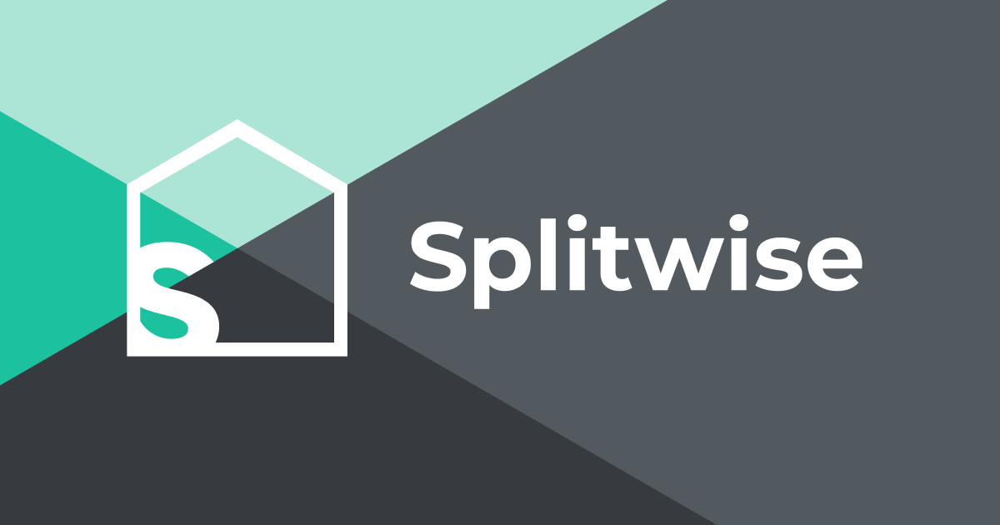
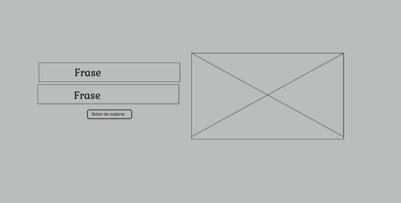
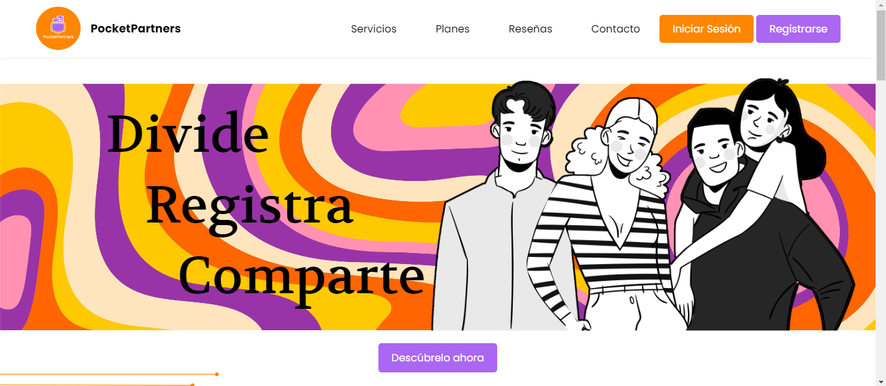
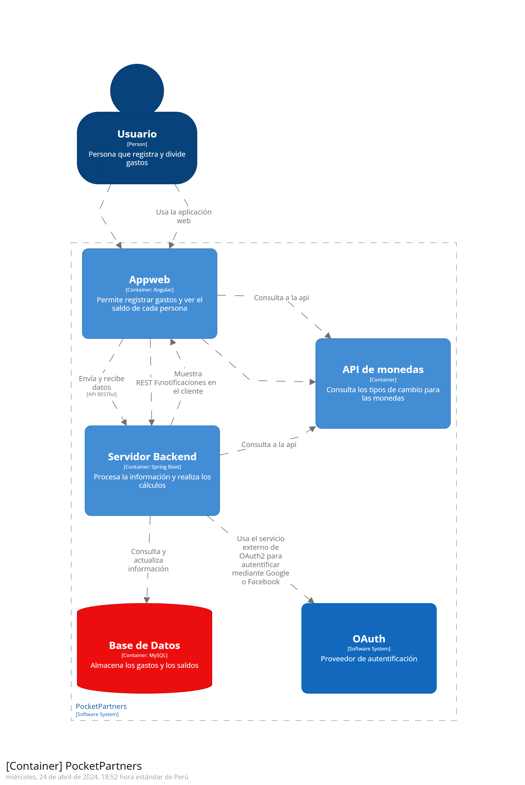
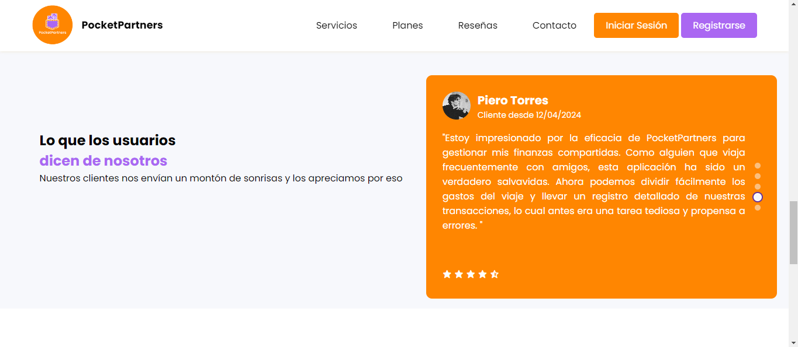
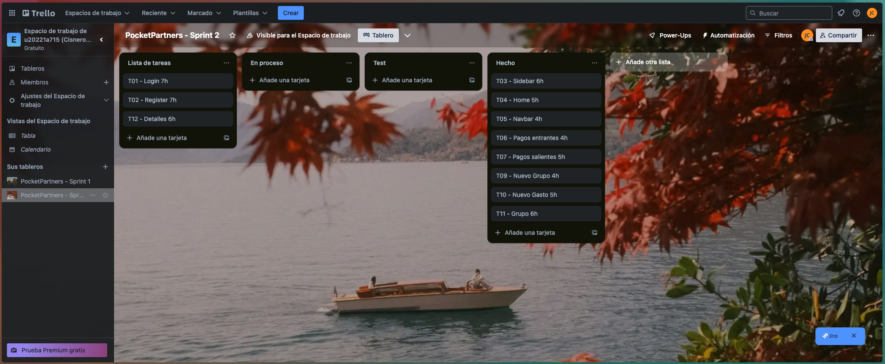

<p align="center">
  
</p>

<div align="center">

# Universidad Peruana de Ciencias Aplicadas

## Carrera de Ingeniería de Software

</div>

<div align="center">

Ciclo: 2024 - 0 1

Curso: Desarrollo de Aplicaciones Open Source

Sección: SW58

Profesor: Efraín Ricardo Bautista Ubillús

“Informe de Trabajo Final”

Startup: FairFinance

Producto: PocketPartners

Grupo: 03

|          Integrantes           |   Código   |
| :----------------------------: | :--------: |
| Carbajal Pozzo, Joaquín Alonso | U202121881 |
|  Cisneros Tafur, Diego Rafael  | U20221A715 |
|   Jarama Peñaloza, Fiorella    | U202120418 |
|      Ramos Carpio, Karen       | U20201E493 |
| Ventura Allasi, Randel Russell | U201910669 |

Mayo 2024

</div>

<br>
<br>
<br>
<br>
<br>
<br>
<br>
<br>
<br>

# **Registro de Versiones**

<table>
  <thead>
    <tr>
        <th>Versión</th>
        <th>Fecha</th>
        <th>Autor</th>
        <th>Descripción de modificación</th>
    </tr>
  </thead>
  <tbody>
  <tr>
      <td><strong>TB1</strong></td>
      <td>Sábado 13 de Abril</td>
      <td>
        <ul>
          <li>Carbajal Pozzo, Joaquín Alonso</li>
          <li>Cisneros Tafur, Diego Rafael</li>
          <li>Jarama Peñaloza, Fiorella</li>
          <li>Ramos Carpio, Karen</li>
          <li>Ventura Allasi, Randel Russell</li>
        </ul>
      </td>
      <td>
        Se han incluído los siguientes capítulos:
        <ul>
          <li>Capítulo I: Introducción</li>
          <li>Capítulo II: Requirements Elicitation & Analysis</li>
          <li>Capítulo III: Requirements Specification</li>
          <li>Capítulo IV: Product Design</li>
          <li>Avance del Capítulo V: Product Implementation, Validation & Deployment hasta el punto 5.2.1.8</li>
          <li>Avance de Conclusiones, Bibliografía y Anexos</li>
        </ul>
      </td>
  </tr>
  <tr>
      <td><strong>TP</strong></td>
      <td>Lunes 29 de Abril</td>
      <td>
        <ul>
          <li>Carbajal Pozzo, Joaquín Alonso</li>
          <li>Cisneros Tafur, Diego Rafael</li>
          <li>Jarama Peñaloza, Fiorella</li>
          <li>Ramos Carpio, Karen</li>
          <li>Ventura Allasi, Randel Russell</li>
        </ul>
      </td>
      <td>
        Se han incluído los siguientes capítulos:
        <ul>
          <li>Avance del Capítulo V: Product Implementation, Validation & Deployment hasta el punto 5.2.2.8</li>
          <li>Avance de Conclusiones, Bibliografía y Anexos</li>
        </ul>
      </td>
  </tr>
  <tr>
      <td><strong>TB2</strong></td>
      <td>Miercoles 5 de Mayo</td>
      <td>
        <ul>
          <li>Carbajal Pozzo, Joaquín Alonso</li>
          <li>Cisneros Tafur, Diego Rafael</li>
          <li>Jarama Peñaloza, Fiorella</li>
        </ul>
      </td>
      <td>
        Se han incluído los siguientes capítulos:
        <ul>
          <li>Avance del Capítulo V: Product Implementation, Validation & Deployment hasta el punto 5.4</li>
          <li>Avance de Conclusiones, Bibliografía y Anexos</li>
        </ul>
      </td>
  </tr>
  </tbody>
</table>

<br>
<br>
<br>
<br>
<br>
<br>
<br>
<br>
<br>
<br>
<br>
<br>
<br>

# **Student Outcomes**

<table style="border-collapse: collapse; width: 100%; border: 1px solid black;">
  <thead>
    <tr style="border-bottom: 1px solid black;">
      <th style="border-right: 1px solid black;">Criterio Específico</th>
      <th style="border-right: 1px solid black;">Acciones Realizadas</th>
      <th>Conclusiones</th>
    </tr>
  </thead>
  <tbody>
    <tr style="border-bottom: 1px solid black;">
      <td style="border-right: 1px solid black;"><strong>Comunica en forma escrita ideas y/o resultados con objetividad a público de diferentes especialidades y niveles jerárquicos, en el marco del desarrollo de un proyecto en ingeniería</strong></td>
      <td style="border-right: 1px solid black;">
        <ul>
          <p><strong>TB1</strong></p>
          <li>Carbajal Pozzo, Joaquín Alonso: Realización de los diagramas C4, involucrados en el proceso de DDD (Domain Driven Design), utilizando el lenguaje ubicuo para permitir a todos los stakeholders entender detalles técnicos a un alto nivel.</li>
          <li>Cisneros Tafur, Diego Rafael: Desarrollo de la sección de header en el landing page, implementación de funcionalidades en JavaScript y documentación de los commits realizados por el equipo.</li>
          <li>Jarama Peñaloza, Fiorella: Utilización de GitHub para documentar el trabajo, aprendizaje de conventional commits y gitflow, y uso del lenguaje markdown para comunicarlo mediante GitHub en un archivo README.md.</li>
          <li>Ramos Carpio, Karen: Comunicación de las herramientas a utilizar, su utilidad y las convenciones típicas en el informe, explicando los pasos necesarios para el diseño de la aplicación Ventura Allasi.</li>
          <li>Randel Russell: Avance en el capítulo 4 y en el diagrama de base de datos.</li>
        </ul> 
        <ul> 
          <p><strong>TP</strong></p>
          <li>Carbajal Pozzo, Joaquín Alonso: Realizo las pantallas correspondientes del fronted Incoming Payments, Outgoing Paymentes y Expenses. Del Informe los puntos de mejora como Unhappy Paths, un video de entrevista, y los puntos actuales de Sprint Planning 2 y el Sprint Backlog 2.</li>
          <li>Cisneros Tafur, Diego Rafael:Realizo las pantallas correspondientes del fronted New Group, Show Groups. Del Informe los puntos de mejora como el Diagrama de Clases, Product Backlog y una Entrevista.</li>
          <li>Jarama Peñaloza, Fiorella: Realizo las pantallas correspondientes del fronted Home, Contactos y Navbar. Del Informe los puntos de mejora como Landing Page Plans & Reviews y una Entrevista, y de los puntos actuales Development Evidence for Sprint Review, Testing Suite Evidence for Sprint Review, Services Documentation Evidence for Sprint Revie, Software Deployment Evidence for Sprint Review y Conclusiones.</li>
          <li>Ramos Carpio, Karen: Solo realizo una entrevista.</li>
          <li>Randel Russell: Realizo una de sus pantallas, Login. Del Informe el punto de mejora de Technical Stories y del informe actual Team Collaboration Insights during Sprint.</li>
        </ul>
        <ul> 
          <p><strong>TB2</strong></p>
          <li>Carbajal Pozzo, Joaquín Alonso: Se encargó de desarrollar los endpoints del backend relacionados con Payments, Expense y Group Operations. Además, implementó mejoras importantes como Lean UX Hypothesis, Sprint Backlog 2, y el diseño de las entrevistas y evaluaciones heurísticas del informe actual. </li>
          <li>Cisneros Tafur, Diego Rafael: Realizó el deployment del backend, así como los endpoints de Groups y GroupMembers. También mejoró la funcionalidad del frontend permitiendo la selección de miembros para el grupo y desarrollando una pantalla adicional para los detalles del grupo. Además, se encargó de la creación del video explicativo sobre el producto y redactó una conclusión.</li>
          <li>Jarama Peñaloza, Fiorella: Desarrolló los acceptance tests y la mayor parte del Sprint 3, además de encargarse del endpoint de Users. También abordó las mejoras de los sprint backlogs anteriores y completó tareas pendientes del frontend como el sideBar y la división de montos por grupo.</li>
          <li>Ramos Carpio, Karen: - </li>
          <li>Randel Russell: - </li>
        </ul>
      </td>
      <td><strong>TB1:</strong><p align="justify">Se logró realizar un trabajo sobresaliente, cumpliendo con todos los segmentos del trabajo y entregando un documento que sirve como sustento escrito para comprender los pasos seguidos en la planificación, desarrollo y envío del proyecto a producción.</p>
      <br>
      <p><strong>TP:</strong></p><p align="justify"> Se logro completar la mayoria de los puntos pedidos, un punto a mejorar seria, que todos los miembros se comprometan a terminar, puesto que sino retrasan al resto de integrantes.</p> 
      <p><strong>TB2:<strong></p><p align="justify">En este sprint del proyecto, el equipo ha logrado avances significativos en el desarrollo de las funcionalidades del sistema, tales como el Backend de nuestro aplicativo y su integracion con el Frontend</p>
      </td>
    </tr>
    <tr style="border-bottom: 1px solid black;">
      <td style="border-right: 1px solid black;"><strong>Comunica oralmente sus ideas y/o resultados con objetividad a público de diferentes especialidades y niveles jerárquicos, en el marco del desarrollo de un proyecto en ingeniería</strong></td>
      <td style="border-right: 1px solid black;">
        <ul>
          <p><strong>TB1</strong></p>
          <li>Carbajal Pozzo, Joaquín Alonso: Proceso de entrevistas para el requirements elicitation, comunicación de la propuesta de solución a los clientes esperados y dirección del diseño de la solución.</li>
          <li>Cisneros Tafur, Diego Rafael: Creación de la sección de sprint, diseño de la landing page y su versión responsive, así como la versión responsive de la aplicación web.</li>
          <li>Ramos Carpio, Karen: Mantenimiento de un contacto constante con los segmentos objetivo, comunicación y organización mediante reuniones.</li>
          <li>Jarama Peñaloza, Fiorella: Realización de exposiciones grabadas para explicar los requisitos del proyecto, cómo fueron implementados y el ciclo de vida del desarrollo del software.</li>
          <li>Randel Russell: Avance en el capítulo 4 y en el diagrama de base de datos.</li>
        </ul>
        <ul> 
          <p><strong>TP</strong></p>
          <li>Carbajal Pozzo, Joaquín Alonso: Realizo las pantallas correspondientes del fronted Incoming Payments, Outgoing Paymentes y Expenses. Del Informe los puntos de mejora como Unhappy Paths, un video de entrevista, y los puntos actuales de Sprint Planning 2 y el Sprint Backlog 2.</li>
          <li>Cisneros Tafur, Diego Rafael:Realizo las pantallas correspondientes del fronted New Group, Show Groups. Del Informe los puntos de mejora como el Diagrama de Clases, Product Backlog y una Entrevista.</li>
          <li>Jarama Peñaloza, Fiorella: Realizo las pantallas correspondientes del fronted Home, Contactos y Navbar. Del Informe los puntos de mejora como Landing Page Plans & Reviews y una Entrevista, y de los puntos actuales Development Evidence for Sprint Review, Testing Suite Evidence for Sprint Review, Services Documentation Evidence for Sprint Revie, Software Deployment Evidence for Sprint Review y Conclusiones.</li>
          <li>Ramos Carpio, Karen: Solo realizo una entrevista.</li>
          <li>Randel Russell: Realizo una de sus pantallas, Login. Del Informe el punto de mejora de Technical Stories y del informe actual Team Collaboration Insights during Sprint.</li>
        </ul>
        <ul> 
          <p><strong>TB2</strong></p>
          <li>Carbajal Pozzo, Joaquín Alonso: Se encargó de desarrollar los endpoints del backend relacionados con Payments, Expense y Group Operations. Además, implementó mejoras importantes como Lean UX Hypothesis, Sprint Backlog 2, y el diseño de las entrevistas y evaluaciones heurísticas del informe actual. </li>
          <li>Cisneros Tafur, Diego Rafael: Realizó el deployment del backend, así como los endpoints de Groups y GroupMembers. También mejoró la funcionalidad del frontend permitiendo la selección de miembros para el grupo y desarrollando una pantalla adicional para los detalles del grupo. Además, se encargó de la creación del video explicativo sobre el producto y redactó una conclusión.</li>
          <li>Jarama Peñaloza, Fiorella: Desarrolló los acceptance tests y la mayor parte del Sprint 3, además de encargarse del endpoint de Users. También abordó las mejoras de los sprint backlogs anteriores y completó tareas pendientes del frontend como el sideBar y la división de montos por grupo.</li>
          <li>Ramos Carpio, Karen: - </li>
          <li>Randel Russell: - </li>
        </ul>
      </td>
      <td><p><strong>TB1</strong></p><p align="justify">El equipo estableció medios de comunicación para entregar un trabajo completo dentro de los cortos períodos de tiempo para la entrega del proyecto. Además, se comunicaron los resultados obtenidos a los stakeholders, quienes demostraron su satisfacción con el programa.</p>
      <br>
      <p><strong>TP:<strong></p><p align="justify">El equipo no logro realizar un trabajo completo, mientras algunos miembros han demostrado una participación activa y significativa en el desarrollo del proyecto, otros no han contribuido de manera tangible durante este periodo. Es crucial para el éxito del proyecto que todos los miembros del equipo se involucren y aporten en futuras tareas y sprints.</p>
      <p><strong>TB2:<strong></p><p align="justify">En este sprint del proyecto, el equipo ha logrado avances significativos en el desarrollo de las funcionalidades del sistema, tales como el Backend de nuestro aplicativo y su integracion con el Frontend</p>
      </td>
    </tr>
  </tbody>
</table>

# **Project Report Collaboration Insights**

URL Project Report (Github): https://github.com/PocketPartners/Informe

# **Tabla de Contenido**

- [Universidad Peruana de Ciencias Aplicadas](#universidad-peruana-de-ciencias-aplicadas)
  - [Carrera de Ingeniería de Software](#carrera-de-ingeniería-de-software)
- [**Registro de Versiones**](#registro-de-versiones)
- [**Student Outcomes**](#student-outcomes)
- [**Project Report Collaboration Insights**](#project-report-collaboration-insights)
- [**Tabla de Contenido**](#tabla-de-contenido)
- [Capítulo I Introducción](#capítulo-i-introducción)
  - [1.1. Startup Profile](#11-startup-profile)
    - [1.1.1. Descripción de la Startup](#111-descripción-de-la-startup)
    - [1.1.2. Perfiles de integrantes del equipo](#112-perfiles-de-integrantes-del-equipo)
  - [1.2. Solution Profile](#12-solution-profile)
    - [1.2.1. Antecedentes y problemática](#121-antecedentes-y-problemática)
    - [1.2.2. Lean UX Process](#122-lean-ux-process)
      - [1.2.2.1. Lean UX Problem Statements](#1221-lean-ux-problem-statements)
      - [1.2.2.2. Lean UX Assumptions](#1222-lean-ux-assumptions)
      - [1.2.2.3. Lean UX Hypothesis Statements](#1223-lean-ux-hypothesis-statements)
      - [1.2.2.4. Lean UX Canvas](#1224-lean-ux-canvas)
  - [1.3. Segmentos objetivo](#13-segmentos-objetivo)
- [Capítulo II Requirements Elicitation \& Analysis](#capítulo-ii-requirements-elicitation--analysis)
  - [2.1. Competidores](#21-competidores)
    - [2.1.1. Análisis Competitivo](#211-análisis-competitivo)
    - [2.1.2. Estrategias y tácticas frente a competidores](#212-estrategias-y-tácticas-frente-a-competidores)
  - [2.2. Entrevistas](#22-entrevistas)
    - [2.2.1. Diseño de entrevistas](#221-diseño-de-entrevistas)
  - [Preguntas para viajeros](#preguntas-para-viajeros)
  - [Preguntas para amigos que salen a almorzar](#preguntas-para-amigos-que-salen-a-almorzar)
  - [Preguntas para compañeros de piso](#preguntas-para-compañeros-de-piso)
    - [2.2.2 Registro de entrevistas](#222-registro-de-entrevistas)
      - [Renzo Castro, 20 años.](#renzo-castro-20-años)
        - [Resumen de la entrevista](#resumen-de-la-entrevista)
      - [Salvador Chamorro, 22 años.](#salvador-chamorro-22-años)
        - [Resumen de la entrevista](#resumen-de-la-entrevista-1)
      - [Margarita Robles, 36 años.](#margarita-robles-36-años)
        - [Resumen de la entrevista](#resumen-de-la-entrevista-2)
      - [Pilar Iturbe, 32 años.](#pilar-iturbe-32-años)
        - [Resumen de la entrevista](#resumen-de-la-entrevista-3)
      - [Ana Lucia Aguilar, 33 años.](#ana-lucia-aguilar-33-años)
        - [Resumen de la entrevista](#resumen-de-la-entrevista-4)
      - [Elizabeth Saico Quispe, 32 años.](#elizabeth-saico-quispe-32-años)
        - [Resumen de la entrevista](#resumen-de-la-entrevista-5)
      - [Nadia Lucas Coronel, 22 años.](#nadia-lucas-coronel-22-años)
        - [Resumen de la Entrevista](#resumen-de-la-entrevista-6)
      - [Isaac Martín Nonalaya Rondón, 21 años.](#isaac-martín-nonalaya-rondón-21-años)
        - [Resumen de la Entrevista](#resumen-de-la-entrevista-7)
    - [2.2.3. Análisis de entrevistas](#223-análisis-de-entrevistas)
  - [2.3. Needfinding](#23-needfinding)
    - [2.3.1 User Personas](#231-user-personas)
  - [**User persona viajero**](#user-persona-viajero)
  - [**User persona que frecuenta restaurantes**](#user-persona-que-frecuenta-restaurantes)
  - [**User persona compañero de piso**](#user-persona-compañero-de-piso)
    - [2.3.2 User task Matrix](#232-user-task-matrix)
    - [2.3.3 User Journey Mapping](#233-user-journey-mapping)
  - [**User persona viajero**](#user-persona-viajero-1)
  - [**User persona que frecuenta restaurantes**](#user-persona-que-frecuenta-restaurantes-1)
  - [**User persona compañero de piso**](#user-persona-compañero-de-piso-1)
    - [2.3.4 Empathy Mapping](#234-empathy-mapping)
  - [**Empathy Map User Viajero**](#empathy-map-user-viajero)
  - [**Empathy Map User Frecuente de restaurantes**](#empathy-map-user-frecuente-de-restaurantes)
  - [**Empathy Map User Compañero de Piso**](#empathy-map-user-compañero-de-piso)
    - [2.3.5 As-Is Scenario Mapping](#235-as-is-scenario-mapping)
    - [As - Is User Viajero](#as---is-user-viajero)
    - [As - Is User Frecuente de Restaurante](#as---is-user-frecuente-de-restaurante)
    - [As - Is User Compañero de Piso](#as---is-user-compañero-de-piso)
  - [2.4 Ubiquitous Language](#24-ubiquitous-language)
- [Capítulo III Requirements Especification](#capítulo-iii-requirements-especification)
  - [3.1 To-Be Scenario Mapping](#31-to-be-scenario-mapping)
    - [To - Be User Viajero](#to---be-user-viajero)
    - [To - Be User Frecuente de Restaurante](#to---be-user-frecuente-de-restaurante)
    - [To - Be User Compañero de Piso](#to---be-user-compañero-de-piso)
  - [3.2 User Stories](#32-user-stories)
  - [3.3 Impact Mapping](#33-impact-mapping)
      - [Mejorar la experiencia de distribución de movimientos financieros grupales.](#mejorar-la-experiencia-de-distribución-de-movimientos-financieros-grupales)
      - [Digitalizar el 80% de procesos de registro de saldos y movimientos financieros grupales.](#digitalizar-el-80-de-procesos-de-registro-de-saldos-y-movimientos-financieros-grupales)
      - [Discernir la preocupación constante del uso de diferentes registros de movimientos financieros en los usuarios Compañeros de piso.](#discernir-la-preocupación-constante-del-uso-de-diferentes-registros-de-movimientos-financieros-en-los-usuarios-compañeros-de-piso)
  - [3.4 Product Backlog](#34-product-backlog)
- [Capítulo IV Product Design](#capítulo-iv-product-design)
  - [4.1. Style Guidelines](#41-style-guidelines)
    - [4.1.1. General Style Guidelines](#411-general-style-guidelines)
    - [4.1.2. Web Style Guidelines](#412-web-style-guidelines)
  - [4.2. Information Architecture](#42-information-architecture)
    - [4.2.1. Organization Systems](#421-organization-systems)
    - [4.2.2. Labeling Systems](#422-labeling-systems)
    - [4.2.3. SEO Tags and Meta Tags](#423-seo-tags-and-meta-tags)
    - [4.2.4. Searching Systems](#424-searching-systems)
    - [4.2.5. Navigation Systems](#425-navigation-systems)
  - [4.3. Landing Page UI Design](#43-landing-page-ui-design)
    - [4.3.1. Landing Page Wireframe](#431-landing-page-wireframe)
    - [4.3.2. Landing Page Mock-up](#432-landing-page-mock-up)
  - [4.4. Web Applications UX/UI design](#44-web-applications-uxui-design)
    - [4.4.1. Web Applications wireframes](#441-web-applications-wireframes)
    - [4.4.2. Web Application Wireflow Diagram](#442-web-application-wireflow-diagram)
    - [4.4.3 Web Application Mock-Ups](#443-web-application-mock-ups)
    - [4.4.4. Web Applications User Flow Diagrams](#444-web-applications-user-flow-diagrams)
      - [User goal: Consultar movimientos y resumen.](#user-goal-consultar-movimientos-y-resumen)
      - [User goal: Como usuario quiero crear una cuenta](#user-goal-como-usuario-quiero-crear-una-cuenta)
      - [User goal: Como usuario quiero editar cuenta](#user-goal-como-usuario-quiero-editar-cuenta)
      - [User goal: Como usuario quiero exportar datos](#user-goal-como-usuario-quiero-exportar-datos)
      - [User goal: Como usuario quiero acceder menú agregar](#user-goal-como-usuario-quiero-acceder-menú-agregar)
      - [User goal: Como usuario quiero crear un grupo](#user-goal-como-usuario-quiero-crear-un-grupo)
      - [User goal: Como usuario quiero consultar pagos entrantes](#user-goal-como-usuario-quiero-consultar-pagos-entrantes)
      - [User goal: Como usuario quiero consultar pagos salientes](#user-goal-como-usuario-quiero-consultar-pagos-salientes)
      - [User goal: Como usuario quiero registrar un nuevo gasto](#user-goal-como-usuario-quiero-registrar-un-nuevo-gasto)
  - [4.5. Web Applications Prototyping](#45-web-applications-prototyping)
  - [4.6. Domain-Driven Software Architecture.](#46-domain-driven-software-architecture)
    - [4.6.1. Software Architecture Context Diagram.](#461-software-architecture-context-diagram)
    - [4.6.2. Software Architecture Container Diagrams.](#462-software-architecture-container-diagrams)
    - [4.6.3. Software Architecture Components Diagrams.](#463-software-architecture-components-diagrams)
  - [4.7. Software Object-Oriented Design.](#47-software-object-oriented-design)
    - [4.7.1. Class Diagrams.](#471-class-diagrams)
    - [4.7.2. Class Dictionary.](#472-class-dictionary)
  - [4.8. Database Design.](#48-database-design)
    - [4.8.1. Database Diagram](#481-database-diagram)
- [Capítulo V Product Implementation, Validation \& Deployment](#capítulo-v-product-implementation-validation--deployment)
  - [5.1. Software Configuration Management](#51-software-configuration-management)
    - [5.1.1. Software Development Environment Configuration](#511-software-development-environment-configuration)
    - [5.1.2. Source Code Management](#512-source-code-management)
    - [5.1.3. Source Code Style Guide \& Conventions](#513-source-code-style-guide--conventions)
    - [5.1.4. Software Deployment Configuration](#514-software-deployment-configuration)
  - [5.2. Landing Page, Services \& Applications Implementation](#52-landing-page-services--applications-implementation)
    - [5.2.1. Sprint 1](#521-sprint-1)
      - [5.2.1.1. Sprint Planning 1](#5211-sprint-planning-1)
      - [5.2.1.2. Sprint Backlog 1](#5212-sprint-backlog-1)
      - [5.2.1.3. Development Evidence for Sprint Review](#5213-development-evidence-for-sprint-review)
      - [5.2.1.4. Testing Suite Evidence for Sprint Review](#5214-testing-suite-evidence-for-sprint-review)
      - [5.2.1.5. Execution Evidence for Sprint Review](#5215-execution-evidence-for-sprint-review)
      - [5.2.1.6. Services Documentation Evidence for Sprint Review](#5216-services-documentation-evidence-for-sprint-review)
      - [5.2.1.7. Software Deployment Evidence for Sprint Review](#5217-software-deployment-evidence-for-sprint-review)
      - [5.2.1.8. Team Collaboration Insights during Sprint](#5218-team-collaboration-insights-during-sprint)
    - [5.2.2. Sprint 2](#522-sprint-2)
      - [5.2.2.1. Sprint Planning 2](#5221-sprint-planning-2)
      - [5.2.2.2. Sprint Backlog 2](#5222-sprint-backlog-2)
      - [5.2.2.3. Development Evidence for Sprint Review](#5223-development-evidence-for-sprint-review)
      - [5.2.2.4. Testing Suite Evidence for Sprint Review](#5224-testing-suite-evidence-for-sprint-review)
      - [5.2.2.5. Execution Evidence for Sprint Review](#5225-execution-evidence-for-sprint-review)
      - [5.2.2.6. Services Documentation Evidence for Sprint Review](#5226-services-documentation-evidence-for-sprint-review)
      - [5.2.2.7. Software Deployment Evidence for Sprint Review](#5227-software-deployment-evidence-for-sprint-review)
      - [5.2.2.8. Team Collaboration Insights during Sprint](#5228-team-collaboration-insights-during-sprint)
    - [5.2.3. Sprint 3](#523-sprint-3)
      - [5.2.3.1. Sprint Planning 3](#5231-sprint-planning-3)
      - [5.2.3.2. Sprint Backlog 3](#5232-sprint-backlog-3)
      - [5.2.3.3. Development Evidence for Sprint Review](#5233-development-evidence-for-sprint-review)
      - [5.2.3.4. Testing Suite Evidence for Sprint Review](#5234-testing-suite-evidence-for-sprint-review)
      - [5.2.3.5. Execution Evidence for Sprint Review](#5235-execution-evidence-for-sprint-review)
      - [5.2.3.6. Services Documentation Evidence for Sprint Review](#5236-services-documentation-evidence-for-sprint-review)
      - [5.2.3.7. Software Deployment Evidence for Sprint Review](#5237-software-deployment-evidence-for-sprint-review)
      - [5.2.3.8. Team Collaboration Insights during Sprint](#5238-team-collaboration-insights-during-sprint)
  - [5.3. Validation Interviews](#53-validation-interviews)
    - [5.3.1. Diseño de Entrevistas](#531-diseño-de-entrevistas)
    - [5.3.2. Registro de Entrevistas](#532-registro-de-entrevistas)
    - [5.3.3. Evaluaciones según heurísticas](#533-evaluaciones-según-heurísticas)
  - [5.4. Video About-the-Product](#54-video-about-the-product)
  - [Avance de Conclusiones, Bibliografía y Anexos](#avance-de-conclusiones-bibliografía-y-anexos)
    - [Conclusiones](#conclusiones)
    - [Bibliografía](#bibliografía)
    - [Anexos](#anexos)

# Capítulo I Introducción

## 1.1. Startup Profile

En esta sección se presenta la descripción del startup y los perfiles de los miembros del equipo

### 1.1.1. Descripción de la Startup

<p align="justify">La startup, presentada con el nombre de “FairFinance”, se enfoca en facilitar la división de gastos y la gestión de finanzas compartidas entre grupos de personas.Para ello, implementa una plataforma donde los usuarios pueden crear grupos para organizar y compartir gastos, dentro de estos grupos, pueden agregar gastos, especificando quién pagó y cuánto, así como qué parte corresponde a cada persona. La aplicación calcula automáticamente las deudas y los saldos, mostrando claramente quién debe cuánto a quién, es especialmente útil para compañeros de cuarto, parejas, amigos o familiares que comparten gastos en actividades como viajes, cenas, alquileres, facturas de servicios, compras compartidas. Por otro lado también ofrece características adicionales, como la posibilidad de dividir los gastos de forma equitativa según porcentajes personalizados, la programación de recordatorios de pago y la capacidad de agregar comentarios o notas a cada gasto. Además, proporciona opciones para liquidar deudas directamente lo que facilita la simplificación y la transparencia en la gestión de las finanzas compartidas.</p>

<p align="justify">Misión: Facilitar la administración equitativa y transparente de gastos compartidos, simplificando la gestión financiera entre amigos, familiares y compañeros de vivienda.</p>

<p align="justify">Visión: Convertirnos en la plataforma líder mundial para la gestión colaborativa de gastos, promoviendo la armonía y la transparencia en las relaciones financieras cotidianas.</p>

<p align="justify">Logotipo de la Startup:</p>

<p style="text-align: center" align="center"> <p align="center"></p></p>

<p align="justify">Logotipo del servicio:</p>

<p style="text-align: center" align="center"> <p align="center"></p></p>

### 1.1.2. Perfiles de integrantes del equipo

<TABLE BORDER>
	<TR>
		<TH><h2>Intregantes</h2></TH> 
		<TH><h2>Descripción</h2></TH>
		<TH><h2>Conocimientos</h2></TH>
	</TR>
	<TR>
		<td style="text-align: center" align="center"><p align="center"> Fiorella Jarama - U202120418   </p></td> 
		<td style="text-align: center" align="center">Estudiante de 6to ciclo de la carrera de Ingeniería de Software. Me interesa la inteligencia artificial y el desarrollo de aplicaciones móviles. Me considero una persona responsable y 			autodidacta, soy buena trabajando en grupo y adquirir nuevos conocimientos de parte de mis compañeros.</td>
		<td style="text-align: center" align="center">Conocimiento de Frontend en lenguaje HTML, CSS, JavaScript. Conocimiento básico de C + +, Python, SQL. Habilidades en programas de diseño web, y conocimiento en Agile Frameworks</td>
	</TR>
	<TR>
		<td style="text-align: center" align="center"><p align="center"> Karen Ramos - U20201E493  </p></td>
		<td style="text-align: center" align="center">Cuento con gran capacidad de autoaprendizaje, esto me permite alcanzar mejores índices de productividad para la empresa de forma individual como en trabajo en equipo para poder llegar a los 		objetivos definidos por la empresa.Tengo un alto sentido del compromiso y la responsabilidad por lo que puedo garantizar que la tarea que me sea asignada será gestionada con diligencia.</td>
		<td style="text-align: center" align="center">Desarrollador entusiasta de resolución de problemas de .NET con experiencia en C#, JavaScript, TypeScript, Golang, C++, HTML CSS. Además de .NET, .Net Core, Angular, React y Kendo UI. 			Trabaja bien tanto individualmente como en un ambiente de equipo. Como profesional de TI, me dedico a administrar mis proyectos hasta su finalización, asegurándose de que se completen en el plazo establecido</td>
	</TR>
	<TR>
		<td style="text-align: center" align="center"><p align="center"> Joaquín Carbajal - U2021218813  </p></td>
		<td style="text-align: center" align="center">Estudiante de 5to ciclo de Ingeniería de Software. Me interesa el desarrollo móvil y el desarrollo web. En mis tiempos libres me gusta caminar, leer y cocinar. Considero que soy responsable 		y empeñoso para conseguir lo que busco.</td>
		<td style="text-align: center" align="center">Buen manejo de lenguajes como HTML, CSS y C++, conocimiento del funcionamiento y uso de otros lenguajes como C#, JavaScript, Typescript, Java y SQL.</td>
	</TR>
	<TR>
		<td style="text-align: center" align="center"><p align="center"> Diego Cisneros Tafur - U20221A715  </p></td>
		<td style="text-align: center" align="center">Estudiante de 5to ciclo de Ingeniería de software. Me gusta la inteligencia artificial, programación competitiva, hacking ético, jugar videojuegos y leer.</td>
		<td style="text-align: center" align="center">Domino C++, Python, SQL y Rust. También tengo conocimientos básicos de  JS y TS y me apasiona el desarrollo frontend y backend.</td>
	</TR>
	<TR>
		<td style="text-align: center" align="center"><p align="center"> Randel Ventura - U201910669  </p></td>
		<td style="text-align: center" align="center">21 años. Estudiante del 5to ciclo de Ingeniería de Software. Aspirante profesional del desarrollo web Frontend & Backend, inteligencia artificial, ML y Data Management.. Hobbies: Idiomas, 		tenis, literatura, cine francés y descubrir música</td>
		<td style="text-align: center" align="center">Conocimientos Web Frontend: HTML, CSS, JavaScript, TS. Conocimientos dedicados:  Python, TensorFlow, PyTorch. Organización y desarrollo Agile. Frameworks Web: React, Spring y Laravel. </td>
	</TR>
</TABLE>

## 1.2. Solution Profile

### 1.2.1. Antecedentes y problemática

<p><strong>What (Qué)</strong></p>
<p align="justify">El problema radica en el desafío de dividir equitativamente los gastos y las facturas compartidas entre amigos, compañeros de cuarto, familiares y grupos, este proceso podía ser complicado y propenso a generar conflictos, ya que calcular quién debe cuánto y a quién puede resultar confuso y tedioso.</p>

<p><strong>When (Cuándo)</strong></p>
<p align="justify">El dilema principal surge cuando se tiene situaciones donde hay gastos compartidos que deben dividirse equitativamente entre múltiples personas. Esto puede ocurrir en cualquier momento en el que un grupo de individuos comparta gastos, ya sea en viajes, cenas, facturas de servicios públicos o cualquier otro tipo de transacción económica compartida.</p>

<p><strong>Where (Dónde)</strong></p>
<p align="justify">El servicio está direccionado a ser agente de solución para los grupos de personas que comparten responsabilidades económicas de una mismo recinto.</p>

<p><strong>Where (Dónde)</strong></p>
<p align="justify">El problema se manifiesta durante el proceso de dividir y rastrear gastos compartidos. hay una necesidad de registrar fácilmente quién pagó qué, dividir los gastos de manera equitativa y realizar un seguimiento en tiempo real de quién debe dinero a quién, esto permite simplificar y transparentar este proceso, por otro lado, ayuda a prevenir malentendidos y conflictos relacionados con el dinero, mejorando así la experiencia de compartir gastos entre amigos, familiares y compañeros de vivienda.</p>

<p><strong>Who (Quién)</strong></p>
<p align="justify">La plataforma será utilizada por una variedad de personas, incluidos amigos que comparten gastos en viajes, compañeros de apartamento que dividen el alquiler y las facturas, parejas que gestionan sus finanzas conjuntas, entre otros grupos que necesitan dividir y rastrear gastos compartidos.</p>

<p><strong>Why (Por qué)</strong></p>
<p align="justify">La causa principal del problema es tener un registro manual de quién ha pagado qué y quién debe a quién puede resultar confuso y propenso a errores humanos, lo que puede dar lugar a malentendidos y conflictos.</p>

<p><strong>How (Cómo)</strong></p>
<p align="justify">Permite a los usuarios registrar fácilmente quién pagó qué, dividir los gastos de manera equitativa y realizar un seguimiento en tiempo real de quién debe dinero a quién. Al simplificar y transparentar este proceso, podemos ayudar a prevenir malentendidos y conflictos relacionados con el dinero, mejorando así la experiencia de compartir gastos entre amigos, familiares y compañeros de vivienda.</p>

<p><strong>How much (Cuánto)</strong></p>
<p align="justify">Según La Encuesta Nacional de Capacidades Financieras (2023), el 46% de la población peruana cuenta con un nivel medio de educación financiera y un 13% tiene un nivel adecuado; pero aún hay un 41% que carece de capacidades financieras, según revela la tercera Encuesta Nacional de Capacidades Financieras, desarrollada por la Superintendencia de Banca, Seguros y AFP del Perú (SBS) y la CAF - Banco de Desarrollo de América Latina, presentada en la inauguración de la Semana Mundial del Ahorro 2023. La encuesta tiene como objetivo conocer los niveles de conocimientos, actitudes y comportamientos de los peruanos con relación a temas financieros, así como identificar cambios producidos respecto a los años 2013 y 2019. Esta fue realizada por Ipsos-Perú en el año 2022 e incluyó a peruanos a partir de los 18 años de todos los niveles socioeconómicos en zonas urbanas como rural. Cabe precisar que la encuesta se basó en la metodología de la Organización para la Cooperación y el Desarrollo Económico (OECD) y que se trata de una iniciativa que forma parte de la Política Nacional de Inclusión Financiera. Por otro lado, el porcentaje de adultos que eligió un producto financiero a partir de una comparación o búsqueda de información creció de 56% a 60% entre el 2019 y 2022. Asimismo, el consejo de familiares y amigos mantiene su influencia (40% en 2019 y 42% en el 2022) al momento de elegir un producto financiero. Sin embargo, otras estrategias que incrementan su relevancia fueron la revisión de portales de comparación de precios, tasas y tarifas y la publicidad en redes sociales, con el 21% y 18%, respectivamente. Es ahí que se ve implicado Pocket Partners como alternativa de gestión para una buena salud financiera.</p>

<p><strong>How much (Cuánto)</strong></p>
<p align="justify">El sistema se dirige principalmente a grupos de personas que comparten gastos, como amigos, compañeros de apartamento, parejas, etc. Por lo tanto, el porcentaje de usuarios que se verán beneficiados depende en gran medida de la prevalencia de este tipo de relaciones y situaciones de compartición de gastos en la población general. En resumen, el porcentaje de usuarios que se verán beneficiados por el servicio probablemente sea significativo, especialmente entre aquellos que comparten gastos de manera regular en diversas situaciones sociales y de convivencia. Sin embargo, el porcentaje exacto variará dependiendo de factores demográficos y culturales específicos.</p>

### 1.2.2. Lean UX Process

#### 1.2.2.1. Lean UX Problem Statements

- Hemos detectado que a los usuarios les resulta difícil realizar un seguimiento preciso de los gastos compartidos con varias personas, lo que genera confusión, disputas y cálculos manuales que consumen mucho tiempo.
- Hemos observado que los usuarios se sienten frustrados por la falta de actualizaciones en tiempo real sobre los gastos compartidos, lo que genera incertidumbre sobre sus obligaciones financieras y posibles gastos excesivos.
- Hemos notado que los usuarios expresan frustración por el esfuerzo manual necesario para clasificar los gastos con precisión, lo que genera registros desorganizados y dificultades para rastrear los patrones de gastos.
- Hemos detectado que los usuarios desean una integración perfecta con sus cuentas bancarias u otras plataformas financieras para agilizar el seguimiento de gastos y facilitar procesos de reembolso más rápidos.
- Hemos observado que los usuarios luchan con la complejidad de liquidar facturas dentro de grupos, incluidas contribuciones desiguales, pagos parciales y múltiples métodos de pago, lo que genera retrasos y malentendidos.
- Hemos observado que los usuarios expresan preocupaciones sobre la privacidad y la seguridad cuando comparten detalles de gastos con otros, particularmente en situaciones financieras delicadas o entre conocidos.
- Hemos notado que los usuarios enfrentan desafíos al asignar responsabilidades por gastos específicos dentro de los grupos, lo que genera desacuerdos y dificultades para resolver disputas de manera justa.
- Hemos detectado que los usuarios enfrentan desafíos al asignar responsabilidades por gastos específicos dentro de los grupos, lo que genera desacuerdos y dificultades para resolver disputas de manera justa.
- Hemos detectado que los usuarios se sienten abrumados por el volumen de notificaciones y alertas dentro de la aplicación, lo que genera distracciones y dificultades para priorizar actualizaciones importantes.

#### 1.2.2.2. Lean UX Assumptions

Business Assumptions:

1. Creemos que nuestros usuarios necesitan adoptar soluciones digitales para administrar gastos compartidos.
2. Estas necesidades se pueden satisfacer con el desarrollo de una plataforma que permitirá el acceso oportuno y confiable a una plataforma en línea en lugar de métodos tradicionales como llevar un registro manual en una hoja de cálculo.
3. Nuestros clientes están dispuestos a proporcionar información financiera, como detalles de cuentas bancarias o tarjetas de crédito, para facilitar los pagos y reembolsos a través de la aplicación.
4. El valor más importante de un cliente es la equidad y la transparencia en la división de gastos compartidos y están dispuestos a utilizar una herramienta como FarFinance para lograrlo.
5. El cliente también va a obtener diversos beneficios adicionales como visualizar reportes estadísticos dentro de la aplicación con datos actuales e históricos.
6. Vamos a obtener la mayoría de los clientes ya que prefieren una experiencia de usuario sin complicaciones que les permita registrar y dividir gastos fácilmente, sin la necesidad de aprender complejas funciones o características.
7. Vamos a obtener ingresos mediante el modelo de suscripción llamado FairFinance Pro y FairFinance Enterprise con diferentes niveles para el uso de la aplicación por parte de las empresas.
8. Las notificaciones y los recordatorios automáticos son eficaces para mantener a los usuarios comprometidos y recordarles registrar sus gastos y realizar pagos en la aplicación.
9. Vamos a tener ventaja frente a nuestra competencia debido a que la plataforma incluye validación contable con las version FarFinance Enterprise.
10. El mayor riesgo del servicio es que el segmento objetivo no se muestre dispuesto e interesado en automatizar los procesos de pago colectivo. Las razones vendrían a ser de un contexto interno social: problemas de adaptación,pensamiento estático y manejo de herramientas tecnológicas.

User Assumptions:

¿Quién es el usuario?

El usuario de FarFinance puede ser cualquier persona que necesita gestionar gastos compartidos de manera eficiente, ya sea en entornos personales o profesionales:

Amigos o compañeros de cuarto: Grupos de amigos que comparten gastos comunes, como el alquiler, las facturas de servicios públicos, las compras de comestibles y las cenas fuera.

Familias: Miembros de la familia que desean realizar un seguimiento de los gastos compartidos, como la compra de comestibles, la factura del teléfono celular o los gastos de viaje.

Compañeros de trabajo: Equipos de trabajo que necesitan dividir gastos relacionados con viajes de negocios, almuerzos de equipo, suministros de oficina compartidos, etc.

Estudiantes universitarios: Estudiantes universitarios que comparten gastos de vivienda, alimentos, libros de texto y otras necesidades estudiantiles comunes.

Viajeros: Grupos de amigos o familias que viajan juntos y desean dividir los costos de alojamiento, transporte, comidas y actividades.

Grupos sociales y comunitarios: Clubes, organizaciones sin fines de lucro o equipos deportivos que necesitan rastrear y dividir los costos de eventos, salidas grupales o actividades compartidas.

Profesionales autónomos y freelancers: Trabajadores independientes que necesitan gestionar gastos comerciales compartidos, como alquiler de espacios de trabajo, herramientas y suministros.

Grupos de proyectos o equipos de estudio: Estudiantes o profesionales que trabajan en proyectos grupales o académicos y necesitan compartir gastos relacionados con materiales, reuniones, etc.

¿Qué problemas tiene nuestro producto? ¿Resolver?

Un problema que enfrenta actualmente la aplicación, radica en que para algunos usuarios, especialmente aquellos menos familiarizados con la tecnología, la interfaz podría resultar confusa o compleja de usar. Esto puede dificultar la adopción y el uso continuo de la aplicación.Por otro lado, aunque se ofrece una amplia gama de características útiles, algunos usuarios pueden encontrar que carece de ciertas funcionalidades específicas que podrían mejorar su experiencia de usuario. Por ejemplo, puede haber demanda de características adicionales de informes o integraciones con otras aplicaciones financieras. Además, dado que involucra compartir información financiera y personal con otros usuarios, la privacidad y la seguridad de los datos son preocupaciones importantes. Cualquier brecha de seguridad o preocupación relacionada con la privacidad podría afectar la confianza de los usuarios en la aplicación.

¿Qué características son importantes?

Las características más importantes de la plataforma son:
Permite dividir los gastos de manera equitativa entre amigos, compañeros de piso o familiares. Esto es especialmente útil para situaciones en las que múltiples personas comparten gastos, como el alquiler, las facturas de servicios públicos, las comidas compartidas, etc.
Registra quién debe dinero a quién, manteniendo un seguimiento claro de las deudas compartidas. Esto elimina la necesidad de llevar un registro manual y reduce las posibilidades de conflictos sobre quién debe pagar qué.
Es útil para grupos de personas que pueden utilizar diferentes monedas. La aplicación admite múltiples monedas y realiza conversiones automáticamente, lo que facilita la gestión de gastos compartidos en diferentes países o regiones.

¿Dónde encaja nuestro producto en su trabajo o vida?

El producto encaja en varios aspectos de la vida y el trabajo, especialmente en situaciones donde las personas comparten gastos y necesitan una forma conveniente y equitativa de administrar sus finanzas compartidas

¿Cuándo y cómo es nuestro producto usado?

El servicio será utilizado por el segmento objetivo cuando surja la necesidad de agregar nuevos gastos, especificar quién participa en ellos, dividir equitativamente la cantidad, agregar comentarios y notas, y realizar un seguimiento de las deudas compartidas. La aplicación también proporciona notificaciones y recordatorios para ayudar a los usuarios a mantenerse al día con sus gastos compartidos y pagos pendientes.

¿Cómo debe verse nuestro producto y cómo debe comportarse?

La apariencia y el comportamiento deseado de FarFinance deben enfocarse en la usabilidad, la claridad y la eficiencia para facilitar la gestión de gastos compartidos, la interfaz de usuario debe ser simple y clara, con un diseño intuitivo que permita a los usuarios navegar fácilmente por la aplicación y acceder a todas las funciones importantes sin confusión. Por otro lado debe verse como una aplicación limpia, organizada y con funcionalidades claras y directas que faciliten la gestión de gastos compartidos para los usuarios.

Feature Assumptions:

Creemos que la aplicación debe contar con una interfaz de usuario intuitiva y fácil de usar para gestionar sus gastos compartidos, por lo que las características se desarrollan teniendo en cuenta la simplicidad y la intuición en el diseño de la interfaz de usuario.

Creemos que la plataforma debe de tener la capacidad de manejar recordatorios para realizar pagos, por lo que las características incluyen notificaciones y recordatorios automáticos para ayudar a los usuarios a mantenerse al día con sus finanzas compartidas.

Creemos que nuestros usuarios valoran la seguridad y la privacidad de sus datos financieros, por lo que las características se diseñan para garantizar la protección de la información personal y financiera de los usuarios mediante medidas de seguridad adecuadas.

Creemos que los usuarios pueden tener diferentes preferencias y necesidades en la forma en que desean dividir sus gastos compartidos, por lo que las características proporcionan opciones flexibles para dividir los gastos de manera equitativa según las preferencias individuales.

#### 1.2.2.3. Lean UX Hypothesis Statements

Hypothesis Statement 01:
Creemos que si simplificamos el proceso de división de gastos en FairFinance los usuarios encontrarán más fácil y rápido agregar y dividir gastos compartidos. Sabremos que hemos tenido éxito cuando aumente la adopción y retención de la aplicación.

Hypothesis Statement 02:
Creemos que si implementamos notificaciones y recordatorios automáticos para deudas pendientes en FairFinance los usuarios estarán más al tanto de sus obligaciones financieras compartidas y tomarán medidas para resolverlas a tiempo. Sabremos que hemos tenido éxito cuando la gestión de gastos compartidos de nuestros usuarios se vea mejorada, así como la gestión de sus ingresos y egresos.

Hypothesis Statement 03:
Creemos que si mejoramos la sincronización de datos en FairFinance los usuarios podrán acceder y actualizar su información de gastos compartidos de manera consistente desde cualquier dispositivo. Sabremos que hemos tenido éxito cuando nuestros usuarios dejen comentarios positvos acerca del uso entre plataformas y la sincronización entre estos dispositivos.

Hypothesis Statement 04:
Creemos que si implementamos medidas de seguridad adicionales para proteger la información financiera y personal de los usuarios en FairFinance los usuarios tendrán una mayor confianza en la privacidad de sus datos y estarán más inclinados a compartir información sensible a través de la aplicación. Sabremos que hemos tenido éxito cuando veamos que más usuarios utilizan nuestros features relacionados al manejo de infromación sensible.

#### 1.2.2.4. Lean UX Canvas

El Lean UX Canvas es una herramienta utilizada en el campo del diseño centrado en el usuario (UX) y la metodología Lean para crear y desarrollar productos de manera más eficiente y efectiva. Su objetivo es proporcionar un marco estructurado para la colaboración entre equipos multidisciplinarios. A continuación se presenta el Lean UX Canvas trabajado por el equipo a través de la herramienta digital Mural:

<p style="text-align: center" align="center"> <p align="center"></p></p>
<A HREF="https://app.mural.co/t/opso6836/m/opso6836/1712598445725/0636fb07984bf6d4efa16afadcf32ed49794f9cd?sender=u3a3ac67b672d09ad13ca4525"> Lean UX Canvas PocketPartners </A>

<p style="text-align: center" align="center"> <p align="center"></p></p>
<A HREF="https://app.mural.co/t/opso6836/m/opso6836/1712598445725/0636fb07984bf6d4efa16afadcf32ed49794f9cd?sender=u3a3ac67b672d09ad13ca4525"> Lean UX Canvas PocketPartners </A>

## 1.3. Segmentos objetivo

El segmento objetivo de PcketPartners consiste en personas y grupos que comparten gastos y desean una solución conveniente y efectiva para rastrear, dividir y liquidar esos gastos. Aquí hay algunos segmentos específicos que podrían formar parte del público objetivo de PocketPartners:

Grupos de Amigos o Compañeros de Piso: Personas que comparten gastos comunes, como el alquiler, las facturas de servicios públicos, las compras de comestibles y las salidas sociales.

Familias o Parejas: Hogares que desean administrar y dividir los gastos compartidos, incluyendo facturas, compras familiares y actividades recreativas.

Grupos de Viajeros: Amigos o familiares que viajan juntos y necesitan rastrear y dividir los gastos relacionados con el transporte, el alojamiento, la comida y las actividades turísticas.

Grupos de Trabajo o Proyectos: Equipos que colaboran en proyectos o actividades compartidas y necesitan una forma de dividir y registrar los gastos relacionados con el trabajo.

Estudiantes o Residentes Universitarios: Estudiantes universitarios que viven juntos o comparten gastos de manera informal, como el alquiler de alojamiento, la compra de alimentos y los gastos de ocio.

Profesionales Autónomos o Freelancers: Individuos que trabajan de forma independiente y necesitan rastrear y dividir los gastos relacionados con proyectos, clientes y actividades laborales.

Grupos de Organizaciones sin Fines de Lucro o Clubes: Organizaciones sin fines de lucro, asociaciones o clubes que necesitan una manera de administrar y dividir los gastos compartidos entre sus miembros.

PcketPartners se dirige a una amplia variedad de usuarios que comparten gastos en diferentes contextos y situaciones de la vida, ofreciendo una solución versátil y adaptable para satisfacer las necesidades de estos segmentos específicos.

# Capítulo II Requirements Elicitation & Analysis

## 2.1. Competidores

### 2.1.1. Análisis Competitivo

<table border>
    <thead>
        <tr >
            <th colspan=6 style="text-align: center">
				<h2>
					Competitive Analisis Landscape
				</h2>
			</th>
        </tr>
    </thead>
    <tbody>
        <tr>
            <td colspan=2 rowspan=2 style="text-align: center" align="center">¿Por qué llevar a cabo este análisis?</td>
            <td colspan=4 style="text-align: center" align="center">¿Quiénes son nuestros principales competidores?</td>
        </tr>
		<tr>
            <td colspan=4 style="text-align: center" align="center">Gracias al análisis de la competencia, se logra comprender el entorno competitivo en el que operará nuestro producto. Esto proporciona una visión detallada de quienes son nuestros competidores directos e indirectos, logrando así, trazar 
 una estretegia sólida para alcanzar la máxima exposición de nuestro producto, llegando así a más posibles consumidores.</td>
        </tr>
		<tr>
			<td rowspan=3 style="text-align: center" align="center">Perfil</td>
			<td rowspan=2 style="text-align: center" align="center">Overview</td>
      <td style="text-align: center" align="center">PocketPartners <p align="center">
</p></td>
			<td style="text-align: center" align="center">Splittr <p align="center"></p></td>
			<td style="text-align: center" align="center">Tricount <p align="center"></p></td>
			<td style="text-align: center" align="center">Splitwise <p align="center"></p></td>
		</tr>
		<tr>
			<td style="text-align: center" align="center">Plataforma que busca facilitar el proceso de división de costos en diversas situaciones, con varias herramientas que son de utilidad en dicho momento</td>
			<td style="text-align: center" align="center">Plataforma que busca dividir los gastos grupales en viajes o comidas.</td>
			<td style="text-align: center" align="center">Plataforma colaborativa que busca dividir todo tipo de gastos grupales.</td>
			<td style="text-align: center" align="center">Plataforma que busca, de forma colaborativa, llevar un recuento de todos los gastos grupales que se hacen.</td>
		</tr>
		<tr>
			<td style="text-align: center" align="center">Ventaja Competitiva ¿Qué valor ofrecen a los clientes</td>
			<td style="text-align: center" align="center"><ul><li>Organización por grupos y etiquetas</li> <li>Notificaciones en tiempo real</li> <li>Beneficios adicionales por plan premium</li></ul> </td>
			<td style="text-align: center" align="center"><ul><li>Simplicidad de la plataforma</li> <li>Exportar a pdf o cvs</li> <li>No requiere registro</li></ul> </td>
			<td style="text-align: center" align="center"><ul><li>División desigual de gastos</li> <li>Guardado de fotos</li> <li>Notificaciones en tiempo real</li></ul> </td>
			<td style="text-align: center" align="center"><ul><li>Facilidad de uso</li> <li>Sincronización en la nube</li> <li>Métodos de pago integrados</li> <li>Funciones pro adicionales</li></ul> </td>
		</tr>
		<tr>
			<td rowspan=2 style="text-align: center" align="center">Perfil del Marketing</td>
			<td style="text-align: center" align="center">Mercado Objetivo</td>
			<td style="text-align: center" align="center"><ul><li>Viajeros que busquen dividir sus gastos</li> <li>Roomates que quieran dividir los gastos del hogar</li> <li>Grupos de personas que desean dividir los gastos de una cena</li></ul> </td>
			<td style="text-align: center" align="center"><ul><li>Viajes</li> <li>Casas compartidas</li></ul> </td>
			<td style="text-align: center" align="center"><ul><li>Parejas que desean dividir gastos</li> <li>Viajeros que quieren gestionar sus compras</li> <li>Comapñeros de piso</li></ul> </td>
			<td style="text-align: center" align="center"><ul><li>Viajeros</li> <li>Compañeros de piso</li> <li>Parejas</li> <li>Grupos de amigos</li></ul> </td>
		</tr>
		<tr>
			<td style="text-align: center" align="center">Estrategias de Marketing</td>
			<td style="text-align: center" align="center"><ul><li>Uso de publicidad en redes sociales</li> <li>Recomendación de voz a voz</li> <li>Prueba gratis de 30 días del plan premium para lograr retención</li></ul> </td>
			<td style="text-align: center" align="center"><ul><li>Promoción de la app en su cuenta de Twitter</li></ul> </td>
			<td style="text-align: center" align="center"><ul><li>Presentación de referencias en su landing page</li> <li>Cuentas activas de Facebook y Twitter</li></ul> </td>
			<td style="text-align: center" align="center"><ul><li>Presentación en una landing page vistosa</li> <li>Fácil acceso a los contactos para invitar más personas</li> <li>Página de redes sociales</li></ul> </td>
		</tr>
		<tr>
			<td rowspan=3 style="text-align: center" align="center">Perfil del Producto</td>
			<td style="text-align: center" align="center">Productos & Servicios</td>
			<td style="text-align: center" align="center">Sitio web para el registro y uso de nuestro aplicativo</td>
			<td style="text-align: center" align="center">Aplicativo móvil para el uso de la solución</td>
			<td style="text-align: center" align="center">Aplicativo móvil para el uso de la solución</td>
			<td style="text-align: center" align="center">Aplicativo móvil para el uso de la solución</td>
		</tr>
		<tr>
			<td style="text-align: center" align="center">Precios & Costos</td>
			<td style="text-align: center" align="center"><ul><li>Suscripción de un mes - 9.90 soles</li> <li>Suscripción de un año - 29.90 soles</li> <li>Suscripción empresarial - 169.90 soles</li></ul> </td>
			<td style="text-align: center" align="center"><ul><li>Pase de un mes - 2.90 soles</li> <li>Suscripción de un año - 11.90 soles</li> <li>Pase de por vida - 39.90 soles</li></ul> </td>
			<td style="text-align: center" align="center"><ul><li>Suscripción de un mes - 12.90 soles</li> <li>Suscripción de un año - 35.90 soles</li></ul> </td>
			<td style="text-align: center" align="center"><ul><li>Suscripción de un mes - 19.90 soles</li> <li>Suscripción de un año - 149.90 soles</li></ul> </td>
		</tr>
		<tr>
			<td style="text-align: center" align="center">Canales de distribución (web/móvil)</td>
			<td style="text-align: center" align="center">Plataforma web</td>
			<td style="text-align: center" align="center">Plataforma móvil</td>
			<td style="text-align: center" align="center">Plataforma móvil</td>
			<td style="text-align: center" align="center">Plataforma móvil</td>
		</tr>
		<tr>
			<td rowspan=4 style="text-align: center" align="center">Análisis SWOT</td>
			<td style="text-align: center" align="center">Fortalezas</td>
			<td style="text-align: center" align="center"><ul><li>Canales de atención disponibles</li> <li>Cálculo automático de saldos</li> <li>Uso de etiquetas para categorizar y filtrar las transacciones</li></ul> </td>
			<td style="text-align: center" align="center"><ul><li>Funciona offline</li> <li>Se sincroniza de forma automática con nuestros amigos</li></ul> </td>
			<td style="text-align: center" align="center"><ul><li>Uso de imágenes como evidencia</li> <li>Uso de claves de color para mejor visualización</li></ul> </td>
			<td style="text-align: center" align="center"><ul><li>Integración con cuentas de banco para realizar los pagos dentro de la misma aplicación</li> <li>División en partes iguales o desiguales</li></ul> </td>
		</tr>
		<tr>
			<td style="text-align: center" align="center">Debilidades</td>
			<td style="text-align: center" align="center"><ul><li>Requiere de conección a internet</li> <li>No soporta muchos idiomas</li></ul> </td>
			<td style="text-align: center" align="center"><ul><li>El diseño es demasiado simple</li> <li>Carece de diferenciadores con la competencia</li> <li>Cobra por features que se encuentran gratis en otras aplicaciones</li></ul> </td>
			<td style="text-align: center" align="center"><ul><li>La interfaz no es fácil de usar</li> <li>Cobra por features que se encuentran gratis en otras aplicaciones</li></ul> </td>
			<td style="text-align: center" align="center"><ul><li>Te da una cantidad de gastos limitados en el plan gratuito</li> <li>Los planes premium son demasiado costosos</li></ul> </td>
		</tr>
		<tr>
			<td style="text-align: center" align="center">Oportunidades</td>
			<td style="text-align: center" align="center"><ul><li>Es posible agregar más funcionalidades</li> <li>Ya se está empezando a crear un mercado gracias a las otras apps</li></ul> </td>
			<td style="text-align: center" align="center">Se puede agregar un poco más de profundidad al diseño</td>
			<td style="text-align: center" align="center">Se puede mejorar la interfaz para que sea más intuitiva</td>
			<td style="text-align: center" align="center">Es la aplicación con más features</td>
		</tr>
		<tr>
			<td style="text-align: center" align="center">Amenazas</td>
			<td style="text-align: center" align="center">Es comlpicado competir con aplicaciones ya establecidas en el mercado</td>
			<td style="text-align: center" align="center">Sigue quedándose atrás en la cantidad de features que tiene comparado con la competencia</td>
			<td style="text-align: center" align="center">Los consumidores están acostumbrados a aplicaciones intuitivas, por lo que aprender a utilizar una app va a ser complicaco para algunos usuarios</td>
			<td style="text-align: center" align="center">Los precios altos ocasionan que los usuarios no deseen pagar la suscripción</td>
		</tr>
    </tbody>
</table>

### 2.1.2. Estrategias y tácticas frente a competidores

Gracias al análisis presentado anteriormente, logramos identificar todos los aspectos necesarios para poder idear un plan de acción de forma efectiva. Con el cuál lograremos un mejor producto con mejores resultados después del periodo de lanzamiento. Acontinuación se brindará dicho plan, representado en una serie de estrategias y tácticas para alcanzar lo anteriormente mencionado.

**Afrontando las fortalezas de nuestros competidores:**

- Se sincroniza de forma automática con nuestros amigos
- Uso de imágenes como evidencia
- Uso de claves de color para mejor visualización
- Integración con cuentas de banco para realizar los pagos dentro de la misma aplicación

**Comprendemos que nuestras fortalezas son:**

- Canales de atención disponibles
- Cálculo automático de saldos
- Uso de etiquetas para categorizar y filtrar las transacciones

Entonces, podemos aplicar las siguientes estrategias y tácticas:

**Estrategias**

- Hacer que el usuario se sienta cómodo utilizando nuestra aplicación.

**Tácticas**

- Aplicar códigos de color para que sea más amigable visualmente para los consumidores
- Agregar la opción de agregar imágenes
- Añadir la sincronización en tiempo real

**Afrontando las debilidades de nuestros competidores:**

- El diseño es demasiado simple
- Cobra por features que se encuentran gratis en otras aplicaciones
- La interfaz no es fácil de usar
- Los planes premium son demasiado costosos

**Comprendemos que nuestras debilidades son:**

- Requiere de conección a internet
- No soporta muchos idiomas

Entonces, podemos aplicar las siguientes estrategias y tácticas:

**Estrategias**

- Crear un ambiente intuitivo y visual para que el usuario no se sienta perdido al momento de utilizar el aplicativo, además de brindarle el mejor valor por su dinero

**Tácticas**

- Utilizar un diseño llamativo
- Crear una interfaz dinámica e intuitiva
- No elevar demasiado los costos luego del posicionamiento inicial
- Agregar más features gratis

**Afrontando las oportunidades de nuestros competidores:**

- Se puede agregar un poco más de profundidad al diseño
- Se puede mejorar la interfaz para que sea más intuitiva
- Es la aplicación con más features

**Comprendemos que oportunidades fortalezas son:**

- Es posible agregar más funcionalidades
- Ya se está empezando a crear un mercado gracias a las otras apps

Entonces, podemos aplicar las siguientes estrategias y tácticas:

**Estrategias**

- Aprovecharemos las oportunidades de nuestros competidores para agregar sus mejoras a nuestro aplicativo

**Tácticas**

- Añadir las mejoras de nuestros competidores
- Aprovechar el mercado existente para tener más alcance

**Afrontando las amenazas de nuestros competidores:**

- Sigue quedándose atrás en la cantidad de features que tiene comparado con la competencia
- Los consumidores están acostumbrados a aplicaciones intuitivas, por lo que aprender a utilizar una app va a ser complicaco para algunos usuarios
- Los precios altos ocasionan que los usuarios no deseen pagar la suscripción

**Comprendemos que nuestras amenazas son:**

- Es comlpicado competir con aplicaciones ya establecidas en el mercado

Entonces, podemos aplicar las siguientes estrategias y tácticas:

**Estrategias**

- Utilizaremos las amenazas de los otros competidores para evitar caer en los mismos errores que ellos

**Tácticas**

- No aumentar mucho los precios
- Siempre comparar nuestros features con los de la competencia para no quedarnos por detrás
- Crear una interfaz intuitiva y simple

## 2.2. Entrevistas

### 2.2.1. Diseño de entrevistas

_Preguntas generales:_

- ¿Cuál es su nombre?
- ¿Cuántos años tiene?
- ¿Cuál es la actividad que más realiza con sus amigos o conocidos?

## Preguntas para viajeros

1. Al momento de realizar su viaje, ¿cómo llevan los registros de los gastos de cada uno?
2. Cuando viaja con sus amigos, ¿cómo suelen realizar los pagos?
3. ¿Cuál piensa que es la mayor dificultad al momento de hacer esta operación?
4. ¿Encuentra tardado este proceso de divisón?
5. ¿Qué hace cuando se olvida anotar algún gasto o préstamo realizado?
6. ¿Conoce alguna herrmienta que le pueda ayudar a realizar estos cálculos?

## Preguntas para amigos que salen a almorzar

1. Cuando salen a cenar, ¿cómo pagan la cuenta?
2. ¿Cómo hacen para recordar cuánto debe pagar cada uno?
3. ¿Cuánto tiempo se demoran en el proceso del cálculo?
4. ¿Qué hace cuando se olvida anotar algún gasto o préstamo realizado?
5. ¿Conoce alguna herrmienta que le pueda ayudar a realizar estos cálculos?
6. ¿Cuál piensa que es la mayor dificultad al momento de hacer esta operación?

## Preguntas para compañeros de piso

1. ¿Cuál es su proceso para dividir los gastos?
2. ¿Cómo lleva registro de los gastos?
3. ¿Cómo lleva registro de los pagos?
4. ¿Conoce alguna manera de hacer más simple este tema?
5. ¿Cuál es la mayor dificultad que tiene al momento de realizar esta operación?
6. ¿Conoce alguna herramienta que le pueda ayudar a realizar estos cálculos?

### 2.2.2 Registro de entrevistas

Link de las entrevistas: https://upcedupe-my.sharepoint.com/:v:/g/personal/u20221a715_upc_edu_pe/Eauqe08D_odKv6wei15YkBgBGgLwmBNKkY-dZDeTV66P1g?e=moang1

#### Renzo Castro, 20 años.

 <div align="center">
  
 </div>

Inicio: Minuto 14:50
Fin: Minuto 20:10

##### Resumen de la entrevista

El entrevistado indica que al momento de viajar o en salidas con amigos y a la vez con personas con las que vive, utiliza herramientas conocidas como papel y lápiz, Google Sheets o Excel para llevar el registro de los gastos. Indica que el proceso de división de gastos es demora y que en ocasiones se olvida de anotar algún gasto o préstamo. Además, menciona que no conoce muchas herramientas que le ayuden con los cálculos o que le faciliten el proceso aparte de Splitwise o otra mas conocida.
<br>

#### Salvador Chamorro, 22 años.

<div align="center">
  
</div>

Inicio: Minuto 04:09
Fin: Minuto 8:16

##### Resumen de la entrevista

El entrevistado indica que al momento de viajar o en salidas con amigos y a la vez con personas con las que vive, utiliza herramientas conocidas como papel y lápiz, Google Sheets o Excel para llevar el registro de los gastos. Indica que el proceso de división de gastos es demora y que en ocasiones es dificil cuado hay muchas personas involucradas. Además, menciona que no conoce muchas herramientas que le ayuden con los cálculos o que le faciliten este proceso.
<br>

#### Margarita Robles, 36 años.

 <div align="center">
  
 </div>

Inicio: Minuto 00:00
Fin: Minuto 04:04

##### Resumen de la entrevista

La entrevistada indica ser una viajera concurrente con sus amigos o grupos afines de la misma actividad, utiliza herramientas caseras de apuntes como un cuadernillo, notas en el celular al momento de hacer registros y una calculadora al hacer los cálculos finales. Indica que el proceso de división de todos los gastos le toma buen tiempo de demora y que en ocasiones se da cuenta que olvidó anotar algún gasto o préstamo, lo cual es molesto. Menciona que no conoce ninguna herramienta que le ayude con los cálculos o que le faciliten el proceso de registras los gastos compartidos con sus compañeros viajeros, así que está contenta y dispuesta de recibir mayores noticias de nuestro producto PocketPartners.

#### Pilar Iturbe, 32 años.

 <div align="center">
  
 </div>
 
 Inicio: Minuto 22:11
Fin: Minuto 23:49

##### Resumen de la entrevista

Pilar tiene 32 años las acrividades que ams realiza con sus amios es salir a comer,
en cuanto a sus compañeros de piso, divide los gastos y pagos siempre por whatsapp
no ha tenido muchas dificultades con este proceso y no conoce aluna herramienta
que pueda ayudarle con este proceso
.<br>

#### Ana Lucia Aguilar, 33 años.

 <div align="center">
  
 </div>
 
  Inicio: Minuto 23:49
  Fin: Minuto 26:36

##### Resumen de la entrevista

Ana Lucia tiene 33 años y la actividad u ma realia con sus amigos y conocidos es viajar,
al momemnto de realizar u viaje le toman foto a los pagos o las boletas que tengan
y cada uno realiza el pago respectivo a quien realizo el pago, no encuentra mucha demora
al realizar los pagos ya que tienen un acuerdo previo de pago, lo que utilizza es la calculadora
para realizar los calculos no conoce alguna aplicaacion que le ayude con este tipo de calculos.<br>

#### Elizabeth Saico Quispe, 32 años.

 <div align="center">
  
 </div>

Inicio: Minuto 26:37
Fin: Minuto 29:46

##### Resumen de la entrevista

La entrevistada indica que es muy importante llevar el gasto, ya que algunas ocasionaes uno paga ya sea con yape o tranferencia y los demas le hacen en recargo, pero muchas veces es tedioso llevar un control en imagenes de dichos pagos la mayoria de veces solo se usa whatsapp sobre todo cuandos se tiene un viaje programado, por ahora el unico registro que lleva es el del historial de imagenes de whatsapp y el registrr de movimiento de sus tarjetas. Con el pasar de los dias de la finalizacion de algun viaje eso termina olvidandose y nunca se saldan cuentas.<br>

#### Nadia Lucas Coronel, 22 años.

 <div align="center">
  
 </div>
 
  Inicio: Minuto 08:17
  Fin: Minuto 10:54

##### Resumen de la Entrevista

<p align="justify">La entrevista proporciona una visión clara sobre cómo las personas gestionan y dividen sus gastos compartidos, destacando la importancia de establecer acuerdos iniciales y llevar un registro detallado de los gastos y pagos. Nadia menciona la variedad de métodos utilizados, desde guardar recibos físicos hasta el uso de aplicaciones móviles específicas. Aunque se resalta la necesidad de simplificar el proceso, se señala una dificultad común en recordar quién pagó qué, lo que destaca la demanda de herramientas más eficientes para facilitar la división de gastos</p>

#### Isaac Martín Nonalaya Rondón, 21 años.

 <div align="center">
  
 </div>
 
  Inicio: Minuto 10:55
  Fin: Minuto 14:52

##### Resumen de la Entrevista

<p align="justify">La entrevista proporciona una visión clara sobre cómo algunas personas siguen llevando un método tradicional para llevar el registro de sus gastos debido a la complejidad que supone aprender otros métodos. Pero esto también refleja el interes de las personas por tener sus cuentas claras en todo momento, así como evidencia el uso de un sistema de registros de sus ingresos y egresos.</p>

### 2.2.3. Análisis de entrevistas

<p align="justify">Los entrevistados destacan la necesidad de simplificar y agilizar el proceso de dividir gastos durante viajes y salidas con amigos o compañeros de vivienda. En ambas situaciones, los entrevistados utilizan métodos tradicionales como papel y lápiz, Google Sheets o Excel para llevar un registro de los gastos compartidos, pero enfrentan desafíos como la demora en el proceso, olvidos de gastos o préstamos, y la falta de conocimiento sobre herramientas más eficientes. Sin embargo, muestran disposición para adoptar soluciones que faciliten esta tarea. En este contexto, PocketPartners emerge como una solución prometedora. Al ofrecer una interfaz intuitiva, cálculos automáticos y registro en tiempo real, esta aplicación tiene el potencial de simplificar drásticamente el proceso de división de gastos, ayudando a los usuarios a gestionar de manera más efectiva sus finanzas compartidas durante sus actividades sociales y de viaje.</p>

## 2.3. Needfinding

### 2.3.1 User Personas

## **User persona viajero**

<p align="center"></p>

## **User persona que frecuenta restaurantes**

<p align="center"></p>

## **User persona compañero de piso**

<p align="center"></p>

### 2.3.2 User task Matrix

<table >
    <thead>
        <tr>
        	<th colspan=1 style="text-align: center"></th>
		<th colspan=2 style="text-align: center">Viajero</th>
		<th colspan=2 style="text-align: center">Frecuenta restaurantes</th>
		<th colspan=2 style="text-align: center">Tiene compañeros de piso</th>
        </tr>
    </thead>
    <tbody>
        <tr>
        	<td style="text-align: center" align="center">TASK</td>
        	<td style="text-align: center" align="center">FREQUENCY</td>
		<td style="text-align: center" align="center">IMPORTANCE</td>
		<td style="text-align: center" align="center">FREQUENCY</td>
		<td style="text-align: center" align="center">IMPORTANCE</td>
		<td style="text-align: center" align="center">FREQUENCY</td>
		<td style="text-align: center" align="center">IMPORTANCE</td>
        </tr>
	<tr>
        	<td style="text-align: center" align="center">Dividir los gastos</td>
        	<td style="text-align: center" align="center">Always</td>
		<td style="text-align: center" align="center">High</td>
		<td style="text-align: center" align="center">Always</td>
		<td style="text-align: center" align="center">High</td>
		<td style="text-align: center" align="center">Always</td>
		<td style="text-align: center" align="center">High</td>
        </tr>
	<tr>
        	<td style="text-align: center" align="center">Calcular los gastos</td>
        	<td style="text-align: center" align="center">Sometimes</td>
		<td style="text-align: center" align="center">Medium</td>
		<td style="text-align: center" align="center">Always</td>
		<td style="text-align: center" align="center">HIgh</td>
		<td style="text-align: center" align="center">Always</td>
		<td style="text-align: center" align="center">High</td>
        </tr>
	<tr>
        	<td style="text-align: center" align="center">Mantener registro de deudas</td>
        	<td style="text-align: center" align="center">Always</td>
		<td style="text-align: center" align="center">High</td>
		<td style="text-align: center" align="center">Sometimes</td>
		<td style="text-align: center" align="center">High</td>
		<td style="text-align: center" align="center">Always</td>
		<td style="text-align: center" align="center">High</td>
        </tr>
	<tr>
        	<td style="text-align: center" align="center">Mantener registro de pagos</td>
        	<td style="text-align: center" align="center">Always</td>
		<td style="text-align: center" align="center">High</td>
		<td style="text-align: center" align="center">Always</td>
		<td style="text-align: center" align="center">Medium</td>
		<td style="text-align: center" align="center">Always</td>
		<td style="text-align: center" align="center">High</td>
        </tr>
	<tr>
        	<td style="text-align: center" align="center">Rotular los gastos</td>
        	<td style="text-align: center" align="center">Sometimes</td>
		<td style="text-align: center" align="center">Medium</td>
		<td style="text-align: center" align="center">Never</td>
		<td style="text-align: center" align="center">Low</td>
		<td style="text-align: center" align="center">Sometimes</td>
		<td style="text-align: center" align="center">Low</td>
        </tr>
	<tr>
        	<td style="text-align: center" align="center">Uso de múltiples divisas</td>
        	<td style="text-align: center" align="center">Sometimes</td>
		<td style="text-align: center" align="center">High</td>
		<td style="text-align: center" align="center">Never</td>
		<td style="text-align: center" align="center">Low</td>
		<td style="text-align: center" align="center">Sometimes</td>
		<td style="text-align: center" align="center">Medium</td>
        </tr>
	<tr>
        	<td style="text-align: center" align="center">Guardado de boletas</td>
        	<td style="text-align: center" align="center">Always</td>
		<td style="text-align: center" align="center">Medium</td>
		<td style="text-align: center" align="center">Sometimes</td>
		<td style="text-align: center" align="center">Low</td>
		<td style="text-align: center" align="center">Always</td>
		<td style="text-align: center" align="center">High</td>
        </tr>
	<tr>
        	<td style="text-align: center" align="center">Uso de archivos excel</td>
        	<td style="text-align: center" align="center">Always</td>
		<td style="text-align: center" align="center">High</td>
		<td style="text-align: center" align="center">Sometimes</td>
		<td style="text-align: center" align="center">Medium</td>
		<td style="text-align: center" align="center">Neves</td>
		<td style="text-align: center" align="center">Low</td>
        </tr>
	<tr>
        	<td style="text-align: center" align="center">Estar notificados de los consumos de otros</td>
        	<td style="text-align: center" align="center">Always</td>
		<td style="text-align: center" align="center">Medium</td>
		<td style="text-align: center" align="center">Sometimes</td>
		<td style="text-align: center" align="center">Low</td>
		<td style="text-align: center" align="center">Sometimes</td>
		<td style="text-align: center" align="center">Medium</td>
        </tr>
    </tbody>
</table>

### 2.3.3 User Journey Mapping

## **User persona viajero**

<p align="center"></p>

## **User persona que frecuenta restaurantes**

<p align="center"></p>

## **User persona compañero de piso**

<p align="center"></p>

### 2.3.4 Empathy Mapping

Técnica utilizada en el diseño UX y la investigación de usuarios para comprender mejor las necesidades, emociones y comportamientos de los usuarios. Mapa Visual que representa desde la perspectiva del usuario el recorrido de sus necesidades y deseos en la problemática reconocida.

## **Empathy Map User Viajero**

<p align="center"></p>

## **Empathy Map User Frecuente de restaurantes**

<p align="center"></p>

## **Empathy Map User Compañero de Piso**

<p align="center"></p>

### 2.3.5 As-Is Scenario Mapping

Visualización y comprensión el estado actual del proceso de la determinación de requerimientos. Este mapa muestra el flujo de actividades, las interacciones entre elementos y las áreas potenciales para mejorar.

### As - Is User Viajero

<p align="center"></p>

### As - Is User Frecuente de Restaurante

<p align="center"></p>

### As - Is User Compañero de Piso

<p align="center"></p>

## 2.4 Ubiquitous Language

- Final User(Usuario Final): Usuario determinado como miembro del grupo SplitWise, quien podrá crear registros, obtener los cálculos finales, etc.
- Expense(Gasto): Los gastos los registra el usuario y se pueden clasificar como alimentos, servicios públicos, etc.
- Record(Registro): Los registros se dar por el usuario y se podrán ordenar y filtrar para facilitar el acceso.
- Balance(Balance): Registros de todos los movimientos financieros detodos los montos ingresados de los registros dados por el usuario.
- Final Total Calculation(Cálculos finales): La plataforma calcula el importe total final de cada usuario en función de sus aportaciones y gastos.
- Notification(Notificación): Los usuarios reciben notificaciones de nuevos gastos y actualizaciones de saldo.
- Settlement(Asentamiento): La aplicación ofrece opciones para métodos de pago y seguimiento de transacciones.
- Expense Sharing(Gasto compartido): La aplicación calcula automáticamente el valor equitativo.
- Summary(Resumen): La plataforma proporciona un resumen de las transacciones y saldos de cada usuario.
- Dashboard(Dashboard): El panel muestra una descripción general de las finanzas del grupo, incluidos saldos y transacciones recientes.
- Privacy Settings(Configuraciones de privacidad): Los usuarios pueden establecer preferencias de privacidad para su información financiera.
- Reminder(Recordatorio): La plataforma envía recordatorios a los usuarios sobre registros de transacciones o liquidaciones pendientes.
- Integration(Integración): La plataforma ofrece integración con servicios externos para procesamiento de pagos e importación/exportación de datos.

# Capítulo III Requirements Especification

## 3.1 To-Be Scenario Mapping

### To - Be User Viajero

<p align="center"></p>

### To - Be User Frecuente de Restaurante

<p align="center"></p>

### To - Be User Compañero de Piso

<p align="center"></p>

## 3.2 User Stories

<table style="border-collapse: collapse; border: 1px solid black;">
    <thead>
      <tr>
        <th style="border: 1px solid black;"><h2>User Story ID</h2></th>
        <th style="border: 1px solid black;"><h2>Titulo</h2></th>
        <th style="border: 1px solid black;"><h2>Descripción</h2></th>
        <th style="border: 1px solid black;"><h2>Criterios de aceptación</h2></th>
        <th style="border: 1px solid black;"><h2>Relacionado con (Epic ID)</h2></th>
      </tr>
    </thead>
    <tbody>
    <!-- US-01 -->
        <tr>
        <td style="text-align: center; border: 1px solid black;" align="center"><b>US-01</b></td>
        <td style="text-align: center; border: 1px solid black;" align="center">Landing Page - Home</td>
        <td style="border: 1px solid black;" align="justify">
          Como usuario, deseo encontrar una página de inicio atractiva y bien diseñada al ingresar al sitio web de la empresa, para obtener una impresión positiva de la misma desde el primer momento.
        </td>
        <td style="border: 1px solid black;" align="justify">
          <b>Escenario 1: Seccion Home</b> <br>
          <b>Dado que:</b> soy un usuario habitual de la aplicación PocketPartners y deseo acceder a mi información financiera de manera rápida y conveniente<br>
            <b>Cuando:</b>  ingreso a la sección "Home" desde el Landing Page<br>
            <b>Entonces:</b> se me muestra una imagen resumen y un Hero atractivo, ademas de una barra de navegación.
            <br>
        </td>
        <td style="text-align: center; border: 1px solid black;" align="center">EP01</td>
      </tr>
    <!-- US-02 -->
    <tr>
        <td style="text-align: center; border: 1px solid black;" align="center"><b>US-02</b></td>
        <td style="text-align: center; border: 1px solid black;" align="center">Seccion - Servicios</td>
        <td style="border: 1px solid black;" align="justify">
          Como usuario, quiero observar una seccion en el Landing Page que me diga que servicios ofrece este aplicativo.
        </td>
        <td style="border: 1px solid black;" align="justify">
          <b>Escenario:</b> Descubriendo los Servicios en el Landing Page <br>
            <b>Dado que</b> soy un potencial usuario interesado en las funcionalidades del aplicativo PocketPartners. <br>
            <b>Cuando</b> ingreso al Landing Page de la aplicación. <br>
            <b>Entonces</b> deseo encontrar una sección claramente identificada que me informe sobre los servicios que ofrece la aplicación. <br>
            <b>Y</b>, espero encontrar una descripción concisa y atractiva de las características y beneficios principales que ofrece la aplicación. <br>
            <b>Y</b>, esta sección debe proporcionarme una visión general de cómo el aplicativo puede ayudarme en la gestión de mis finanzas y en la colaboración con otros usuarios.
        </td>
        <td style="text-align: center; border: 1px solid black;" align="center">EP01</td>
      </tr>
    <!-- US-03 -->
    <tr>
        <td style="text-align: center; border: 1px solid black;" align="center"><b>US-03</b></td>
        <td style="text-align: center; border: 1px solid black;" align="center">Video - AboutTheProduct</td>
        <td style="border: 1px solid black;" align="justify">
          Como usuario, quiero observar una seccion en el Landing Page que tenga un video acerca del producto que estoy considerando usar.
        </td>
        <td style="border: 1px solid black;" align="justify">
          <b>Escenario:</b> Visualizando el Video sobre el Producto en el Landing Page <br>
            <b>Dado que</b> soy un visitante interesado en conocer más sobre el producto PocketPartners. <br>
            <b>Cuando</b> accedo al Landing Page de la aplicación. <br>
            <b>Entonces</b> espero encontrar una sección dedicada que contenga un video explicativo sobre el producto. <br>
            <b>Y</b>, quiero que este video me proporcione información relevante y atractiva sobre las características clave, el funcionamiento y los beneficios de utilizar PocketPartners. <br>
            <b>Y</b>, deseo que el video esté bien presentado y sea fácil de reproducir, lo que me permitirá obtener una comprensión clara y rápida de lo que ofrece el producto.
        </td>
        <td style="text-align: center; border: 1px solid black;" align="center">EP01</td>
      </tr>
    <!-- US-04 -->
    <tr>
        <td style="text-align: center; border: 1px solid black;" align="center"><b>US-04</b></td>
        <td style="text-align: center; border: 1px solid black;" align="center">Seccion Reseñas</td>
        <td style="border: 1px solid black;" align="justify">
          Como usuario, quiero observar una seccion donde halla reseñas de aquellos usuarios que ya hicieron uso de la aplicacion.
        </td>
        <td style="border: 1px solid black;" align="justify">
          <b>Escenario:</b> Leyendo Reseñas en la Sección de Reseñas del Landing Page <br>
            <b>Dado que</b> soy un usuario interesado en la aplicación PocketPartners y quiero tener una idea de las experiencias de otros usuarios. <br>
            <b>Cuando</b> visito la sección de "Reseñas" en el Landing Page. <br>
            <b>Entonces</b> espero encontrar testimonios y opiniones de usuarios que ya han utilizado la aplicación. <br>
            <b>Y</b>, deseo que estas reseñas sean variadas, incluyendo opiniones positivas y constructivas, para tener una visión equilibrada del producto. <br>
        </td>
        <td style="text-align: center; border: 1px solid black;" align="center">EP01</td>
      </tr>
    <!-- US-05 -->
    <tr>
        <td style="text-align: center; border: 1px solid black;" align="center"><b>US-05</b></td>
        <td style="text-align: center; border: 1px solid black;" align="center">Seccion Registro</td>
        <td style="border: 1px solid black;" align="justify">
          Como usuario, quiero observar una seccion donde halla un apoyo visual y un formulario para registarse.
        </td>
        <td style="border: 1px solid black;" align="justify">
           <b>Escenario:</b> Registrándome en la Sección de Registro del Landing Page <br>
            <b>Dado que</b> soy un usuario nuevo interesado en utilizar la aplicación PocketPartners. <br>
            <b>Cuando</b> visito la sección de "Registro" en el Landing Page. <br>
            <b>Entonces</b> espero encontrar un formulario claro y sencillo que me permita crear una cuenta nueva. <br>
            <b>Y</b>, deseo que la sección incluya elementos visuales que me guíen durante el proceso de registro, como iconos intuitivos o ejemplos de información a proporcionar. <br>
            <b>Y</b>, busco un proceso de registro rápido y sin complicaciones, con la opción de recibir confirmación de registro por correo electrónico para garantizar la seguridad de mi cuenta.
        </td>
        <td style="text-align: center; border: 1px solid black;" align="center">EP01</td>
      </tr>
    <!-- US-06 -->
    <tr>
        <td style="text-align: center; border: 1px solid black;" align="center"><b>US-06</b></td>
        <td style="text-align: center; border: 1px solid black;" align="center">Seccion Contacto</td>
        <td style="border: 1px solid black;" align="justify">
          Como usuario, quiero observar una seccion donde este los contactos, como numero fijo o redes sociales, de la empresa. 
        </td>
        <td style="border: 1px solid black;" align="justify">
          <b>Escenario:</b> Consultando los Contactos de la Sección "Footer" del Landing Page <br>
            <b>Dado que</b> soy un usuario interesado en obtener más información sobre la empresa detrás de la aplicación PocketPartners. <br>
            <b>Cuando</b> llego al final del Landing Page y observo la sección "Footer". <br>
            <b>Entonces</b> espero encontrar los contactos de la empresa, como un número telefónico de contacto o enlaces a sus redes sociales. <br>
            <b>Y</b>, deseo que esta sección sea fácilmente accesible y visible, preferiblemente ubicada en la parte inferior de la página para una navegación conveniente. <br>
        </td>
        <td style="text-align: center; border: 1px solid black;" align="center">EP01</td>
      </tr>
      <!-- US-07 -->
      <tr>
        <td style="text-align: center; border: 1px solid black;" align="center"><b>US-07</b></td>
        <td style="text-align: center; border: 1px solid black;" align="center">Nuevo Grupo</td>
        <td style="border: 1px solid black;" align="justify">
          Como usuario, quiero crear un nuevo de dividion para podermantenerme al tanto de las actualizaciones en mis finanzas compartidas y evitar perder información importante.
        </td>
        <td style="border: 1px solid black;" align="justify">
          <b>Escenario 1: Éxito al Crear un Nuevo Grupo</b> <br>
          <b>Dado que:</b> Soy un usuario de PocketPartners que desea mantenerse al tanto de las actualizaciones en mis finanzas compartidas.
            <br>
            <b>Cuando:</b> Accedo a la opción de crear un nuevo grupo desde la aplicación.
            <br>
            <b>Entonces:</b> Se me presenta un formulario para ingresar los detalles del nuevo grupo, como nombre, descripción y participantes.
            <br>
            <b>Entonces:</b> Ingreso la información requerida y confirmo la creación del grupo.
            <br>
            <b>Y:</b> El nuevo grupo se crea con éxito y puedo comenzar a utilizarlo para mantenerme al tanto de las actualizaciones en mis finanzas compartidas.
        </td>
        <td style="text-align: center; border: 1px solid black;" align="center">EP02</td>
      </tr>
      <!-- US09 -->
        <tr>
        <td style="text-align: center; border: 1px solid black;" align="center"><b>US-08</b></td>
          <td style="text-align: center; border: 1px solid black;" align="center">Lista de los grupos</td>
          <td style="border: 1px solid black;" align="justify">
            Como usuario, quiero poder buscar un grupo en específico por el nombre de los que soy miembro para tener una búsqueda ágil.
          </td>
          <td style="border: 1px solid black;" align="justify">
            <b>Escenario 1: </b> <br>
            <b>Dado que</b> el usuario registrado quiera buscar un grupo s<br>
            <b>Cuando</b> dé click a la seccion "Grupos" <br>
            <b>Entonces</b> podrá onservar todos los grupos y sus fechas de creacion.
          </td>
          <td style="text-align: center; border: 1px solid black;" align="center">EP02</td>
        </tr>
    <!-- US09 -->
      <tr>
        <td style="text-align: center; border: 1px solid black;" align="center">US-09</td>
        <td style="text-align: center; border: 1px solid black;" align="center">Detalles del Grupo</td>
        <td style="border: 1px solid black;" align="justify">
          Como usuario, quiero poder observar los detalles de los grupo, cuanto me deben en total y por gasto para poder llevar una cuenta mas detalla de cada grupo y mis finanzas.
        </td>
        <td style="border: 1px solid black;" align="justify">
          <b>Dado que:</b> Soy un usuario de PocketPartners interesado en observar los detalles de un grupo en particular.
          <br>
            <b>Cuando:</b> Accedo a la sección de detalles del grupo desde la aplicación.
            <br>
            <b>Entonces:</b> Se me presenta una lista con todos los gastos realizados por el grupo, junto con la información de quién realizó el gasto, la cantidad gastada y la fecha.
            <br>
            <b>Entonces:</b> También puedo ver el saldo total del grupo, que muestra cuánto dinero se debe en total y quién debe cuánto.
            <br>
            <b>Y:</b> Utilizo esta información para llevar un registro detallado de los gastos del grupo y mis finanzas relacionadas con él, lo que me permite una mejor gestión de mis recursos económicos.
        </td>
        <td style="text-align: center; border: 1px solid black;" align="center">EP02</td>
      </tr>
      <!-- US10 -->
      <tr>
        <td style="text-align: center; border: 1px solid black;" align="center"><b>US-10</b></td>
        <td style="text-align: center; border: 1px solid black;" align="center">Añadir o Eliminar Transacciones</td>
        <td style="border: 1px solid black;" align="justify">
          Como usuario, quiero poder editar o eliminar transacciones registradas incorrectamente para corregir errores y mantener un registro preciso de mis gastos compartidos.
        </td>
        <td style="border: 1px solid black;" align="justify">
          <b>Escenario 1: Observar opciones</b> <br>
          <b>Dado que</b> el usuario se ha registrado en la aplicación PocketPartners y ha iniciado sesión en su cuenta, <br>
          <b>Cuando</b> acceda a la sección de "Historial de Transacciones" o "Registro de Gastos", <br>
          <b>Entonces</b> mirará una lista de todas las transacciones registradas, con opciones para editar o eliminar cada una. <br><br> 
          <b>Escenario 2: Editar detalles</b> <br>
          <b>Dado que</b> el usuario está visualizando la lista de transacciones en la aplicación PocketPartners, <br>
          <b>Cuando</b> seleccione una transacción específica que desea editar, <br>
          <b>Entonces</b> podrá acceder a un formulario de edición donde pueda modificar los detalles de la transacción, el monto, la descripción o la fecha. <br><br>
          <b>Escenario 3: Eliminar transacción</b> <br>
          <b>Dado que</b> el usuario desea eliminar una transacción registrada incorrectamente, <br>
          <b>Cuando</b> seleccione la opción para eliminar una transacción específica, <br>
          <b>Entonces</b> mirará una confirmación de eliminación y, al confirmar, la transacción se eliminará de su historial de transacciones de manera permanente.
        </td>
        <td style="text-align: center; border: 1px solid black;" align="center">EP02</td>
      </tr>
      <!-- US11 -->
      <tr>
        <td style="text-align: center; border: 1px solid black;" align="center"><b>US-11</b></td>
        <td style="text-align: center; border: 1px solid black;" align="center">Reportes de Gastos</td>
        <td style="border: 1px solid black;" align="justify">
          Como usuario, quiero poder ver informes detallados sobre mis gastos compartidos para comprender mejor mis patrones de gastos y tomar decisiones financieras más informadas.
        </td>
        <td style="border: 1px solid black;" align="justify">
          <b>Escenario 1: Ver informe general</b> <br>
          <b>Dado que</b> el usuario ha iniciado sesión en su cuenta de PocketPartners, <br>
          <b>Cuando</b> acceda a la sección de "Reportes" en la aplicación, <br>
          <b>Entonces</b> podrá ver un resumen general de sus gastos compartidos, incluidos gráficos y tablas que muestran los totales por categoría de gasto, período de tiempo, etc. <br><br> 
          <b>Escenario 2: Filtrar informe por período</b> <br>
          <b>Dado que</b> el usuario está visualizando el informe general de gastos, <br>
          <b>Cuando</b> seleccione un período de tiempo específico (por ejemplo, el último mes, el último trimestre, etc.), <br>
          <b>Entonces</b> el informe se actualizará para mostrar solo los datos correspondientes a ese período seleccionado.
        </td>
        <td style="text-align: center; border: 1px solid black;" align="center">EP02</td>
      </tr>
      <!-- US12 -->
      <tr>
        <td style="text-align: center; border: 1px solid black;" align="center">US-12</td>
        <td style="text-align: center; border: 1px solid black;" align="center">Conversor de Moneda Integrado</td>
        <td style="border: 1px solid black;" align="justify">
          Como usuario, quiero convertir los montos de mis transacciones a diferentes monedas para facilitar la comprensión de los gastos por parte de los usuarios que usen otras monedas.
        </td>
        <td style="border: 1px solid black;" align="justify">
          <b>Escenario 1: Acceso al Conversor</b> <br>
          <b>Dado que</b> el usuario se haya registrado en la aplicación PocketPartners, <br>
          <b>Cuando</b> acceda a la sección de "+ detalles" o "Informe de Gastos", <br>
          <b>Entonces</b> podrá visualizar una opción para convertir las transacciones a diferentes monedas utilizando un conversor de moneda integrado. <br><br>
          <b>Escenario 2: Conversión</b> <br>
          <b>Dado que</b> el usuario selecciona la opción de convertir una transacción a una moneda diferente, <br>
          <b>Cuando</b> ingrese la tasa de cambio actual o seleccione una tasa de cambio predefinida, <br>
          <b>Entonces</b> el monto de la transacción se actualizará automáticamente para reflejar el valor en la moneda seleccionada.
        </td>
        <td style="text-align: center; border: 1px solid black;" align="center">EP02</td>
      </tr>
      <!-- US13 -->
      <tr>
        <td style="text-align: center; border: 1px solid black;" align="center">US-13</td>
        <td style="text-align: center" align="center">Detalles de Transacción</td>
        <td style="border: 1px solid black;" align="justify">
          Como usuario, quiero visualizar detalles específicos de cada transacción, como el nombre del usuario que ingresó la transacción, la fecha y una descripción del gasto, para tener claridad y transparencia en el registro de gastos compartidos.
        </td>
        <td style="border: 1px solid black;" align="justify">
          <b>Escenario 1: Ver detalles</b> <br>
          <b>Dado que</b> el usuario se ha registrado en la aplicación PocketPartners, <br>
          <b>Cuando</b> acceda a la sección de "Historial de Transacciones" o "Registro de Gastos", <br>
          <b>Entonces</b> podrá ver una lista de todas las transacciones registradas. <br><br>
          <b>Escenario 2: Ver detalles de una transacción específica</b> <br>
          <b>Dado que</b> el usuario está visualizando la lista de transacciones en la aplicación PocketPartners, <br>
          <b>Cuando</b> seleccione una transacción específica, <br>
          <b>Entonces</b> podrá ver detalles adicionales de la transacción, incluyendo el nombre del usuario que la ingresó, la fecha y una descripción del gasto.
        </td>
        <td style="text-align: center; border: 1px solid black;" align="center">EP02</td>
      </tr>
      <!-- US14 -->
      <tr>
        <td style="text-align: center; border: 1px solid black;" align="center">US-14</td>
        <td style="text-align: center" align="center">Registro de Pago</td>
        <td style="border: 1px solid black;" align="justify">
          Como usuario, quiero registrar los pagos que hago a otros miembros del grupo para mantener un registro preciso y actualizado de las deudas pagadas y pendientes.
        </td>
        <td style="border: 1px solid black;" align="justify">
          <b>Escenario 1: Registrar Pago</b> <br>
          <b>Dado que</b> el usuario registrado en la aplicación PocketPartners desea registrar un pago realizado a otro miembro del grupo, <br>
          <b>Cuando</b> acceda a la sección de "Registrar Pago" y seleccione el miembro del grupo al que realizó el pago, <br>
          <b>Entonces</b> podrá ingresar los detalles del pago, incluyendo el monto, la fecha y una descripción. <br><br>
          <b>Escenario 2: Confirmación</b> <br>
          <b>Dado que</b> el usuario ha ingresado los detalles del pago, <br>
          <b>Cuando</b> seleccione la opción para guardar o confirmar el registro del pago, <br>
          <b>Entonces</b> el pago se añadirá al historial de pagos, actualizando automáticamente las deudas pendientes en el grupo.
        </td>
        <td style="text-align: center; border: 1px solid black;" align="center">EP02</td>
      </tr>
      <!-- US15 -->
      <tr>
        <td style="text-align: center; border: 1px solid black;" align="center"><b>US-15</b></td>  
        <td style="text-align: center; border: 1px solid black;" align="center">Historial de Gastos</td>
        <td style="border: 1px solid black;" align="justify">
          Como usuario, quiero visualizar el historial de gastos compartidos para revisar y analizar mis finanzas pasadas y tener un registro claro de todas las transacciones realizadas.
        </td>
        <td style="border: 1px solid black;" align="justify">
          <b>Escenario 1: Visualización del historial</b> <br>
          <b>Dado que</b> el usuario registrado desee revisar su historial de gastos, <br>
          <b>Cuando</b> acceda a la sección de "Historial de Gastos", <br>
          <b>Entonces</b> podrá ver una lista detallada de todas las transacciones registradas en el pasado, ordenadas por fecha y categorizadas según corresponda. <br><br>
          <b>Escenario 2: Búsqueda y Filtros</b> <br>
          <b>Dado que</b> el usuario desee encontrar transacciones específicas dentro de su historial de gastos, <br>
          <b>Cuando</b> utilice las opciones de búsqueda o filtro disponibles, <br>
          <b>Entonces</b> podrá localizar rápidamente transacciones basadas en criterios como la fecha, el monto, la categoría o el nombre del miembro del grupo que registró la transacción.
        </td>
        <td style="text-align: center; border: 1px solid black;" align="center">EP02</td>
      </tr>
      <!-- US16 -->
      <tr>
        <td style="text-align: center; border: 1px solid black;" align="center">US-16</td>
        <td style="text-align: center; border: 1px solid black;" align="center">Dividir Gastos</td>
        <td style="border: 1px solid black;" align="justify">
          Como usuario, quiero tener la opción de dividir un gasto en partes iguales entre los miembros del grupo para reflejar situaciones donde los costos no se distribuyen equitativamente.
        </td>
        <td style="border: 1px solid black;" align="justify">
          <b>Escenario 1: Selección de Monto Personalizado</b> <br>
          <b>Dado que</b> el usuario registrado esté creando un nuevo gasto compartido, <br>
          <b>Cuando</b> ingrese los detalles del gasto, como el monto total y la descripción, <br>
          <b>Entonces</b> tendrá la opción de seleccionar la función "Dividir en Partes Desiguales" antes de guardar el gasto. <br><br>
          <b>Escenario 2: División de Montos</b> <br>
          <b>Dado que</b> el usuario ha seleccionado la opción "Dividir en Partes Desiguales" al crear un nuevo gasto, <br>
          <b>Cuando</b> el gasto se guarda exitosamente, <br>
          <b>Entonces</b> podrá ingresar montos personalizados para cada miembro del grupo, reflejando la distribución desigual de los costos según lo acordado por los miembros del grupo.
        </td>
        <td style="text-align: center; border: 1px solid black;" align="center">EP02</td>
      </tr>
      <!-- US-17 -->
      <tr>
        <td style="text-align: center; border: 1px solid black;" align="center"><b>US-17</b></td>  
        <td style="text-align: center; border: 1px solid black;" align="center">Grafico de gastos mensuales </td>
        <td style="border: 1px solid black;" align="justify">
          Como usuario, quiero poder obervar en la aplicación PocketPartners mis finanzas desde un gráfico en la seccion "Home".
        </td>
        <td style="border: 1px solid black;" align="justify">
          <b>Escenario 1: Line Chart</b> <br>
          <b>Dado que</b> Soy un usuario de la aplicación PocketPartners que desea tener una visión gráfica de mis finanzas mensuales<br>
          <b>Cuando</b> ingreso a la sección "Home" de la aplicación PocketPartners.<br>
          <b>Entonces</b> observo un gráfico que muestra mis gastos mensuales de manera clara y comprensible.<br><br>
        </td>
        <td style="text-align: center; border: 1px solid black;" align="center">EP02</td>
      </tr>
      <!-- US-18 -->
      <tr>
      <td style="text-align: center; border: 1px solid black;" align="center">US-18</td>
        <td style="text-align: center; border: 1px solid black;" align="center">Nuevo Gasto por Grupo</td>
        <td style="border: 1px solid black;" align="justify">
          Como usuario, quiero poder agregar un nuevo gasto realizado y por especificiar el grupo.
        </td>
        <td style="border: 1px solid black;" align="justify">
          <b>Escenario 1: Agregar un Nuevo Gasto por Grupo</b> <br>
          <b>Dado que</b> Soy un usuario de la aplicación y deseo registrar un nuevo gasto por grupo. <br>
          <b>Cuando</b> acceda a la sección "Nuevo Gasto" en la aplicación. <br>
          <b>Entonces</b> veo un formulario donde puedo ingresar los detalles del gasto, incluido el monto, la fecha y el grupo al que pertenece.<br><br>
          <b>Y</b> Después de completar el formulario, el nuevo gasto se registra correctamente en la aplicación y se muestra en la sección correspondiente del grupo especificado.<br><br>
          <b>Escenario 2: Escenario de Error: Agregar Nuevo Gasto por Grupo</b> <br>
          <b>Dado que</b> soy un usuario de la aplicación y deseo registrar un nuevo gasto por grupo. <br>
          <b>Cuando</b> intento agregar un nuevo gasto sin completar todos los campos obligatorios en el formulario. <br>
          <b>Entonces</b> recibo un mensaje de error indicando que algunos campos son obligatorios y debo completarlos antes de continuar.<br>
          <b>Y</b> los campos obligatorios se resaltan para que pueda identificar fácilmente qué información falta <br>
          <b>Y</b> una vez que completo todos los campos requeridos y vuelvo a enviar el formulario, el nuevo gasto se registra correctamente en la aplicación y se muestra en la sección correspondiente del grupo especificado. <br>
        </td>
        <td style="text-align: center; border: 1px solid black;" align="center">EP02</td>
      </tr>
      <!-- US-19 -->
      <tr>
      <td style="text-align: center; border: 1px solid black;" align="center">US-19</td>
        <td style="text-align: center; border: 1px solid black;" align="center">Descartar Contactos</td>
        <td style="border: 1px solid black;" align="justify">
          Como usuario, quiero poder descartar contactos de una dividion de gasto para poder gestionar mis finanzas compartidas de manera mas sencilla.
        </td>
        <td style="border: 1px solid black;" align="justify">
          <b>Escenario 1: Éxito al Descartar Contacto de la División</b>
            <b>Dado que:</b> Soy un usuario que desea gestionar mis finanzas compartidas de manera más sencilla. <br>
            <b>Cuando:</b> Accedo a la sección de división de gastos de la aplicación. <br>
            <b>Y:</b> Selecciono la opción para descartar un contacto de la división de gastos. <br>
            <b>Entonces:</b> Se me presenta una lista de contactos asociados con la división de gastos. <br>
            <b>Y:</b> Selecciono el contacto que deseo descartar. <br>
            <b>Entonces:</b> El contacto seleccionado es eliminado de la división de gastos con éxito. <br>
            <b>Y:</b> Recibo una confirmación visual de que el contacto ha sido descartado. <br>
            <b>Y:</b> Puedo verificar que el contacto ya no aparece en la lista de participantes de la división de gastos, lo que me permite gestionar mis finanzas compartidas de manera más eficiente.<br>
          <b>Escenario 2: Error al Descartar Contacto de la División</b>
            <b>Dado que:</b> Estoy intentando gestionar mis finanzas compartidas y descartar un contacto de la división de gastos. <br>
            <b>Cuando:</b> Selecciono la opción para eliminar un contacto de la división. <br>
            <b>Y:</b> Intento eliminar un contacto que aún tiene transacciones pendientes asociadas. <br>
            <b>Entonces:</b> Se me muestra un mensaje de error indicando que no puedo descartar el contacto seleccionado debido a transacciones pendientes. <br>
            <b>Y:</b> Se resaltan las transacciones pendientes asociadas al contacto para que pueda revisarlas y completarlas si es necesario. <br>
            <b>Y:</b> Debo resolver las transacciones pendientes antes de intentar descartar nuevamente el contacto de la división de gastos, garantizando así la integridad de mis registros financieros compartidos.
        </td>
        <td style="text-align: center; border: 1px solid black;" align="center">EP02</td>
      </tr>
      <!-- US20 -->
        <tr>
        <td style="text-align: center; border: 1px solid black;" align="center">US-20</td>
          <td style="text-align: center; border: 1px solid black;" align="center">Grafico de avanze de pagos</td>
          <td style="border: 1px solid black;" align="justify">
            Como usuario, quiero poder observar un grafico de pie para poder analizar cuantos pagos restantes faltan.
          </td>
          <td style="border: 1px solid black;" align="justify">
            <b>Escenario: Éxito al Visualizar el Gráfico de Pie</b>
            <b>Dado que:</b> Soy un usuario que desea analizar el progreso de los pagos restantes. <br>
            <b>Cuando:</b> Accedo a la sección de análisis de pagos de la aplicación. <br>
            <b>Y:</b> Selecciono la opción para visualizar un gráfico de pie. <br>
            <b>Entonces:</b> Se me presenta un gráfico de pie que muestra el avance de los pagos realizados en comparación con los pagos totales. <br>
            <b>Y:</b> Puedo interpretar fácilmente la distribución de los pagos restantes a través del gráfico. <br>
            <b>Y:</b> Utilizo esta información para entender mejor mi situación financiera y planificar futuros pagos de manera más efectiva.
          </td>
          <td style="text-align: center; border: 1px solid black;" align="center">EP02</td>
        </tr>
        <!-- US-21 -->
        <tr>
          <td style="text-align: center; border: 1px solid black;" align="center">US-21</td>
          <td style="text-align: center; border: 1px solid black;" align="center">Nuevo Contacto</td>
          <td style="border: 1px solid black;" align="justify">
            Como usuario quiero poder añadir un nuevo contacto para poder seleccionarlos cuando llegue a crear un nuevo Grupo.
          </td>
          <td style="border: 1px solid black;" align="justify">
            <b>Escenario 1: Éxito al Añadir un Nuevo Contacto</b>
            <b>Dado que:</b> Soy un usuario que desea crear un nuevo grupo en la aplicación. <br>
            <b>Cuando:</b> Accedo a la sección de gestión de contactos. <br>
            <b>Y:</b> Selecciono la opción para añadir un nuevo contacto. <br>
            <b>Entonces:</b> Se me presenta un formulario para ingresar la información del nuevo contacto, como nombre, dirección de correo electrónico, etc. <br>
            <b>Y:</b> Completo el formulario con la información del nuevo contacto. <br>
            <b>Entonces:</b> El contacto es añadido con éxito a mi lista de contactos. <br>
            <b>Y:</b> Puedo seleccionar este nuevo contacto cuando llegue a crear un nuevo grupo, facilitando así la gestión de mis grupos y contactos en la aplicación.
            <b>Escenario 2: Error al Añadir un Nuevo Contacto</b>
            <b>Dado que:</b> Estoy intentando añadir un nuevo contacto a mi lista. <br>
            <b>Cuando:</b> Ingreso la información del nuevo contacto en el formulario correspondiente. <br>
            <b>Y:</b> Algo sale mal durante el proceso de añadir el contacto. <br>
            <b>Entonces:</b> Se me muestra un mensaje de error indicando la razón por la cual no se pudo añadir el contacto. <br>
            <b>Y:</b> Se resaltan los campos del formulario que requieren corrección o información adicional. <br>
            <b>Y:</b> Corrijo los errores señalados y vuelvo a intentar añadir el contacto, asegurándome de completar el proceso con éxito para poder utilizar este contacto en la creación de nuevos grupos en la aplicación.
          </td>
          <td style="text-align: center; border: 1px solid black;" align="center">EP02</td>
        </tr>
        <!-- US22 -->
        <tr>
        <td style="text-align: center; border: 1px solid black;" align="center">US-22</td>
          <td style="text-align: center; border: 1px solid black;" align="center">Acceso a Contactos</td>
          <td style="border: 1px solid black;" align="justify">
            Como usuario quiero poder tener acceso a una lista de los contactos que tengo en esta aplicación.
          </td>
          <td style="border: 1px solid black;" align="justify">
            <b>Escenario 1: Acceder a la lista de Contactos</b> <br>
            <b>Dado que</b> el usuario registrado quiera poder observar una lista de los contactos <br>
            <b>Cuando</b> dé click a Contactos en la barra de navegación<br>
            <b>Entonces</b> se mostrará una lista de todos los contactos<br>
            <br>
            <b>Escenario 2: Agregar un Contacto</b> <br>
            <b>Dado que</b> el usuario quiera agregar un nuevo contacto <br>
            <b>Cuando</b> dé click a Add Contact<br>
            <b>Entonces</b> se mostrará un formulario donde podrá llenar la información del nuevo contacto<br>
            <b>Y</b> luego podrá visualizarlo en la misma lista.
          </td>
          <td style="text-align: center; border: 1px solid black;" align="center">EP02</td>
        </tr>
        <!-- US23 -->
        <tr>
          <td style="text-align: center; border: 1px solid black;" align="center">US-23</td>
          <td style="text-align: center; border: 1px solid black;" align="center">Inicio de sesión en la aplicación</td>
          <td style="border: 1px solid black;" align="justify">
            Como usuario, quiero ser capaz de iniciar sesión en la aplicación para poder ver los servicios que ofrece PocketPartners.
          </td>
          <td style="border: 1px solid black;" align="justify">
            <b>Escenario 1: </b> <br>
            <b>Dado que</b> soy un usuario registrado de PocketPartners <br>
            <b>Cuando</b> halla ingresado mis datos y haga clic en el botón "Iniciar sesión"<br>
            <b>Entonces</b> la aplicación debería validar mis datos y otorgarme acceso a mi cuenta<br>
            <b>Y</b> debería ser redirigido a la seccion "Home" de mi cuenta.
          </td>
          <td style="text-align: center; border: 1px solid black;" align="center">EP04</td>
        </tr>
        <!-- US26 -->
        <tr>
        <td style="text-align: center; border: 1px solid black;" align="center">US-24</td>
          <td style="text-align: center; border: 1px solid black;" align="center">Cierre de sesión en la aplicación</td>
          <td style="border: 1px solid black;" align="justify">
            Como usuario, deseo tener la capacidad de finalizar la sesión en mi cuenta después de utilizar la aplicación, con el fin de garantizar que algun externo pueda acceder a mis datos de la aplicación ni a la información personal que he proporcionado en ella.
          </td>
          <td style="border: 1px solid black;" align="justify">
            <b>Escenario: Éxito al Cerrar Sesión en la Aplicación</b> <br>
            <b>Dado que:</b> Soy un usuario de la aplicación y deseo proteger mi privacidad y datos personales. <br>
            <b>Cuando:</b> He terminado de utilizar la aplicación y deseo cerrar mi sesión. <br>
            <b>Entonces:</b> Busco y selecciono la opción de "Cerrar sesión" en la interfaz de la aplicación. <br>
            <b>Entonces:</b> Se me redirige a una pantalla de confirmación que indica que mi sesión ha sido cerrada correctamente. <br>
            <b>Y:</b> Verifico que no puedo acceder a ninguna función de la aplicación sin volver a iniciar sesión, lo que me asegura que mis datos están protegidos en caso de que alguien más utilice el dispositivo después de mí.
          </td>
          <td style="text-align: center; border: 1px solid black;" align="center">EP04</td>
        </tr>
        <!-- US-27 -->
        <tr>
        <td style="text-align: center; border: 1px solid black;" align="center">US-25</td>
          <td style="text-align: center; border: 1px solid black;" align="center">Modelado de las clases y endpoints</td>
          <td style="border: 1px solid black;" align="justify">
            Como desarrollador, quiero que las clases dentro del backend estén bien estructuradas, para poder alcanzar los endpoint necesarios.
          </td>
          <td style="border: 1px solid black;" align="justify">
            <b>Escenario: Definición de Clases y Endpoints</b> <br>
            <b>Dado que:</b> Soy un desarrollador encargado del backend de la aplicación. <br>
            <b>Cuando:</b> Comienzo a diseñar la arquitectura de clases para el backend. <br>
            <b>Entonces:</b> Identifico las entidades principales que formarán parte del sistema, como Usuario, Gasto, Grupo, etc. <br>
            <b>Entonces:</b> Defino las relaciones entre estas entidades, como la asociación de gastos a un grupo o la pertenencia de un usuario a varios grupos. <br>
            <b>Entonces:</b> Establezco los endpoints necesarios para interactuar con estas entidades, como la creación de un nuevo usuario, la obtención de información de un grupo, la actualización de un gasto, etc. <br>
            <b>Y:</b> Verifico que las clases estén bien estructuradas y que los endpoints cubran todas las funcionalidades requeridas por la aplicación, lo que garantiza un backend robusto y escalable.
          </td>
          <td style="text-align: center; border: 1px solid black;" align="center">EP03</td>
        </tr>
        <!-- US-28 -->
        <tr>
        <td style="text-align: center; border: 1px solid black;" align="center">US-26</td>
          <td style="text-align: center; border: 1px solid black;" align="center">Integracion del backend con el frontend</td>
          <td style="border: 1px solid black;" align="justify">
            Como desarrollador, busco establecer una comunicación eficiente entre el backend y el frontend de PocketPartners para permitir una interacción completa y sin problemas en la aplicación.
          </td>
          <td style="border: 1px solid black;" align="justify">
            <b>Escenario: Integración del Backend con el Frontend</b> <br>
            <b>Dado que:</b> Soy un desarrollador encargado de integrar el backend con el frontend de la aplicación PocketPartners. <br>
            <b>Cuando:</b> Comienzo el proceso de integración. <br>
            <b>Entonces:</b> Configuro las rutas de acceso en el backend para que coincidan con las necesidades del frontend. <br>
            <b>Entonces:</b> Implemento los controladores y servicios necesarios en el backend para procesar las solicitudes del frontend de manera adecuada. <br>
            <b>Entonces:</b> Establezco una API RESTful que permita la transferencia de datos entre el frontend y el backend de manera eficiente y segura. <br>
            <b>Entonces:</b> En el frontend, consumo los endpoints proporcionados por el backend utilizando tecnologías como Axios o Fetch. <br>
            <b>Y:</b> Verifico que la integración sea exitosa al realizar pruebas de extremo a extremo, lo que garantiza una interacción completa y sin problemas en la aplicación PocketPartners.
          </td>
          <td style="text-align: center; border: 1px solid black;" align="center">EP03</td>
        </tr>
    </tbody>
</table>


## 3.3 Impact Mapping

#### Mejorar la experiencia de distribución de movimientos financieros grupales.

<p align="center"></p>

#### Digitalizar el 80% de procesos de registro de saldos y movimientos financieros grupales.

<p align="center"></p>

#### Discernir la preocupación constante del uso de diferentes registros de movimientos financieros en los usuarios Compañeros de piso.

<p align="center"></p>

## 3.4 Product Backlog

<table>
  <thead>
    <tr>
      <th># Orden</th>
      <th>User Story ID</th>
      <th>Título</th>
      <th>Descripción</th>
      <th>Story Points</th>
    </tr>
  </thead>
  <tbody>
    <tr style="text-align: center;">
      <td>1</td>
      <td>US-01</td>
      <td>Landing Page - Home</td>
      <td style="text-align: justify;">Como usuario, deseo encontrar una página de inicio atractiva y bien diseñada al ingresar al sitio web de la empresa, para obtener una impresión positiva de la misma desde el primer momento.</td>
      <td>2</td>
    </tr>  
    <tr style="text-align: center;">
      <td>2</td>
      <td>US-02</td>
      <td>Seccion - Servicios</td>
      <td style="text-align: justify;">Como usuario, quiero observar una seccion en el Landing Page que me diga que servicios ofrece este aplicativo.</td>
      <td>2</td>
    </tr>
    <tr style="text-align: center;">
      <td>3</td>
      <td>US-03</td>
      <td>Video - AboutTheProduct</td>
      <td style="text-align: justify;">Como usuario, quiero observar una seccion en el Landing Page que tenga un video acerca del producto que estoy considerando usar.</td>
      <td>3</td>
    </tr>
    <tr style="text-align: center;">
      <td>4</td>
      <td>US-04</td>
      <td>Seccion Reseñas</td>
      <td style="text-align: justify;">Como usuario, quiero observar una seccion donde halla reseñas de aquellos usuarios que ya hicieron uso de la aplicacion.</td>
      <td>2</td>
    </tr>
    <tr style="text-align: center;">
      <td>5</td>
      <td>US-05</td>
      <td>Seccion Registro</td>
      <td style="text-align: justify;">Como usuario, quiero observar una seccion donde halla un apoyo visual y un formulario para registarse.</td>
      <td>2</td>
    </tr>
    <tr style="text-align: center;">
      <td>6</td>
      <td>US-06</td>
      <td>Seccion Contacto</td>
      <td style="text-align: justify;">Como usuario, quiero observar una seccion donde este los contactos, como numero fijo o redes sociales, de la empresa. </td>
      <td>2</td>
    </tr>
    <tr style="text-align: center;">
      <td>7</td>
      <td>US-07</td>
      <td>Nuevo Grupo</td>
      <td style="text-align: justify;">Como usuario, quiero crear un nuevo de dividion para podermantenerme al tanto de las actualizaciones en mis finanzas compartidas y evitar perder información importante.</td>
      <td>5</td>
    </tr>
    <tr style="text-align: center;">
      <td>8</td>
      <td>US-08</td>
      <td>Lista de los grupos</td>
      <td style="text-align: justify;">Como usuario, quiero poder buscar un grupo en específico por el nombre de los que soy miembro para tener una búsqueda ágil.</td>
      <td>3</td>
    </tr>
    <tr style="text-align: center;">
      <td>9</td>
      <td>US-09</td>
      <td>Detalles del Grupo</td>
      <td style="text-align: justify;">Como usuario, quiero poder observar los detalles de los grupo, cuanto me deben en total y por gasto para poder llevar una cuenta mas detalla de cada grupo y mis finanzas.</td>
      <td>5</td>
    </tr>
    <tr style="text-align: center;">
      <td>10</td>
      <td>US-10</td>
      <td>Añadir o Eliminar Transacciones</td>
      <td style="text-align: justify;">Como usuario, quiero poder editar o eliminar transacciones registradas incorrectamente para corregir errores y mantener un registro preciso de mis gastos compartidos.</td>
      <td>5</td>
    </tr>
    <tr style="text-align: center;">
      <td>11</td>
      <td>US-11</td>
      <td>Reportes de Gastos</td>
      <td style="text-align: justify;">Como usuario, quiero poder ver informes detallados sobre mis gastos compartidos para comprender mejor mis patrones de gastos y tomar decisiones financieras más informadas.</td>
      <td>2</td>
    </tr>
    <tr style="text-align: center;">
      <td>12</td>
      <td>US-12</td>
      <td>Conversor de Moneda Integrado</td>
      <td style="text-align: justify;">Como usuario, quiero convertir los montos de mis transacciones a diferentes monedas para facilitar la comprensión de los gastos por parte de los usuarios que usen otras monedas.</td>
      <td>8</td>
    </tr>
    <tr style="text-align: center;">
      <td>13</td>
      <td>US-13</td>
      <td>Detalles de Transacción</td>
      <td style="text-align: justify;">Como usuario, quiero visualizar detalles específicos de cada transacción, como el nombre del usuario que ingresó la transacción, la fecha y una descripción del gasto, para tener claridad y transparencia en el registro de gastos compartidos.</td>
      <td>5</td>
    </tr>
    <tr style="text-align: center;">
      <td>14</td>
      <td>US-14</td>
      <td>Registro de Pago</td>
      <td style="text-align: justify;"> Como usuario, quiero registrar los pagos que hago a otros miembros del grupo para mantener un registro preciso y actualizado de las deudas pagadas y pendientes.</td>
      <td>8</td>
    </tr>
    <tr style="text-align: center;">
      <td>15</td>
      <td>US-15</td>
      <td>Historial de Gastos</td>
      <td style="text-align: justify;">Como usuario, quiero visualizar el historial de gastos compartidos para revisar y analizar mis finanzas pasadas y tener un registro claro de todas las transacciones realizadas.</td>
      <td>8</td>
    </tr>
    <tr style="text-align: center;">
      <td>16</td>
      <td>US-16</td>
      <td>Dividir Gastos</td>
      <td style="text-align: justify;">Como usuario, quiero tener la opción de dividir un gasto en partes iguales entre los miembros del grupo para reflejar situaciones donde los costos no se distribuyen equitativamente.</td>
      <td>5</td>
    </tr>
    <tr style="text-align: center;">
      <td>17</td>
      <td>US-17</td>
      <td>Grafico de gastos mensuales </td>
      <td style="text-align: justify;">Como usuario, quiero poder obervar en la aplicación PocketPartners mis finanzas desde un gráfico en la seccion "Home".</td>
      <td>3</td>
    </tr>
    <tr style="text-align: center;">
      <td>18</td>
      <td>US-18</td>
      <td>Nuevo Gasto por Grupo</td>
      <td style="text-align: justify;">Como usuario, quiero poder agregar un nuevo gasto realizado y por especificiar el grupo.</td>
      <td>5</td>
    </tr>
    <tr style="text-align: center;">
      <td>19</td>
      <td>US-19</td>
      <td>Descartar Contactos</td>
      <td style="text-align: justify;">Como usuario, quiero poder descartar contactos de una dividion de gasto para poder gestionar mis finanzas compartidas de manera mas sencilla.</td>
      <td>8</td>
    </tr>
    <tr style="text-align: center;">
      <td>20</td>
      <td>US-20</td>
      <td>Grafico de avanze de pagos</td>
      <td style="text-align: justify;">Como usuario, quiero poder observar un grafico de pie para poder analizar cuantos pagos restantes faltan</td>
      <td>3</td>
    </tr>
    <tr style="text-align: center;">
      <td>21</td>
      <td>US-21</td>
      <td>Nuevo Contacto</td>
      <td style="text-align: justify;">Como usuario quiero poder añadir un nuevo contacto para poder seleccionarlos cuando llegue a crear un nuevo Grupo.</td>
      <td>5</td>
    </tr>
    <tr style="text-align: center;">
      <td>22</td>
      <td>US-22</td>
      <td>Acceso a Contactos</td>
      <td style="text-align: justify;">Como usuario quiero poder tener acceso a una lista de los contactos que tengo en esta aplicación.</td>
      <td>8</td>
    </tr>
    <tr style="text-align: center;">
      <td>23</td>
      <td>US-23</td>
      <td>Inicio de sesión en la aplicación</td>
      <td style="text-align: justify;">Como usuario, quiero ser capaz de iniciar sesión en la aplicación para poder ver los servicios que ofrece PocketPartners.</td>
      <td>5</td>
    </tr>
    <tr style="text-align: center;">
      <td>24</td>
      <td>US-24</td>
      <td>Cierre de sesión en la aplicación</td>
      <td style="text-align: justify;">Como usuario, deseo tener la capacidad de finalizar la sesión en mi cuenta después de utilizar la aplicación, con el fin de garantizar que algun externo pueda acceder a mis datos de la aplicación ni a la información personal que he proporcionado en ella.</td>
      <td>5</td>
    </tr>
    <tr style="text-align: center;">
      <td>25</td>
      <td>US-26</td>
      <td>Modelado de las clases y endpoints</td>
      <td style="text-align: justify;">Como desarrollador, quiero que las clases dentro del backend estén bien estructuradas, para poder alcanzar los endpoint necesarios.</td>
      <td>5</td>
    </tr>
    <tr style="text-align: center;">
      <td>26</td>
      <td>US-26</td>
      <td>Integracion del backend con el frontend</td>
      <td style="text-align: justify;">Como desarrollador, busco establecer una comunicación eficiente entre el backend y el frontend de PocketPartners para permitir una interacción completa y sin problemas en la aplicación.</td>
      <td>8</td>
    </tr>
  </tbody>  
</table>

# Capítulo IV Product Design

## 4.1. Style Guidelines

### 4.1.1. General Style Guidelines

<div style="text-align: justify;">
    <strong>Branding</strong>
    <p>El logotipo de PocketPartners se presenta en forma de un círculo, que sugiere una solución integral y completa para las necesidades técnicas de los clientes. En el centro del círculo se encuentra un bolsillo con unos billetes saliendo de adentro, un símbolo universalmente reconocido para el dinero y como este se guarda en él. El texto 'PocketPartners' se coloca de manera prominente debajo del bolsillo, asegurando que el nombre de la marca sea claramente legible y memorable.
    </p> 
</div>

<p align="center">
      
</p>

<div>
  <strong>Typography</strong>
  <p>La tipografía elegida para PocketPartners es "Poppins", una fuente sans-serif moderna y altamente legible. Este tipo de letra se caracteriza por su estilo limpio y contemporáneo, lo que comunica profesionalismo y actualización. La elección de Poppins asegura que el texto en todas las aplicaciones de PocketPartners, desde el logotipo hasta las interfaces de usuario, sea fácilmente legible y tenga una apariencia moderna y uniforme.
  </p>

  <p>Asimismo también se usa la fuente “Volkhov” para diferentes textos a través del sitio web. Volkhov es una fuente serif de bajo contraste con un carácter robusto, diseñada para proporcionar una experiencia de lectura motivadora. Es una familia de cuatro pesos, lo que la hace adecuada para entornos de texto complejos, siendo económica y legible, contemporánea y prominente.
  </p>
</div>

<p align="center">
      
</p>
<p align="center">
      
</p>

**Spacing**

<p>El spacing mantiene: </p>

- Margen entre texto: 16px
- Margen entre elementos: 24px
- Margen entre secciones: 72px

<p align="center">
      
</p>

### 4.1.2. Web Style Guidelines

<p align="center">
      
</p>
<p align="center">
      
</p>
<p align="center">
      
</p>

## 4.2. Information Architecture

### 4.2.1. Organization Systems

<p align="justify">
  En PocketPartners, aplicamos una organización visual del contenido utilizando un sistema de jerarquía visual. Esto significa que resaltamos la información más relevante y esencial en el diseño de nuestras páginas, asegurando que los usuarios encuentren fácilmente lo que están buscando. Además, utilizamos una organización secuencial para guiar a los usuarios a través del proceso de registro y búsqueda de servicios de manera intuitiva.
</p>

<p align="justify">
  En lo que respecta a la categorización de contenido, empleamos una categorización por temas para simplificar la búsqueda de servicios. Los servicios se agrupan en categorías lógicas que se alinean con las necesidades específicas de nuestros usuarios. También organizamos la información según la audiencia principal para proporcionar una experiencia personalizada y relevante para cada usuario.
</p>

### 4.2.2. Labeling Systems

<p align="justify">
  En el proyecto PocketPartners se ha elegido implementar un sistema de etiquetado breve y fácil de comprender para los usuarios. En la barra de navegación, se muestran constantemente etiquetas textuales para las vistas principales, el panel de control y el registro de procesos. Para el flujo principal de la aplicación, los encabezados están presentes en las pantallas, además de que  las secciones del panel de control tienen etiquetas asociadas que informan al usuario sobre el contenido disponible si accede a esas secciones
</p>

### 4.2.3. SEO Tags and Meta Tags

<p align="justify"> 
  Las meta-etiquetas son fragmentos de código HTML que proporcionan información sobre una página web, ayudando en la optimización para motores de búsqueda (SEO), controlando la descripción y título, especificando el conjunto de caracteres, y gestionando la indexación y derechos de autor.   
</p>

<p align="justify">
  Las meta-etiquetas que estan presenten son:
</p>

**Codificacion de caracteres**

<p align="justify"> 
Este meta especifica la codificación de caracteres del documento HTML. En este caso, se establece en "UTF-8", que es una codificación de caracteres ampliamente compatible que incluye una amplia gama de caracteres y es compatible con varios idiomas.
</p>

```
<meta charset="UTF-8">
```

**Título**

<p align="justify"> 
Esta es la etiqueta que define el título del documento HTML que se mostrará en la barra de título o pestaña del navegador.67dx
</p>

```
<title>PocketPartners</title>
```

**Autor**

<p align="justify"> 
Este meta elemento proporciona información sobre el autor del documento HTML. En este caso, el autor se establece como "FairFinance".
</p>

```
<meta name="author" content="FairFinance"/>
```

**Letra del proyecto**

<p align="justify"> 
Este elemento `<link>` se utiliza para importar una fuente externa desde Google Fonts. En este caso, se está importando la fuente "Poppins" con un peso de 300 (delgado). La propiedad rel="stylesheet" indica que el archivo enlazado es una hoja de estilos externa.
</p>

```
<link href="https://fonts.googleapis.com/css2?family=Poppins:wght@300&display=swap" rel="stylesheet">
```

### 4.2.4. Searching Systems

**Implementación del Sistema de Búsqueda:**

<p align="justify"> 
El proyecto FastService tiene previsto implementar un sistema de búsqueda que permita a los usuarios encontrar la información que necesitan de forma sencilla e intuitiva. Este sistema se basará en filtros que faciliten la búsqueda y eviten que el usuario se sienta abrumado por la gran cantidad de información disponible. De esta manera, se mejorará la experiencia del usuario al buscar información en la aplicación.
</p>

- **Crear Etiquetas Personalizadas:**

  <p align="justify"> 
  En la sección de configuración de PocketPartners, los usuarios pueden crear etiquetas personalizadas para categorizar sus gastos. Por ejemplo, podrían crear etiquetas como "Transporte", "Comida", "Entretenimiento", "Alojamiento", etc.
  </p>

- **Asignar Etiquetas a Transacciones:**

  <p align="justify"> 
  Cada vez que realizan una transacción durante el viaje, como pagar por comidas, transporte o actividades, los usuarios pueden asignar una o más etiquetas a esa transacción. Por ejemplo, si compran boletos para un espectáculo, pueden etiquetar esa transacción como "Entretenimiento".
  </p>

- **Filtrar Transacciones por Etiquetas:**

  <p align="justify"> 
  Una vez que han registrado varias transacciones etiquetadas, pueden filtrar fácilmente sus transacciones por etiquetas en PocketPartners. Esto les permite ver rápidamente cuánto han gastado en cada categoría durante el viaje y les ayuda a mantener un registro claro de sus gastos relacionados con diferentes aspectos del viaje.
  </p>

### 4.2.5. Navigation Systems

<p align="justify">
La landing page de PocketPartners está diseñada para ser fácil de usar y te ofrece todas las opciones importantes que necesitas:
</p>

- **Iniciar Sesión / Registrarse:**
  En la landing page, los usuarios tienen la opción de iniciar sesión si ya tienen una cuenta o registrarse si son nuevos en la plataforma. Estos botones permiten a los usuarios acceder a sus cuentas existentes o crear nuevas cuentas para aprovechar al máximo PocketPartners.
- **Barra de Navegación:**

  En la landing page, se tiene una barra de navegación que sigue al usuario a medida que va desplazándose por la landing page, conteniendo los nombres de las 3 secciones principales y únicas.

## 4.3. Landing Page UI Design

### 4.3.1. Landing Page Wireframe

<p align="justify">
En PocketPartners, se emplea el patrón Z en la página de inicio para dirigir a los usuarios de manera eficiente a través del contenido clave. Comienza con el encabezado y mensaje de bienvenida en la esquina superior izquierda, luego pasa horizontalmente por las características que ofrece la aplicación en la esquina superior derecha, continúa diagonalmente hacia la esquina inferior izquierda para más información sobre los planes ofrecidos y lo que nuestros usuarios opinan de nosotros, y finaliza en la esquina inferior derecha con un mensaje que anima a nuestros usuarios a registrarse y una caja de texto para que coloque su email. Este enfoque organizado aumenta la probabilidad de que los usuarios se registren y utilicen la plataforma.
</p>

<p align="center">
      
</p>

<p align="center">
      
</p>

<p align="center">
      
</p>

<p align="center">
      
</p>

<p align="center">
      
</p>

### 4.3.2. Landing Page Mock-up

<p align ="justify">
Se elaboró un esquema inicial para la página de inicio, estableciendo la disposición de los elementos. El mock-up resultante ofrece una representación visual detallada de cómo se verán los elementos en la versión final de la página. Este paso permite ajustes y mejoras antes de la implementación del diseño definitivo, asegurando que cumpla con los requisitos establecidos.
</p>

<p align="center">
      
</p>

<p align="center">
      
</p>

<p align="center">
      
</p>

<p align="center">
      
</p>

<p align="center">
      
</p>

## 4.4. Web Applications UX/UI design

### 4.4.1. Web Applications wireframes

<p align="center"></p>

<p align="center"></p>

<p align="center"></p>

<p align="center"></p>

<p align="center"></p>

<p align="center"></p>

<p align="center"></p>

<p align="center"></p>

<p align="center"></p>

<p align="center"></p>

<p align="center"></p>

### 4.4.2. Web Application Wireflow Diagram

El usuario tiene una cuenta y desea ingresar para consultar sus movimientos y resumen.

<p align="center"></p>

El usuario no tiene una cuenta y desea crearse una para poder emprezar a utilizar la aplicaicón.

<p align="center"></p>

El usuario desea realizar ajustes y cambios en su cuenta

<p align="center"></p>

El usuario busca exportar sus datos para poder presentarselo a sus amigos y tenerlo registrado dentro de su máquina.

<p align="center"></p>

El usuario desea agregar un grupo o relizar un nuevo pago.

<p align="center"></p>

El usuario desea crear un grupo

<p align="center"></p>

El usuario desea consultar los pagos que le han hecho en sus distintos grupos

<p align="center"></p>

El usuario desea consultar sus pagos realizados y pagos faltantes

<p align="center"></p>

El usuario desea registrar un nuevo gasto y dividirlo con su grupo

<p align="center"></p>

### 4.4.3 Web Application Mock-Ups

<p align="center"></p>

<p align="center"></p>

<p align="center"></p>

<p align="center"></p>

<p align="center"></p>

<p align="center"></p>

<p align="center"></p>

<p align="center"></p>

<p align="center"></p>

<p align="center"></p>

<p align="center"></p>

<p align="center"></p>

### 4.4.4. Web Applications User Flow Diagrams

#### User goal: Consultar movimientos y resumen.

El usuario tiene una cuenta y desea ingresar para consultar sus movimientos y el resumen de su cuenta.

<p align="center"></p>

Error al ingresar a la cuenta

<p align="center"></p>

#### User goal: Como usuario quiero crear una cuenta

El usuario no tiene una cuenta y desea crearse una para poder emprezar a utilizar la aplicaicón.

<p align="center"></p>

Error al crear una cuenta nueva

<p align="center"></p>

#### User goal: Como usuario quiero editar cuenta

El usuario desea realizar ajustes y cambios en su cuenta

<p align="center"></p>

#### User goal: Como usuario quiero exportar datos

El usuario busca exportar sus datos para poder presentarselo a sus amigos y tenerlo registrado dentro de su máquina.

<p align="center"></p>

#### User goal: Como usuario quiero acceder menú agregar

El usuario desea crear un grupo nuevo o relizar un pago a algún miembro perteneciente a un grupo existente.

<p align="center"></p>

#### User goal: Como usuario quiero crear un grupo

El usuario desea crear un grupo nuevo para empezar a dividir sus cuentas con los otros miembros.

<p align="center"></p>

Error al crear el grupo nuevo por falta de datos

<p align="center"></p>

#### User goal: Como usuario quiero consultar pagos entrantes

El usuario desea consultar los pagos que le han hecho en sus distintos grupos

<p align="center"></p>

#### User goal: Como usuario quiero consultar pagos salientes

El usuario desea consultar sus pagos realizados y pagos faltantes

<p align="center"></p>

#### User goal: Como usuario quiero registrar un nuevo gasto

El usuario desea registrar un nuevo gasto y dividirlo con su grupo

<p align="center"></p>

Error al registrar el nuevo gasto por falta de datos

<p align="center"></p>

## 4.5. Web Applications Prototyping

<p align="justify">Nuestro prototipo de LandingPage: https://pocketpartners.github.io/LandingPage/ </p>

<p align="center"></p>

## 4.6. Domain-Driven Software Architecture.

### 4.6.1. Software Architecture Context Diagram.

  <div align="center">
        

  </div>
<p align ="justify">
      En esta imagen podemos evidenciar la relación entre el usuario y la aplicación, 
      así como los servicios que se ofrecen a través de la misma. Además, se muestra la interacción con otros sistemas externos, 
      como el sistema como notificaciones y el sistema de autenticación.
</p>

### 4.6.2. Software Architecture Container Diagrams.

  <div align="center">
      

  </div>
<p align ="justify">
      Este diagrama ilustra la estructura de la aplicación, 
      incluyendo los contenedores que la componen y las tecnologías utilizadas en cada uno. 
      Se observa la interacción entre los contenedores y cómo se comunican para brindar los servicios que el usuario necesita.
</p>

### 4.6.3. Software Architecture Components Diagrams.

  <div align="center">
        
        
  </div>
<p align ="justify">
      Los diagrama exponen en detalle los componentes que integran la aplicación, 
      incluyendo las interfaces y dependencias entre ellos.
      Se ilustra la estructura interna de la aplicación y la forma en que los 
      distintos componentes mantienen una interconexión para ofrecer los servicios que el usuario demanda.
</p>

## 4.7. Software Object-Oriented Design.

### 4.7.1. Class Diagrams.


<p align ="justify">
      En este diagrama de clases se muestran las clases que componen la aplicación PocketPartners, se añadió el patron observer para la notificación de los usuarios que permite mantener informados a los usuarios sobre los cambios en el grupo o otros sistemas importantes como pagos o gastos.

### 4.7.2. Class Dictionary.

<div align="center">
    <h3>User Class</h3>
    <table>
      <thead>
          <tr>
              <th>Attribute</th>
              <th>Type</th>
              <th>Description</th>
          </tr>
      </thead>
      <tbody>
          <tr>
              <td>id</td>
              <td>int</td>
              <td>Identificador único del usuario</td>
          </tr>
          <tr>
              <td>userName</td>
              <td>string</td>
              <td>Nombre del usuario</td>
          </tr>
          <tr>
              <td>fullName</td>
              <td>string</td>
              <td>Nombre Normal del usuario</td>
          </tr>
          <tr>
              <td>email</td>
              <td>string</td>
              <td>Correo electrónico del usuario</td>
          </tr>
          <tr>
              <td>password</td>
              <td>string</td>
              <td>Contraseña del usuario</td>
          </tr>  
      </tbody>
    </table>
    <h3>Group Class</h3>
    <table>
      <thead>
          <tr>
              <th>Attribute</th>
              <th>Type</th>
              <th>Description</th>
          </tr>
      </thead>
      <tbody>
          <tr>
              <td>id</td>
              <td>int</td>
              <td>Identificador único del grupo</td>
          </tr>
          <tr>
              <td>name</td>
              <td>string</td>
              <td>Nombre del grupo</td>
          </tr>
          <tr>
              <td>members</td>
              <td>list</td>
              <td>Lista de miembros del grupo</td>
          </tr>
          <tr>
              <td>expenses</td>
              <td>list</td>
              <td>Lista de gastos del grupo</td>
          </tr>  
      </tbody>
    </table>
    <h3>PaymentHistory</h3>
    <table>
      <thead>
          <tr>
              <th>Attribute</th>
              <th>Type</th>
              <th>Description</th>
          </tr>
      </thead>
      <tbody>
          <tr>
              <td>id</td>
              <td>int</td>
              <td>Identificador único del historial de pagos</td>
          </tr>
          <tr>
              <td>Transactions</td>
              <td>Transaction</td>
              <td>Lista de transacciones representa Expenses y Payments</td>
          </tr>
          <tr>
              <td>date</td>
              <td>date</td>
              <td>Fecha del pago</td>
          </tr>
      </tbody>
    </table>
    <h3>Notificaciones</h3>
    <table>
      <thead>
          <tr>
              <th>Attribute</th>
              <th>Type</th>
              <th>Description</th>
          </tr>
      </thead>
      <tbody>
        <tr>
            <td>id</td>
            <td>int</td>
            <td>Identificador único de la notificación</td>
        </tr>
        <tr>
            <td>user</td>
            <td>User</td>
            <td>Usuario al que se le envía la notificación</td>
        </tr>
        <tr>
            <td>message</td>
            <td>str</td>
            <td>Mensaje de la notificación</td>
        </tr>
        <tr>
            <td>date</td>
            <td>datetime</td>
            <td>Fecha de la notificación</td>
        </tr>
      </tbody>
    </table>
    <h3>Observer</h3>
    <table>
      <thead>
          <tr>
              <th>Attribute</th>
              <th>Type</th>
              <th>Description</th>
          </tr>
      </thead>
      <tbody>
        <tr>
            <td>Users</td>
            <td>list</td>
            <td>Lista de usuarios observados</td>
        </tr>
        <tr>
            <td>Group</td>
            <td>Group</td>
            <td>Grupo observado</td>
        </tr>
        <tr>
            <td>Notificaciones</td>
            <td>list</td>
            <td>Lista de notificaciones observadas</td>
        </tr>
        <tr>
            <td>Reminders</td>
            <td>list</td>
            <td>Lista de recordatorios observados</td>
        </tr>
      </tbody>
    </table>
    <h3>Reminder</h3>
      <table>
        <thead>
            <tr>
                <th>Attribute</th>
                <th>Type</th>
                <th>Description</th>
            </tr>
        </thead>
        <tbody>
          <tr>
              <td>id</td>
              <td>int</td>
              <td>Identificador único del recordatorio</td>
          </tr>
          <tr>
              <td>user</td>
              <td>User</td>
              <td>Usuario al que se le envía el recordatorio</td>
          </tr>
          <tr>
              <td>message</td>
              <td>str</td>
              <td>Mensaje del recordatorio</td>
          </tr>
          <tr>
              <td>date</td>
              <td>datetime</td>
              <td>Fecha del recordatorio</td>
          </tr>
        </tbody>
      </table>
    <h3>Transaction</h3>
    <table>
      <thead>
          <tr>
              <th>Attribute</th>
              <th>Type</th>
              <th>Description</th>
          </tr>
      </thead>
      <tbody>
        <tr>
            <td>id</td>
            <td>int</td>
            <td>Identificador único de la transacción</td>
        </tr>
        <tr>
            <td>amount</td>
            <td>float</td>
            <td>Monto de la transacción</td>
        </tr>
        <tr>
            <td>payer</td>
            <td>User</td>
            <td>Usuario que realiza la transacción</td>
        </tr>
        <tr>
            <td>group</td>
            <td>str</td>
            <td>Grupo al que pertenece la transacción</td>
        </tr>
        <tr>
            <td>type</td>
            <td>enum</td>
            <td>Tipo de transacción (Expense o Payment)</td>
        </tr>
        <tr>
            <td>money</td>
            <td>Type money</td>
            <td>Moneda de la transacción</td>
        </tr>
        <tr>
            <td>date</td>
            <td>datetime</td>
            <td>Fecha de la transacción</td>
        </tr>
      </tbody>
    </table>      
    <h3>Payment</h3>
    <table>
      <thead>
          <tr>
              <th>Attribute</th>
              <th>Type</th>
              <th>Description</th>
              Esta es una clase heredada de Transaction
          </tr>
      </thead>
      <tbody>
        <tr>
            <td>id</td>
            <td>int</td>
            <td>Identificador único de la transacción</td>
        </tr>
        <tr>
            <td>amount</td>
            <td>float</td>
            <td>Monto de la transacción</td>
        </tr>
        <tr>
            <td>payer</td>
            <td>User</td>
            <td>Usuario que realiza la transacción</td>
        </tr>
        <tr>
            <td>group</td>
            <td>str</td>
            <td>Grupo al que pertenece la transacción</td>
        </tr>
        <tr>
            <td>type</td>
            <td>enum</td>
            <td>Tipo de transacción (Expense o Payment)</td>
        </tr>
        <tr>
            <td>money</td>
            <td>Type money</td>
            <td>Moneda de la transacción</td>
        </tr>
        <tr>
            <td>date</td>
            <td>datetime</td>
            <td>Fecha de la transacción</td>
        </tr>
      </tbody>
    </table>
    <h3>Expense</h3>
    <table>
      <thead>
          <tr>
              <th>Attribute</th>
              <th>Type</th>
              <th>Description</th>
              Esta es una clase heredada de Transaction
          </tr>
      </thead>
      <tbody>
        <tr>
            <td>id</td>
            <td>int</td>
            <td>Identificador único de la transacción</td>
        </tr>
        <tr>
            <td>amount</td>
            <td>float</td>
            <td>Monto de la transacción</td>
        </tr>
        <tr>
            <td>payer</td>
            <td>User</td>
            <td>Usuario que realiza la transacción</td>
        </tr>
        <tr>
            <td>group</td>
            <td>str</td>
            <td>Grupo al que pertenece la transacción</td>
        </tr>
        <tr>
            <td>type</td>
            <td>enum</td>
            <td>Tipo de transacción (Expense o Payment)</td>
        </tr>
        <tr>
            <td>money</td>
            <td>Type money</td>
            <td>Moneda de la transacción</td>
        </tr>
        <tr>
            <td>date</td>
            <td>datetime</td>
            <td>Fecha de la transacción</td>
        </tr>
      </tbody>
    </table>
    <h3>Money</h3>
    <table>
      <thead>
          <tr>
              <th>Attribute</th>
              <th>Type</th>
              <th>Description</th>
          </tr>
      </thead>
      <tbody>
        <tr>
            <td>type</td>
            <td>str</td>
            <td>Nombre de la moneda</td>
        </tr>
        <tr>
            <td>money_codes</td>
            <td>enum</td>
            <td>Código de la moneda</td>
        </tr>
      </tbody>
    </table>
    <h3>Receipt</h3>
    <table>
      <thead>
          <tr>
              <th>Attribute</th>
              <th>Type</th>
              <th>Description</th>
          </tr>
      </thead>
      <tbody>
        <tr>
            <td>typeDocument</td>
            <td>str</td>
            <td>Tipo de documento</td>
        </tr>
        <tr>
            <td>fact_date</td>
            <td>Date</td>
            <td>Fecha de la factura</td>
        </tr>
        <tr>
            <td>expiration_date</td>
            <td>Date</td>
            <td>Fecha de vencimiento</td>
        </tr>
        <tr>
            <td>total</td>
            <td>float</td>
            <td>Total de la factura</td>
        </tr>
        <tr>
            <td>tax</td>
            <td>float</td>
            <td>Impuesto de la factura</td>
        </tr>
      </tbody>
  </table>
  <h3>ReceiptChecker</h3>
  <table>
      <thead>
          <tr>
              <th>Attribute</th>
              <th>Type</th>
              <th>Description</th>
          </tr>
      </thead>
      <tbody>
        <tr>
            <td>Receipts</td>
            <td>list</td>
            <td>Lista de facturas</td>
        </tr>
        <tr>
            <td>Transactions</td>
            <td>list</td>
            <td>Lista de transacciones</td>
        </tr>
      </tbody> 
    </table> 
    <h3>Role</h3>
    <table>
      <thead>
          <tr>
              <th>Attribute</th>
              <th>Type</th>
              <th>Description</th>
          </tr>
      </thead>
    <tbody>
        <tr>
            <td>RoleType</td>
            <td>enum</td>
            <td>Identifica el tipo de rol</td>
        </tr>
        <tr>
            <td>roleAccess</td>
            <td>int</td>
            <td>Limita el rol segun un número</td>
        </tr>
    </tbody>
  </table>
      <h3>Subscription</h3>
    <table>
      <thead>
          <tr>
              <th>Attribute</th>
              <th>Type</th>
              <th>Description</th>
          </tr>
      </thead>
    <tbody>
        <tr>
            <td>id</td>
            <td>int</td>
            <td>Identifica la suscripción</td>
        </tr>
        <tr>
            <td>paymet_code</td>
            <td>string</td>
            <td>Codigo generado por el sistema paymet para la validacion del pago</td>
        </tr>
        <tr>
          <td>Expire_date</td>
          <td>date</td>
          <td>Fecha de expiración de la suscripción</td>
        </tr>
    </tbody>
  </table>
  <h3>Cards<h3>
  <table>
    <thead>
        <tr>
            <th>Attribute</th>
            <th>Type</th>
            <th>Description</th>
        </tr>
    </thead>
    <tbody>
      <tr>
        <td>id</td>
        <td>int</td>
        <td>Indentidicardor de la card</td>
      </tr>
      <tr>
        <td>card_number</td>
        <td>string</td>
        <td>Número de la tarjeta</td>
      </tr>
      <tr>
        <td>card_holder</td>
        <td>string</td>
        <td>Nombre del titular de la tarjeta</td>
      </tr>
      <tr>
        <td>expiration_date</td>
        <td>date</td>
        <td>Fecha de expiración de la tarjeta</td>
      </tr>
      <tr>
        <td>cvv</td>
        <td>int</td>
        <td>Código de seguridad de la tarjeta</td>
      </tr>
    </tbody>
    </table>
  </div>

## 4.8. Database Design.

### 4.8.1. Database Diagram

[Modelo en Vertabelo](https://my.vertabelo.com/doc/4CT3rJsaHCDIFvnXBUAb4kzmHd2u4UmU)

  <div align="center">
        
  </div>

# Capítulo V Product Implementation, Validation & Deployment

## 5.1. Software Configuration Management

### 5.1.1. Software Development Environment Configuration

**Requirements Management**

1. Trello: Es una herramienta utilizada para gestionar el flujo de trabajo de proyectos principalmente basados en marcos detrabajos ágiles. Será empleado para visualizar y actualizar el estado actual de las tareas e historias de usuariopertenecientes al sprint a desarrollar. Ruta de referencia https://trello.com/es

**Product UX/UI Design**

1. Figma: Plataforma de elaboración de prototipos y edición gráfica, principalmente utilizado para el diseño digital. En elcaso del proyecto, será utilizado para el prototipado de la aplicación y sus versiones de Desktop y Mobile Web Browser.Ruta de referencia https://www.figma.com/login2.
2. Lucidchart: Aplicación para diagramar flujos. Será empleado para el diseño de wireflows, user-flows y el diagrama declases asociado a la aplicación. Ruta de referencia https://www.lucidchart.com/

**Software Testing**

1. Gherkin: Es un sistema de etiquetado utilizado para describir los criterios de aceptación de estructura de una user story.Ruta de referencia https://cucumber.io/docs/gherkin/

**Software Development**

1. WebStorm: Entorno de desarrollo integrado elegido para la elaboración y compilación del código por motivos dedominio por parte de los integrantes del equipo de trabajo. Utilizar este IDE supone de valor para el desarrollo del proyecto puesto que incluye la posibilidad de agregar extensiones de utilidad, soporte de edición de texto en múltipleslenguajes de programación, disponibilidade en múltiples sistemas operativos, entre otros beneficios. Ruta de referencia https://www.jetbrains.com/webstorm/
2. HTML5: HyperText Markup Language, o por sus siglas HTML, es un lenguaje de etiquetado para páginas web. Seráempleado en el desarrollo del proyecto para la presentación del contenido en la aplicación. Ruta de referenciahttps://www.w3schools.com/html/html5_syntax.asp
3. CSS: Cascading Style Sheets es un lenguaje que maneja el diseño y presentación de las páginas web, el cual va de la manocon HTML. Ruta de referencia https://google.github.io/styleguide/htmlcssguide.html
4. JavaScript: Es un lenguaje de programación interpretado y orientado a objetos. Se utilizará para elaborar la interfaz deusuario dentro de la aplicación. Ruta de referencia https://developer.mozilla.org/es/docs/Web/JavaScript
5. Angular: Angular es un framework de desarrollo de aplicaciones web de código abierto y basado en TypeScript, mantenido por Google y una comunidad de desarrolladores. Es utilizado para crear aplicaciones web de una sola página (SPA) y aplicaciones web dinámicas. Angular proporciona un conjunto de herramientas y bibliotecas que simplifican el desarrollo de aplicaciones web complejas al seguir el patrón de arquitectura Modelo-Vista-Controlador (MVC) y ofrecer funcionalidades como enlace de datos bidireccional, inyección de dependencias, rutas, formularios reactivos, animaciones y mucho más https://angular.io/

**Software Deployment**

1. Git: Herramienta de control de versiones que permite registrar y gestionar las diferentes versiones del programa. Seutilizará para mantener un historial de cambios y simplificar la corrección de errores. Los miembros del equipo accederána través de la línea de comandos en sus sistemas locales. Ruta de referencia https://git-scm.com/

**Software Documentation and Project Management**

1. Github: Plataforma basada en la nube que alojará los repositorios de código del proyecto. Facilitará la colaboración entiempo real y la revisión de contribuciones de cada miembro del equipo. Los miembros del equipo accederán a través desus navegadores web. Ruta de referencia https://github.com/

### 5.1.2. Source Code Management

El presente proyecto seguirá los lineamientos del modelo GitFlow para controlar las versiones, donde utilizaremos GitHub como plataforma y sistema para el control de dichas versiones.
**Liks del repositorio de GitHub**:

- Link de la organización: https://github.com/PocketPartners
- Link de la landing page: https://github.com/PocketPartners/LandingPage
- Link del informe: https://github.com/PocketPartners/Informe
- Link del front end: https://github.com/PocketPartners/Frontend
- Link del back end: https://github.com/PocketPartners/Backend

Estrucutra de las ramas:

- **Main Branch:** Esta rama es la principal de la aplicación. Donde se encontrarán las versiones más estables del desarrollo. Solo se admiten cambios que hayan sido probados en otras ramas.
- **Develop Branch:** Esta rama es donde se realizarán los avances del proyecto y desarollo.
- **Feature Branch:** Esta rama es donde se implementarán nuevas características de la aplicación, para luego ser enviada a la rama de desarrollo.
- **Release Branch:** Esta rama es una instancia de la rama Develop, para posteriormente ser enviada a la rama Main.
- **Hotfix Branch:** Estas ramas son creadas con la finalidad de corregir errores puntuales que puedan estar perjudicando al usuario en su experiencia de uso de la aplicación.

### 5.1.3. Source Code Style Guide & Conventions

**HTML**: Unas de las prácticas que hemos seguido para alcanzar un código limpio, conciso, coherente, legible y escalable son las siguientes:

- Se usan elementos HTML que tengan un significado claro y preciso para el contenido que se está marcando. Por ejemplo, utiliza header, nav, main, article, section, aside, footer, entre otros, para estructurar la landing page de forma semántica.
- Aunque HTML5 permite algunas etiquetas sin cierre (como "img" y "input"), utilizamos la buena práctica de cerrar todas las etiquetas correctamente para evitar problemas de renderizado. Por ejemplo: `<p> Código claro y legible.</p>`
- Para mejorar la accesibilidad, siempre incluye el atributo alt en las etiquetas "img" para describir brevemente el contenido de la imagen. Por ejemplo: ``
- HTML permite combinar mayúsculas y minúsculas en los nombres de los elementos y atributos, pero limitamos dar
  al uso de solo minúsculas para preservar el orden y asegurar la legibilidad del código.
- No omitir las etiquetas `<html>`, `<body>` y `<header>`.
- Escribir en una línea los comentarios cortos.

**CSS**: Entre las prácticas se mencionan:

- Los nombres de clases son intuitivos, legibles y autodescriptivos.
- Separar los nombres de las clases y ID con guión, por ejemplo: `#userViajero-id` y`.userImg-shape{}`
- Separar las declaraciones y selectores en nuevas líneas para agilizar la legibilidad.
- Usar comentarios para explicar el código.
- Aplicar sangría a todo el contenido de un bloque.

**JavaScript**: Principales prácticas aplicadas:

- Uso de camelCase para nombrar variables y funciones. Por ejemplo, `myVariable` y `myFunction`.
- Uso de PascalCase para nombrar clases y constructores.Por ejemplo, `myClass`.
- Evitar el uso de nombres de variables genéricos o ambiguos.
- Uso general de comentarios para explicar el propósito y funcionalidad de la porción del código.
- Uso de punto y coma al final de cada declaración.
- Uso de comillas simples ('') o comillas dobles ("") de forma consistente para las cadenas de texto.
- Organización del código en bloques lógicos separados por líneas en blanco para mejorar la legibilidad.
- Uso de el operador ternario `(condición ? resultadoTrue : resultadoFalse)` de manera adecuada y legible.
- Evitar el uso de funciones obsoletas o en desuso.
- Uso de try-catch para manejar y gestionar errores de manera adecuada.

**Gherking Language:** Lenguaje de dominio específico utilizado en Behavior Driven Development (BDD), se enfoca en facilitar la comunicación entre los equipos de negocios y técnicos al abordar los problemas concretos. Para mejorar la legibilidad y la organización de nuestrosd escenarios, se emplean saltos de línea y palabras clave como "Given", "When", "Then" y "And". Estas prácticas nos ayudan a estructurar de manera clara y efectiva los diferentes tipos de escenarios en BDD.

### 5.1.4. Software Deployment Configuration

<p align="justify"> 
  Para la implementación de la aplicación PocketPartners, se utilizará la plataforma de Github Pages y Github Actions para la implementación y despliegue de la aplicación. 
  Donde en cada cambio que se realice en nuestra rama pricipal (main), se desplegará automáticamente en la plataforma de Github Pages.
</p>

- Paso uno: Crear un archivo de configuración de flujo de trabajo en la carpeta .github/workflows/main.yml.
En este caso obtaremos por una ya creada por la comunidad de Github Actions exactamente el de Jekyll que nos permitira desplegar nuestra aplicación en Github Pages simplemente haciendo push a la rama main.

  

- Paso dos: Subir nuestros cambios a la rama main.

- Paso tres: Verificar que se haya desplegado correctamente en la plataforma de Github Pages.
  

## 5.2. Landing Page, Services & Applications Implementation

### 5.2.1. Sprint 1

#### 5.2.1.1. Sprint Planning 1

<table>
  <caption>Sprint #1</caption>
  <thead>
    <tr>
      <th colspan="2">Sprint Planning Backlog</th>
    </tr>
  </thead>
  <tbody>
    <tr>
      <td>Fecha</td>
      <td>08/04/2024</td>
    </tr>
    <tr>
      <td>Hora</td>
      <td>17:00 horas (GMT -5)</td>
    </tr>
    <tr>
      <td>Ubicación</td>
      <td>Modalidad remota a través de plataforma Discord</td>
    </tr>
    <tr>
      <td>Preparado por</td>
      <td>Jarama Peñaloza, Fiorella</td>
    </tr>
    <tr>
      <td>Asistentes (a la reunión de planificación)</td>
      <td>Todos los miembros de FairFinance</td>
    </tr>
    <tr>
      <td colspan="2">
        <strong>Sprint n - 1 Review</strong>
      </td>
    </tr>
    <tr>
      <td>Resumen</td>
      <td>
        Se creará la organización de FairFinance en Github y el repositorio de la organización. Además, se implementará el single page landing page.
      </td>
    </tr>
    <tr>
      <td colspan="2">
        <strong>Sprint n - 1 Retrospective</strong>
      </td>
    </tr>
    <tr>
      <td>Resumen</td>
      <td>
        La implementación para el landing se ha realizado mediante html y css.
      </td>
    </tr>
    <tr>
      <td colspan="2">
        <strong>Sprint Goal and User Stories</strong>
      </td>
    </tr>
    <tr>
      <td>Sprint 1 Velocity</td>
      <td>5</td>
    </tr>
    <tr>
      <td>Sum of Story Points</td>
      <td>8</td>
    </tr>
  </tbody>
</table>

#### 5.2.1.2. Sprint Backlog 1

En el primer Sprint, se implementará la página LandingPage de PocketPartners. La herramienta para gestionar a los miebros del equipo y visualizar los avanzes del proyecto será Trello.


Aqui podra encontrar la evidencia de Trelo:
https://trello.com/invite/b/1wElHuAs/ATTIfcb4e18a8cb60d870438f23502ff3344F06E6516/pocketpartners-sprint-1


<table style="width:100%; border-collapse: collapse;">
  <tr style="border: 1px solid black;">
    <th style="border: 1px solid black;">Sprint #</th>
    <th style="border: 1px solid black;" colspan="7">Sprint 1</th>
  </tr>
  <tr style="border: 1px solid black;">
    <th style="border: 1px solid black;"colspan="2">User Story</th>
    <th style="border: 1px solid black;"colspan="6">Workitem/Task</th>
  </tr>
  <tr style="border: 1px solid black;">
    <th style="border: 1px solid black;">Id</th>
    <th style="border: 1px solid black;">Title</th>
    <th style="border: 1px solid black;">Id</th>
    <th style="border: 1px solid black;">Title</th>
    <th style="border: 1px solid black;">Description</th>
    <th style="border: 1px solid black;">Estimation (Hours)</th>
    <th style="border: 1px solid black;">Assigned To</th>
    <th style="border: 1px solid black;">Status (To-do/In-Process/To-Review/Done)</th>
  </tr>
  <tr style="border: 1px solid black;">
    <td style="border: 1px solid black;" rowspan="2">US01</td>
    <td style="border: 1px solid black;" rowspan="2">Seccion "Home"</td>
    <td style="border: 1px solid black;">T01</td>
    <td style="border: 1px solid black;">Barra de Navegacion</td>
    <td style="border: 1px solid black;">Interaccion con la Barra de navegacion</td>
    <td style="border: 1px solid black;">1h</td>
    <td style="border: 1px solid black;">Fiorella Jarama</td>
    <td style="border: 1px solid black;">Done</td>
  </tr>
  <tr style="border: 1px solid black;">
    <td style="border: 1px solid black;">T02</td>
    <td style="border: 1px solid black;">Diseño del Hero</td>
    <td style="border: 1px solid black;">Desarrollo del diseño de la seccion principal</td>
    <td style="border: 1px solid black;">2h</td>
    <td style="border: 1px solid black;">Fiorella Jarama</td>
    <td style="border: 1px solid black;">Done</td>
  </tr>
  <tr style="border: 1px solid black;">
    <td style="border: 1px solid black;">US02</td>
    <td style="border: 1px solid black;">Seccion "Servicios"</td>
    <td style="border: 1px solid black;">T03</td>
    <td style="border: 1px solid black;">Diseño de "Nuestro Servicios"</td>
    <td style="border: 1px solid black;">Desarrollo del diseño de la seccion que describe nuestro servicios</td>
    <td style="border: 1px solid black;">2h</td>
    <td style="border: 1px solid black;">Diego Cisneros</td>
    <td style="border: 1px solid black;">Done</td>
  </tr>
  <tr style="border: 1px solid black;">
    <td style="border: 1px solid black;">US03</td>
    <td style="border: 1px solid black;">Video About The Product</td>
    <td style="border: 1px solid black;">T04</td>
    <td style="border: 1px solid black;">El video de nuestro producto</td>
    <td style="border: 1px solid black;">Diseño de la seccion para el video de nuestro producto</td>
    <td style="border: 1px solid black;">3</td>
    <td style="border: 1px solid black;">Diego Cisneros</td>
    <td style="border: 1px solid black;">In Process</td>
  </tr>
  <tr style="border: 1px solid black;">
    <td style="border: 1px solid black;">US04</td>
    <td style="border: 1px solid black;">Seccion "Reseña"</td>
    <td style="border: 1px solid black;">T05</td>
    <td style="border: 1px solid black;">Reseñas de nuestros clientes</td>
    <td style="border: 1px solid black;">Diseño de la seccion con las reseñas acerca de nuestro producto</td>
    <td style="border: 1px solid black;">2h</td>
    <td style="border: 1px solid black;">Karen Ramos</td>
    <td style="border: 1px solid black;">Done</td>
  </tr>
  <tr style="border: 1px solid black;">
    <td style="border: 1px solid black;">US05</td>
    <td style="border: 1px solid black;">Seccion "Registro"</td>
    <td style="border: 1px solid black;">T06</td>
    <td style="border: 1px solid black;">Seccion de registro a la app</td>
    <td style="border: 1px solid black;">Diseño de la seccion donde se puen registrar nuestros futuros clientes</td>
    <td style="border: 1px solid black;">2h</td>
    <td style="border: 1px solid black;">Joaquin Carbajal</td>
    <td style="border: 1px solid black;">Done</td>
  </tr>
  <tr style="border: 1px solid black;">
    <td style="border: 1px solid black;">US06</td>
    <td style="border: 1px solid black;">Seccion "Footer"</td>
    <td style="border: 1px solid black;">T07</td>
    <td style="border: 1px solid black;">Enlaces de Contacto</td>
    <td style="border: 1px solid black;">Diseño de la seccion donde de se encuentran nuestros medios de comunicacion</td>
    <td style="border: 1px solid black;">2h</td>
    <td style="border: 1px solid black;">Joaquin Carbajal</td>
    <td style="border: 1px solid black;">Done</td>
  </tr>
</table>


#### 5.2.1.3. Development Evidence for Sprint Review

<p align="justify">A continuación se presentan informacion de los commits de la Landing page de PocketPartners, con el uso de HTML, CSS y JavaScript</p>

<table border="0" width="100%" height="100%">
  <tr>
    <th>Repository</th>
    <th>Branch</th>
    <th>Commit Id</th>
    <th>Commit Message</th>
    <th>Commited on</th>
  </tr>
  <tr>
    <td>Landing Page</td>
    <td>developer</td>
    <td>1c23922a980579e72d882443b3c4d49823bbcbac</td>
    <td>feat: navbar</td>
    <td>08/10/2024</td>
  </tr>
   <tr>
    <td></td>
    <td></td>
    <td>84e4dbdcf1773fcfd5820743222dc1f490e8766c</td>
    <td>feat: home</td>
    <td>09/04/2024</td>
  </tr>
  <tr>
    <td></td>
    <td></td>
    <td>3ed58ac70fba5ac93635032ee181856f107ccb33</td>
    <td>feat(footer): added subscribe section in footer</td>
    <td>10/04/2024</td>
  </tr>
  <tr>
    <td></td>
    <td></td>
    <td>1d21d009d135540353ccbdb44a64f18656e9c941</td>
    <td>feat(footer): added footer info section with links and info about de company</td>
    <td>10/04/2024</td>
  </tr>
  <tr>
    <td></td>
    <td></td>
    <td>8368ca2527fae35b1b94da3a03da0d3648473aa0</td>
    <td>fix(footer): fixed styles in botton footer section</td>
    <td>10/04/2024</td>
  </tr>
  <tr>
    <td></td>
    <td></td>
    <td>a6b9c0f3ec45231e74a78db230eb48c555b32229</td>
    <td>fix(footer): icons size</td>
    <td>10/04/2024</td>
  </tr>
  <tr>
    <td></td>
    <td></td>
    <td>e604b1c31ef96c3441acdd1294887eb738432ed1</td>
    <td>feat: index de los services</td>
    <td>10/04/2024</td>
  </tr>
  <tr>
    <td></td>
    <td></td>
    <td>5e8cfa0e61ca39da6d150a304ac2c50f20dfe9e5</td>
    <td>feat: css de services</td>
    <td>10/04/2024</td>
  </tr>
   <tr>
    <td></td>
    <td></td>
    <td>95d0e5d69e162c6805163ba5cbc179ee5c7d1a42</td>
    <td>feat(footer): added hover in icons</td>
    <td>10/04/2024</td>
  </tr>
   <tr>
    <td></td>
    <td></td>
    <td>272130405c146d13c389850eac08abdaeed5349e</td>
    <td>feat: Add reviews</td>
    <td>10/04/2024</td>
  </tr>
  </table>

#### 5.2.1.4. Testing Suite Evidence for Sprint Review

<p align="justify">En el transcurso del primer sprint, no se realizaron pruebas en la aplicación ya que nuestro enfoque estuvo dirigido exclusivamente a la construcción de la página de inicio.</p>

#### 5.2.1.5. Execution Evidence for Sprint Review

<p align="justify">A continuación se presentan capturas del landing page implementado parcialmente en código, con el uso de HTML, CSS y JavaScript</p>





#### 5.2.1.6. Services Documentation Evidence for Sprint Review

<p align="justify">En este sprint en particular, no hemos utilizado servicios web, ya que nos hemos concentrado exclusivamente en la creación de la página de inicio estática. Por lo tanto, en esta presentación no se proporciona documentación relacionada con la utilización de servicios web.
</p>

#### 5.2.1.7. Software Deployment Evidence for Sprint Review

<p align = "justify">Hasta ahora, no hemos utilizado servicios web en el proceso de desarrollo de la página de inicio. Esto significa que no hemos realizado actividades como la creación de cuentas, la configuración de recursos en proveedores de servicios en la nube, la creación de proyectos de desarrollo para la integración o automatización de tareas de implementación, entre otras acciones relacionadas.</p>

<p align = "justify">En cuanto al despliegue de la página de inicio, lo hemos realizado en la plataforma de Github Pages. </p>

<p align = "justify">Se puede acceder a la página de inicio a través del siguiente enlace: https://pocketpartners.github.io/LandingPage/  </p>

#### 5.2.1.8. Team Collaboration Insights during Sprint

<p align = "justify">A continuación se presentan capturas de los insights del repositorio del landing page
en Github </p>


<p align = "justify">De la mimsma manera se presentan capturas de los insights del repositorio del Informe
en Github </p>


### 5.2.2. Sprint 2

#### 5.2.2.1. Sprint Planning 2

<table>
  <caption>Sprint #2</caption>
  <thead>
    <tr>
      <th colspan="2">Sprint Planning Backlog</th>
    </tr>
  </thead>
  <tbody>
    <tr>
      <td>Fecha</td>
      <td>20/04/2024</td>
    </tr>
    <tr>
      <td>Hora</td>
      <td>20:00 horas (GMT -5)</td>
    </tr>
    <tr>
      <td>Ubicación</td>
      <td>Modalidad remota a través de plataforma Discord</td>
    </tr>
    <tr>
      <td>Preparado por</td>
      <td>Jarama Peñaloza, Fiorella</td>
    </tr>
    <tr>
      <td>Asistentes (a la reunión de planificación)</td>
      <td>Todos los miembros de FairFinance</td>
    </tr>
    <tr>
      <td colspan="2">
        <strong>Sprint n - 2 Review</strong>
      </td>
    </tr>
    <tr>
      <td>Resumen</td>
      <td>
        Se creará el repositorio del aplicativo web. Además, se asignarán las tareas a realizar como las secciones del aplicativo a desarrollar y las correcciones al informe.
      </td>
    </tr>
    <tr>
      <td colspan="2">
        <strong>Sprint n - 2 Retrospective</strong>
      </td>
    </tr>
    <tr>
      <td>Resumen</td>
      <td>
        La implementación para el aplicativo web se desarrolló con html, css y TypeScript junto con Angular.
      </td>
    </tr>
    <tr>
      <td colspan="2">
        <strong>Sprint Goal and User Stories</strong>
      </td>
    </tr>
    <tr>
      <td>Sprint 2 Velocity</td>
      <td>5</td>
    </tr>
    <tr>
      <td>Sum of Story Points</td>
      <td>8</td>
    </tr>
  </tbody>
</table>

#### 5.2.2.2. Sprint Backlog 2

En el segundo Sprint, se implementará el aplicativo web de PocketPartners. La herramienta para gestionar a los miebros del equipo y visualizar los avanzes del proyecto será Trello.



Aqui podra encontrar la evidencia de Trelo:
https://trello.com/invite/b/7ZmAk75z/ATTIb206f9629661b03465eb3e457fe9574d335E2050/pocketpartners-sprint-2

<table style="width:100%; border-collapse: collapse;">
  <tr style="border: 1px solid black;">
    <th style="border: 1px solid black;">Sprint #</th>
    <th style="border: 1px solid black;" colspan="7">Sprint 2</th>
  </tr>
  <tr style="border: 1px solid black;">
    <th style="border: 1px solid black;" colspan="2">User Story</th>
    <th style="border: 1px solid black;" colspan="6">Workitem/Task</th>
  </tr>
  <tr style="border: 1px solid black;">
    <th style="border: 1px solid black;">Id</th>
    <th style="border: 1px solid black;">Title</th>
    <th style="border: 1px solid black;">Id</th>
    <th style="border: 1px solid black;">Title</th>
    <th style="border: 1px solid black;">Description</th>
    <th style="border: 1px solid black;">Estimation (Hours)</th>
    <th style="border: 1px solid black;">Assigned To</th>
    <th style="border: 1px solid black;">Status (To-do/In-Process/To-Review/Done)</th>
  </tr>
  <tr style="border: 1px solid black;">
    <td style="border: 1px solid black;" rowspan="2">US-07</td>
    <td style="border: 1px solid black;" rowspan="2">Crear un Nuevo Grupo</td>
    <td style="border: 1px solid black;">T01</td>
    <td style="border: 1px solid black;">Diseñar la Interfaz de Usuario (UI) para la Creación de Grupos</td>
    <td style="border: 1px solid black;">Como usuario, quiero una pantalla intuitiva donde pueda ingresar los detalles de un nuevo grupo, para que pueda crear un grupo fácilmente y sin confusiones.</td>
    <td style="border: 1px solid black;">3h</td>
    <td style="border: 1px solid black;">Diego Cisneros</td>
    <td style="border: 1px solid black;">Done</td>
  </tr>
  <tr style="border: 1px solid black;">
    <td style="border: 1px solid black;">T02</td>
    <td style="border: 1px solid black;">Implementar la Funcionalidad de Creación de Grupos en el Backend</td>
    <td style="border: 1px solid black;">Como desarrollador, quiero implementar la funcionalidad de creación de grupos en el backend, para que los datos ingresados por los usuarios se almacenen correctamente y se manejen adecuadamente los errores.</td>
    <td style="border: 1px solid black;">2h</td>
    <td style="border: 1px solid black;">Diego Cisneros</td>
    <td style="border: 1px solid black;">Done</td>
  </tr>
  <tr style="border: 1px solid black;">
    <td style="border: 1px solid black;">US-08</td>
    <td style="border: 1px solid black;">Visualización de Grupos</td>
    <td style="border: 1px solid black;">T03</td>
    <td style="border: 1px solid black;">Observar una lista de todos los grupos creados</td>
    <td style="border: 1px solid black;">Como usuario, quiero una pantalla donde pueda ver una lista de todos los grupos, para poder navegar y seleccionar un grupo de interés.</td>
    <td style="border: 1px solid black;">3h</td>
    <td style="border: 1px solid black;">Diego Cisneros</td>
    <td style="border: 1px solid black;">Done</td>
  </tr>
  <tr style="border: 1px solid black;">
    <td style="border: 1px solid black;"rowspan="2">US-09</td>
    <td style="border: 1px solid black;"rowspan="2">Observar Detalles del Grupo</td>
    <td style="border: 1px solid black;">T04</td>
    <td style="border: 1px solid black;">Acceder a la página de detalles del grupo</td>
    <td style="border: 1px solid black;">Como usuario, quiero dar clic en el nombre de un grupo en la lista de grupos para poder acceder a la página de detalles del grupo.</td>
    <td style="border: 1px solid black;">2h</td>
    <td style="border: 1px solid black;">Diego Cisneros</td>
    <td style="border: 1px solid black;">Done</td>
  </tr>
  <tr style="border: 1px solid black;">
    <td style="border: 1px solid black;">T05</td>
    <td style="border: 1px solid black;">Dividir el gasto total entre todos los integrantes del grupo</td>
    <td style="border: 1px solid black;">Como usuario, quiero poder observar el monto total debido para poder dividirlo entre todos los integrantes de grupo.</td>
    <td style="border: 1px solid black;">2h</td>
    <td style="border: 1px solid black;">Fiorella Jarama</td>
    <td style="border: 1px solid black;">Done</td>
  </tr>
  <tr style="border: 1px solid black;">
    <td style="border: 1px solid black;"rowspan="2">US-10</td>
    <td style="border: 1px solid black;"rowspan="2">Añadir o Eliminar Transacciones</td>
    <td style="border: 1px solid black;">T06</td>
    <td style="border: 1px solid black;">Diseñar la Interfaz de Usuario (UI) para Añadir y Eliminar Transacciones</td>
    <td style="border: 1px solid black;">Como usuario, quiero ingresar los detalles de una transacción nueva (monto, categoría, fecha, etc.) y guardarla en mi registro financiero.</td>
    <td style="border: 1px solid black;">2h</td>
    <td style="border: 1px solid black;">Diego Cisneros</td>
    <td style="border: 1px solid black;">Done</td>
  </tr>
  <tr style="border: 1px solid black;">
    <td style="border: 1px solid black;">T07</td>
    <td style="border: 1px solid black;">iseñar la Interfaz de Usuario (UI) para Añadir y Eliminar Transacciones</td>
    <td style="border: 1px solid black;">Como usuario, quiero poder eliminar una transacción existente de mi registro financiero.</td>
    <td style="border: 1px solid black;">2h</td>
    <td style="border: 1px solid black;">Fiorella Jarama</td>
    <td style="border: 1px solid black;">Done</td>
  </tr>
  <tr style="border: 1px solid black;">
    <td style="border: 1px solid black;">US- 11</td>
    <td style="border: 1px solid black;">Visualizar Reportes de Gastos</td>
    <td style="border: 1px solid black;">T08</td>
    <td style="border: 1px solid black;">Visualizar Reportes de Gastos</td>
    <td style="border: 1px solid black;">Como usuario, quiero visualizar reportes de gastos para poder analizar mis transacciones categorizadas</td>
    <td style="border: 1px solid black;">2h</td>
    <td style="border: 1px solid black;">Joaquin Carbajal</td>
    <td style="border: 1px solid black;">Done</td>
  </tr>
  <tr style="border: 1px solid black;">
    <td style="border: 1px solid black;">US- 12</td>
    <td style="border: 1px solid black;">Conversor de Moneda Integrado</td>
    <td style="border: 1px solid black;">T09</td>
    <td style="border: 1px solid black;">Convertidor de moneda integrado</td>
    <td style="border: 1px solid black;">Como usuario, quiero ingresar un monto en una moneda y convertirlo a otra moneda para conocer el equivalente según el tipo de cambio actual.</td>
    <td style="border: 1px solid black;">2h</td>
    <td style="border: 1px solid black;">Fiorella Jarama</td>
    <td style="border: 1px solid black;">Done</td>
  </tr>
  <tr style="border: 1px solid black;">
    <td style="border: 1px solid black;">US- 13</td>
    <td style="border: 1px solid black;">Detalles de Transacción</td>
    <td style="border: 1px solid black;">T10</td>
    <td style="border: 1px solid black;">Visualizar Detalles de una Transacción Individual</td>
    <td style="border: 1px solid black;">Como usuario, quiero ver los detalles de una transacción individual de mi registro financiero para poder analizarla con mayor profundidad.</td>
    <td style="border: 1px solid black;">2h</td>
    <td style="border: 1px solid black;">Joaquin Carbajal</td>
    <td style="border: 1px solid black;">Done</td>
  </tr>
  <tr style="border: 1px solid black;">
    <td style="border: 1px solid black;">US- 14</td>
    <td style="border: 1px solid black;">Registro de Pago</td>
    <td style="border: 1px solid black;">T11</td>
    <td style="border: 1px solid black;">Visualizar Detalles de una Transacción Individual</td>
    <td style="border: 1px solid black;">Como usuario, quiero registrar los pagos que hago a otros miembros del grupo para mantener un registro preciso y actualizado de las deudas pagadasy pendientes</td>
    <td style="border: 1px solid black;">3h</td>
    <td style="border: 1px solid black;">Joaquin Carbajal</td>
    <td style="border: 1px solid black;">Done</td>
  </tr>
  <tr style="border: 1px solid black;">
    <td style="border: 1px solid black;">US- 15</td>
    <td style="border: 1px solid black;">Historial de Gastos</td>
    <td style="border: 1px solid black;">T12</td>
    <td style="border: 1px solid black;">Visualizar historial de Gastos</td>
    <td style="border: 1px solid black;">Como usuario, quiero visualizar el historial de gastos compartidos para revisar y analizar mis finanzas pasadas y tener un registro claro de todas las transacciones realizadas</td>
    <td style="border: 1px solid black;">2h</td>
    <td style="border: 1px solid black;">Joaquin Carbajal</td>
    <td style="border: 1px solid black;">Done</td>
  </tr>
  <tr style="border: 1px solid black;">
    <td style="border: 1px solid black;">US-16</td>
    <td style="border: 1px solid black;">Dividir Gastos</td>
    <td style="border: 1px solid black;">T15</td>
    <td style="border: 1px solid black;">Poder dividir los gastos del grupo</td>
    <td style="border: 1px solid black;">Como usuario, quiero tener un divisor automatico del monto que hay por grupo para poder tener un mejor entendimiento de lo que debo y lo que se debe.</td>
    <td style="border: 1px solid black;">1h</td>
    <td style="border: 1px solid black;">Fiorella Jarama</td>
    <td style="border: 1px solid black;">Done</td>
  </tr>
  <tr style="border: 1px solid black;">
    <td style="border: 1px solid black;">US-17</td>
    <td style="border: 1px solid black;">Grafico con los gastos mensuales</td>
    <td style="border: 1px solid black;">T16</td>
    <td style="border: 1px solid black;">Poder observar un grafico con los gastos mensuales</td>
    <td style="border: 1px solid black;">Como usuario, quiero poder obervar en la aplicación PocketPartners mis finanzas desde un gráfico en la seccion "Home".</td>
    <td style="border: 1px solid black;">2h</td>
    <td style="border: 1px solid black;">Fiorella Jarama</td>
    <td style="border: 1px solid black;">Done</td>
  </tr>
  <tr style="border: 1px solid black;">
    <td style="border: 1px solid black;">US-18</td>
    <td style="border: 1px solid black;">Agregar un Nuevo Gasto por Grupo</td>
    <td style="border: 1px solid black;">T17</td>
    <td style="border: 1px solid black;">Agregar un nuevo gasto su informacion y grupo especificado</td>
    <td style="border: 1px solid black;">Como usuario, quiero poder agregar un nuevo gasto realizado y por espeficiar el grupo</td>
    <td style="border: 1px solid black;">2h</td>
    <td style="border: 1px solid black;">Diego Cisneros</td>
    <td style="border: 1px solid black;">Done</td>
  </tr>
  <tr style="border: 1px solid black;">
    <td style="border: 1px solid black;">US-19</td>
    <td style="border: 1px solid black;">Descartar Contactos de la division</td>
    <td style="border: 1px solid black;">T18</td>
    <td style="border: 1px solid black;">Descarte de usuarios</td>
    <td style="border: 1px solid black;">Como usuario, quiero poder descartar contactos de una dividion de gasto para poder gestionar mis finanzas compartidas de forma mas sencilla</td>
    <td style="border: 1px solid black;">2h</td>
    <td style="border: 1px solid black;">Fiorella Jarama</td>
    <td style="border: 1px solid black;">Done</td>
  </tr>
  <tr style="border: 1px solid black;">
    <td style="border: 1px solid black;">US-20</td>
    <td style="border: 1px solid black;">Grafico de pagos</td>
    <td style="border: 1px solid black;">T19</td>
    <td style="border: 1px solid black;">Un Grafico de Pie para ver el avanze de los pagos</td>
    <td style="border: 1px solid black;">CComo usuario, quiero poder observar un grafico de pie para poder analizar cuantos pagos restantes faltan</td>
    <td style="border: 1px solid black;">2h</td>
    <td style="border: 1px solid black;">Fiorella Jarama</td>
    <td style="border: 1px solid black;">Done</td>
  </tr>
  <tr style="border: 1px solid black;">
    <td style="border: 1px solid black;">US-21</td>
    <td style="border: 1px solid black;">Nuevo Contacto</td>
    <td style="border: 1px solid black;">T20</td>
    <td style="border: 1px solid black;">Añadir un Nuevo Contacto</td>
    <td style="border: 1px solid black;">Como usuario quiero poder añadir un nuevo contacto para poder seleccionarlos cuando llegue a crear un nuevo Grupo.</td>
    <td style="border: 1px solid black;">2h</td>
    <td style="border: 1px solid black;">Fiorella Jarama</td>
    <td style="border: 1px solid black;">Done</td>
  </tr>
  <tr style="border: 1px solid black;">
    <td style="border: 1px solid black;">US-22</td>
    <td style="border: 1px solid black;">Acceso a Contactos</td>
    <td style="border: 1px solid black;">T21</td>
    <td style="border: 1px solid black;">Acceso a Contactos</td>
    <td style="border: 1px solid black;">Como usuario quiero poder tener acceso a una lista de los contactos que tengo en esta aplicación.
</td>
    <td style="border: 1px solid black;">2h</td>
    <td style="border: 1px solid black;">Fiorella Jarama</td>
    <td style="border: 1px solid black;">Done</td>
  </tr>
</table>

#### 5.2.2.3. Development Evidence for Sprint Review

<p align="justify">A continuación se presentan informacion de los commits del FrontedEnd del nuestro Aplicativo PocketPartners, con el uso de HTML, CSS, Typescript y Angular</p>

<table border="0" width="100%" height="100%">
  <tr>
    <th>Repository</th>
    <th>Branch</th>
    <th>Commit Id</th>
    <th>Commit Message</th>
    <th>Commited on</th>
  </tr>
  <tr>
    <td>Pocket Partners</td>
    <td>develop</td>
    <td>016d6dbf8409dea47e782ee48639aa9e67cf61f8</td>
    <td>refactor(base-service): change the environment url</td>
    <td>26/04/2024</td>
  </tr>
   <tr>
    <td></td>
    <td></td>
    <td>c8703dac7860ba425b0bbddc729e482f3c0e5f92</td>
    <td>refactor(group): create group form added crud operation</td>
    <td>26/04/2024</td>
  </tr>
  <tr>
    <td></td>
    <td></td>
    <td>3a785223c10951f3dc0b3fea0823b81b787a9624</td>
    <td>feat(group): Added PageGroup component to display all groups</td>
    <td>26/04/2024</td>
  </tr>
  <tr>
    <td></td>
    <td></td>
    <td>1d21d009d135540353ccbdb44a64f18656e9c941</td>
    <td>feat(footer): added footer info section with links and info about de company</td>
    <td>10/04/2024</td>
  </tr>
  <tr>
    <td></td>
    <td></td>
    <td>4a9a7deb9a494dc70d6c699a00670e85d237df4e</td>
    <td>Feat: Created the pages and stablished the routes</td>
    <td>27/04/2024</td>
  </tr>
  <tr>
    <td></td>
    <td></td>
    <td>aaed58b78887c2eea0b96db8b06279842996a9c7</td>
    <td>fix(payments): show some info of groups</td>
    <td>27/04/2024</td>
  </tr>
  <tr>
    <td></td>
    <td></td>
    <td>bdd4381672052b7c6290b87cc5855a239ee30288</td>
    <td>feat: index de los services</td>
    <td>28/04/2024</td>
  </tr>
  <tr>
    <td></td>
    <td></td>
    <td>5e8cfa0e61ca39da6d150a304ac2c50f20dfe9e5</td>
    <td>feat(contact): implementation of contacts screen</td>
    <td>28/04/2024</td>
  </tr>
   <tr>
    <td></td>
    <td></td>
    <td>20b8b6e1233f0890c2f3ba2106cd0c0e8c412b53</td>
    <td>feat(home): added expenses chart</td>
    <td>29/04/2024</td>
  </tr>
   <tr>
    <td></td>
    <td></td>
    <td>c83b8ab92af0d50516660c174545b22af7062861</td>
    <td>feat(expenses): Added ExpenseCard component and its functionality on the expense page</td>
    <td>29/04/2024</td>
  </tr>
  </table>

#### 5.2.2.4. Testing Suite Evidence for Sprint Review

<p align="justify">En el transcurso del segundo sprint, no se realizaron pruebas en la aplicación ya que nuestro enfoque estuvo dirigido exclusivamente a la construcción de la página de inicio.</p>

#### 5.2.2.5. Execution Evidence for Sprint Review

<p align="justify">A continuación se presentan capturas de la aplicacion web en Angular</p>


<p align="justify">Link: https://poketpartners-deployment.vercel.app/home</p>

#### 5.2.2.6. Services Documentation Evidence for Sprint Review

<p align="justify">Se hizo uso de Versel Deployment, un servicio publico. Versel permite hospedar y desplegar sitios web estáticos de manera sencilla, vinculando un repositorio de Github. </p>


#### 5.2.2.7. Software Deployment Evidence for Sprint Review

<p align="justify">La aplicación ha sido desplegada por Versel:</p>

<ul>
  <li>Crea una cuenta en Vercel si aún no se tiene una.</li>
  <li>Accede al panel de Vercel y haz clic en el botón "Importar proyecto".</li>
      
  <li>Selecciona GitHub como la plataforma de importación.</li>
  <li>Se concede los permisos necesarios para que Vercel acceda a tus repositorios de GitHub.</li>
  <li>Se encuentra y se selecciona el repositorio de nuestra aplicación en GitHub. "Pocket Partners"</li>
      
  <li>Se configura los ajustes de despliegue, como el entorno de producción y las variables de entorno si es necesario.</li>
  <li>Se hace clic en el botón "Desplegar" para iniciar el proceso de despliegue.</li>
  <li>Vercel comenzará a compilar y desplegar la aplicación automáticamente.</li>
  <li>Una vez completado el despliegue, se nos da una URL única donde estará accesible la aplicación.</li>
  <li>Frontend Web Applications: Link: https://poketpartners-deployment.vercel.app/home</li>
    
</ul>


#### 5.2.2.8. Team Collaboration Insights during Sprint

<p align = "justify">A continuación se presentan capturas de los insights del repositorio del informe en Github </p>


<p align = "justify">De la mimsma manera se presentan capturas de los insights del repositorio del Frontend en Github </p>


### 5.2.3. Sprint 3
#### 5.2.3.1. Sprint Planning 3

<table>
  <caption>Sprint #3</caption>
  <thead>
    <tr>
      <th colspan="2">Sprint Planning Backlog</th>
    </tr>
  </thead>
  <tbody>
    <tr>
      <td>Fecha</td>
      <td>31/05/2024</td>
    </tr>
    <tr>
      <td>Hora</td>
      <td>17:00 horas (GMT -5)</td>
    </tr>
    <tr>
      <td>Ubicación</td>
      <td>Modalidad remota a través de plataforma Discord</td>
    </tr>
    <tr>
      <td>Preparado por</td>
      <td>Jarama Peñaloza, Fiorella</td>
    </tr>
    <tr>
      <td>Asistentes (a la reunión de planificación)</td>
      <td>Todos los miembros de FairFinance</td>
    </tr>
    <tr>
      <td colspan="2">
        <strong>Sprint n - 3 Review</strong>
      </td>
    </tr>
    <tr>
      <td>Resumen</td>
      <td>
        Se creara el repositiorio del Backend de Fairfinance y se dividiran las tareas de este segun corresponda.
      </td>
    </tr>
    <tr>
      <td colspan="2">
        <strong>Sprint n - 3 Retrospective</strong>
      </td>
    </tr>
    <tr>
      <td>Resumen</td>
      <td>
        Se hizo las mejoras correspondientes al TP
      </td>
    </tr>
    <tr>
      <td colspan="2">
        <strong>Sprint Goal and User Stories</strong>
      </td>
    </tr>
    <tr>
      <td>Sprint 3 Velocity</td>
      <td>7</td>
    </tr>
    <tr>
      <td>Sum of Story Points</td>
      <td>7</td>
    </tr>
  </tbody>
</table>

#### 5.2.3.2. Sprint Backlog 3

En el tercer Sprint, se desarrollara el Backend de nuestro aplicativo . La herramienta para gestionar a los miembros del equipo y visualizar los avanzes del proyecto sera unicamente la tabla mostrada a continuación.

<table style="width:100%; border-collapse: collapse;">
  <tr style="border: 1px solid black;">
    <th style="border: 1px solid black;">Sprint #</th>
    <th style="border: 1px solid black;" colspan="8">Sprint 3</th>
  </tr>
  <tr style="border: 1px solid black;">
    <th style="border: 1px solid black;" colspan="2">User Story</th>
    <th style="border: 1px solid black;" colspan="7">Workitem/Task</th>
  </tr>
  <tr style="border: 1px solid black;">
    <th style="border: 1px solid black;">EPIC ID</th>
    <th style="border: 1px solid black;">EPIC Title</th>
    <th style="border: 1px solid black;">US-ID</th>
    <th style="border: 1px solid black;">Title</th>
    <th style="border: 1px solid black;">Description</th>
    <th style="border: 1px solid black;">Task</th>
    <th style="border: 1px solid black;">Estimation (Hours)</th>
    <th style="border: 1px solid black;">Assigned To</th>
    <th style="border: 1px solid black;">Status (To-do/In-Process/To-Review/Done)</th>
  </tr>
  <tr style="border: 1px solid black;">
    <td style="border: 1px solid black;" rowspan="4">EP-03</td>
    <td style="border: 1px solid black;" rowspan="4">Desarrollo del Backend</td>
    <td style="border: 1px solid black;" rowspan="2">US-25</td>
    <td style="border: 1px solid black;" rowspan="2">Modelado de las clases y endpoints</td>
    <td style="border: 1px solid black;" rowspan="2">Como desarrollador, quiero que las clases dentro del backend estén bien estructuradas, para poder alcanzar los endpoint necesarios</td>
    <td style="border: 1px solid black;">Modelado de clases en IntelliJ</td>
    <td style="border: 1px solid black;" rowspan="2">3h</td>
    <td style="border: 1px solid black;" rowspan="2">Fiorella Jarama - Diego Cisneros - Joaquin Carbajal</td>
    <td style="border: 1px solid black;" rowspan="2">Done</td>
  </tr>
  <tr style="border: 1px solid black;">
    <td style="border: 1px solid black;">Desarrollar y acceder a los endpoints necesarios</td>
  </tr>
  <tr style="border: 1px solid black;">
    <td style="border: 1px solid black;">US-26</td>
    <td style="border: 1px solid black;">Integracion del backend con el frontend</td>
    <td style="border: 1px solid black;">Como desarrollador, busco establecer una comunicación eficiente entre el backend y el frontend de PocketPartners para permitir una interacción completa y sin problemas en la aplicación.</td>
    <td style="border: 1px solid black;">Realizar conectividad</td>
    <td style="border: 1px solid black;">4h</td>
    <td style="border: 1px solid black;">Fiorella Jarama - Diego Cisneros - Joaquin Carbajal</td>
    <td style="border: 1px solid black;">Done</td>
  </tr>
</table>

#### 5.2.3.3. Development Evidence for Sprint Review

<p align = "justify">Repositorio Backend</p>

<table border="1" width="100%" height="100%">
  <tr>
    <th>Repository</th>
    <th>Branch</th>
    <th>Commit Id</th>
    <th>Commit Message</th>
    <th>Committed on</th>
  </tr>
  <tr>
    <td rowspan="31">backend</td>
    <td rowspan="31">develop</td>
    <td>ef5601def88d0aafe73666b64d0aee21d0514ec3</td>
    <td>chore: initial commit</td>
    <td>30/05/2024</td>
  </tr>
   <tr>
    <td>4ef73da28fb05296178734164976a34ccc638986</td>
    <td>chore: added shared context.</td>
    <td>30/05/2024</td>
  </tr>
  <tr>
    <td>2956a1492786b703e8747d89983d21e0aafb3c66</td>
    <td>feat(groupOperations): added main files for group operations.</td>
    <td>30/05/2024</td>
  </tr>
  <tr>
    <td>5ae474e1a2c8bac258b3ea30f08d4bcad7769b31</td>
    <td>feat(users): added user aggregate</td>
    <td>30/05/2024</td>
  </tr>
  <tr>
    <td>6476aae475aacb03cec6597e4859f2b10f2c90bd</td>
    <td>feat(users): added users bounded context</td>
    <td>30/05/2024</td>
  </tr>
  <tr>
    <td>3b5ae18bfc379633548411f9b1790578d35359e8</td>
    <td>feat(group): added group entity and valueobject</td>
    <td>31/05/2024</td>
  </tr>
  <tr>
    <td>c7e45704bb1d3165f21c60b6878ba9d07fcac0f2</td>
    <td>refactor(properties): change pass to database</td>
    <td>31/05/2024</td>
  </tr>
  <tr>
    <td>cff2c461033ed763d3a0bdd27a1d3613c7a7e1e5</td>
    <td>refactor(shared): use the Getter in whole class</td>
    <td>31/05/2024</td>
  </tr>
  <tr>
    <td>cfa3d6760767a993b7bd097f8c2c2083b8742676</td>
    <td>feat(group): added GroupCommandServiceImpl and GroupCommandService</td>
    <td>31/05/2024</td>
  </tr>
  <tr>
    <td>fd6d2e8b9398da4681ee27b14571dcf062bdeb38</td>
    <td>feat(expenses): added the expenses feature.</td>
    <td>01/06/2024</td>
  </tr>
  <tr>
    <td>448f257a9e2dd54c85e53bf799f77252992e11cf</td>
    <td>feat(expenses): added userid column with bugs.</td>
    <td>01/06/2024</td>
  </tr>
  <tr>
    <td>0bd963300ed2f9b1b009cc2fef61727094260b89</td>
    <td>feat(users): added DELETE & UPDATE commands</td>
    <td>01/06/2024</td>
  </tr>
  <tr>
    <td>325ad9c4905c4abbaba38fe26027bcffacf5d7f2</td>
    <td>fix(expenses): error on create</td>
    <td>01/06/2024</td>
  </tr>
  <tr>
    <td>ba6ab5a90e5ce3a3b9fd0f21ffced97bd5ab65d8</td>
    <td>fix(db): error Public Key allowed</td>
    <td>01/06/2024</td>
  </tr>
  <tr>
    <td>355749f026c6c96dce6b45f83f07e63422780d75</td>
    <td>feat: added update feature to expenses.</td>
    <td>02/06/2024</td>
  </tr>
  <tr>
    <td>31bb6d99912e13e55c140ce5111f17577506c1cd</td>
    <td>chore: created the payment files.</td>
    <td>02/06/2024</td>
  </tr>
  <tr>
    <td>766624793b9d44f14a50f923abc070380aa81f2d</td>
    <td>feat(groups): implemented the post to create a new group</td>
    <td>02/06/2024</td>
  </tr>
  <tr>
    <td>4a7c58102711be24f62662bdb2aa84ad76c6b9ab</td>
    <td>feat: added payments with bugs in the query section</td>
    <td>02/06/2024</td>
  </tr>
  <tr>
    <td>c7aefeb19b641d999556ef695853cb91549dcb5e</td>
    <td>fix: queries by id's fixed</td>
    <td>02/06/2024</td>
  </tr>
  <tr>
    <td>3c96b7b04d314c230fe004eab45f4b7f2c239893</td>
    <td>fix: fixed status display</td>
    <td>02/06/2024</td>
  </tr>
  <tr>
    <td>1a786329c12e9289fb46875518cdf368cf62a97c</td>
    <td>feat(groups): added new endpoint to get groups by id</td>
    <td>02/06/2024</td>
  </tr>
  <tr>
    <td>f0ac51bd036aba7e5e1a0faf746154d7a4311301</td>
    <td>doc(groups): added comments to endpoints</td>
    <td>02/06/2024</td>
  </tr>
  <tr>
    <td>50e95f09c89acbd7b701caafac8ed4576d95dade</td>
    <td>doc(groups): added comments to GroupAgregate</td>
    <td>02/06/2024</td>
  </tr>
  <tr>
    <td>cb81fa2820870c9ebc30f210eb8629883431d38c</td>
    <td>fix(groups): chagedValue on method findByName</td>
    <td>02/06/2024</td>
  </tr>
  <tr>
    <td>7affbd98ad072146d7ee65e005b38d8f91031ca9</td>
    <td>added docs for the new endpoint & fix some methods</td>
    <td>02/06/2024</td>
  </tr>
  <tr>
    <td>f23f38a9186371ee6f33e6455de3999d83bee1ce</td>
    <td>feat(group): added group_member entity</td>
    <td>02/06/2024</td>
  </tr>
  <tr>
    <td>df4a456b228ec17dda3f239be67a88b0f66e73d1</td>
    <td>doc(group): added documentation for entity</td>
    <td>02/06/2024</td>
  </tr>
  <tr>
    <td>7b40ed198403d75d16fde0e76f3e94225003e6f3</td>
    <td>feat(group member): added new endpoint POST to join a group</td>
    <td>02/06/2024</td>
  </tr>
  <tr>
    <td>0a56d2e37fb84e599b4842d7658a6628145b6097</td>
    <td>update(groups): added List all Groups</td>
    <td>03/06/2024</td>
  </tr>
  <tr>
    <td>67de7e4d6847112bc11c73efbd4df8698bebbb94</td>
    <td>feat(member group): new verb GET to get all member from a group</td>
    <td>03/06/2024</td>
  </tr>
  <tr>
    <td>c0ee5d6c0558f7ec0710aedad52c81d1ff84fd44</td>
    <td>update(groups): get user full name</td>
    <td>03/06/2024</td>
  </tr>
</table>

<p align = "justify">Repositorio Frontend</p>

<table border="1" width="100%" height="100%">
  <tr>
    <th>Repository</th>
    <th>Branch</th>
    <th>Commit Id</th>
    <th>Commit Message</th>
    <th>Committed on</th>
  </tr>
  <tr>
    <td rowspan="11">Pocket Partners</td>
    <td rowspan="11">develop</td>
    <td>2b3d873879d1d5a1d406d18923342cf2c41d7785</td>
    <td>feat: Update group page layout and styles</td>
    <td>17/05/2024</td>
  </tr>
  <tr>
    <td>4b25982cc649dd5e4bbfc726de1c2d744b656246</td>
    <td>feat: Add redirect to group list after creating a new group</td>
    <td>17/05/2024</td>
  </tr>
  <tr>
    <td>6e38ca5a2f0c58b44503971e4ccddfe600bfca35</td>
    <td>feat(app): new styles</td>
    <td>21/05/2024</td>
  </tr>
  <tr>
    <td>4d9395e1c58a4e546b640ba4773896fa194739ac</td>
    <td>update(header): added navbar</td>
    <td>21/05/2024</td>
  </tr>
  <tr>
    <td>7e6665821135e3c6f00a6560b02ff36429e30802</td>
    <td>chore: Update npm dependencies to latest versions</td>
    <td>21/05/2024</td>
  </tr>
  <tr>
    <td>12660a6eb3bf4c0f566d17167e022f272c91af42</td>
    <td>feat: Add getById method to GroupService</td>
    <td>21/05/2024</td>
  </tr>
  <tr>
    <td>0875f48f49dd4fcebe7a30926ab90145692b81f7</td>
    <td>feat: Add group detail page and redirect to group list after creating a new one</td>
    <td>21/05/2024</td>
  </tr>
  <tr>
    <td>b3e34b578aae92cb1c56aa21ce14959ee734a76f</td>
    <td>update(navbar): added logo</td>
    <td>22/05/2024</td>
  </tr>
  <tr>
    <td>69c4aef8f659fe092008217897f159bdb17dbbba</td>
    <td>update(group-details): added new styles</td>
    <td>22/05/2024</td>
  </tr>
   <tr>
    <td>cdaabfa45dee91dc7eaef2dd072e32e3b45f8043</td>
    <td>update(details): divider & pieChart</td>
    <td>28/05/2024</td>
  </tr>
  <tr>
    <td>053f85b7ea928255e7570a58a7d6902affd080b3</td>
    <td>feat: Add contacts to PartnerEntity and populate group members in FormCreateGroupComponent</td>
    <td>30/05/2024</td>
  </tr>
</table>

#### 5.2.3.4. Testing Suite Evidence for Sprint Review

<p align="justify">Incluimos el código de los .feature Files en el repositorio de Acceptance Tests, estos se realizaron con el lenguaje de Gerkin. A continuacion algunos ejemplos del Sprint 2 y Sprint 3</p>


#### 5.2.3.5. Execution Evidence for Sprint Review

<p align="justify">A continuación se presentan capturas de la aplicacion web en Angular</p>


<p>Puedes ver la aplicacion desplegada aquí:<p><a href="https://poketpartners-deployment.vercel.app/">PocketPartners</a>

#### 5.2.3.6. Services Documentation Evidence for Sprint Review

<p align = "justify">A continuación, se presenta una lista de los puntos finales registrados en OpenAPI que están dentro del alcance del Sprint 3. Posteriormente, se mostrará una tabla que detalla estos puntos finales.</p>

<table style="width:100%; border-collapse: collapse;">
  <tr style="border: 1px solid black;">
    <th style="border: 1px solid black;">Entity</th>
    <th style="border: 1px solid black;">Endpoint</th>
    <th style="border: 1px solid black;">Swagger</th>
  </tr>
  <tr style="border: 1px solid black;">
    <td style="border: 1px solid black;">Users</td>
    <td style="border: 1px solid black;">/api/v1/users</td>
    <td style="border: 1px solid black;"></td>
  </tr>
  <tr style="border: 1px solid black;">
    <td style="border: 1px solid black;">Groups</td>
    <td style="border: 1px solid black;">/api/v1/groups</td>
    <td style="border: 1px solid black;"></td>
  </tr>
  <tr style="border: 1px solid black;">
    <td style="border: 1px solid black;">Groups-Operations</td>
    <td style="border: 1px solid black;">/api/v1/groups-operations</td>
    <td style="border: 1px solid black;"></td>
  </tr>
  <tr style="border: 1px solid black;">
    <td style="border: 1px solid black;">Expenses</td>
    <td style="border: 1px solid black;">/api/v1/expenses</td>
    <td style="border: 1px solid black;"></td>
  </tr>
  <tr style="border: 1px solid black;">
    <td style="border: 1px solid black;">Payments</td>
    <td style="border: 1px solid black;">/api/v1/payments</td>
    <td style="border: 1px solid black;"></td>
  </tr>
  <tr style="border: 1px solid black;">
    <td style="border: 1px solid black;">groupMembers</td>
    <td style="border: 1px solid black;">/api/v1/groups/groupId/members</td>
    <td style="border: 1px solid black;"></td>
  </tr>
</table>

#### 5.2.3.7. Software Deployment Evidence for Sprint Review

<p align="justify"> Para desplegar el backend se hizo uso de Docker y de Microsoft Azure, mientras que con el frontend se siguo usando Vercel. A continuacion las evidencias de deploy en Azure</p>

<p align="justify">
  - Crear un archivo Dockerfile en el directorio raíz de tu proyecto Spring Boot que defina cómo se debe construir la imagen Docker de tu aplicación.
</p>
<p align="justify">
  - Construir la imagen Docker localmente utilizando el Dockerfile.
</p>
<p align="justify">
  - Probar la imagen Docker localmente para asegurarte de que la aplicación funcione correctamente.
</p>
<p align="justify">
  - Iniciar sesión en Azure utilizando Azure CLI.
</p>


<p align="justify">
  - Crear un grupo de recursos en Azure para organizar los recursos relacionados con tu despliegue.
</p>


<p align="justify">
  - Crear un registro de contenedor en Azure (ACR) para almacenar y gestionar las imágenes Docker.
</p>
<p align="justify">
  - Iniciar sesión en el registro de contenedor (ACR) utilizando Azure CLI.
</p>
<p align="justify">
  - Etiquetar y empujar la imagen Docker al registro de contenedor en Azure.
</p>
<p align="justify">
  - Crear un servicio de contenedor en Azure que utilice la imagen Docker almacenada en el registro de contenedor.
</p>
<p align="justify">
  - Verificar que la aplicación esté desplegada correctamente accediendo a la URL pública proporcionada por Azure.
</p>


<br>


<p align = "justify">Puedes ver el backend desplegado aquí:</p><a href="https://fairfinance-pocketpartners-os.happyhill-e56f582f.eastus.azurecontainerapps.io/swagger-ui/index.html#">PocketPartners</a>

#### 5.2.3.8. Team Collaboration Insights during Sprint
<p align = "justify">A continuación se presentan capturas de los insights del repositorio del informe en Github: </p>


<p align = "justify">De la mimsma manera se presentan capturas de los insights del repositorio del Frontend en Github: </p>


<p align = "justify">Finalmente se presentan capturas de los insights del repositorio del Backend en Github: </p>


## 5.3. Validation Interviews
### 5.3.1. Diseño de Entrevistas

* En una escala del 1 al 10, ¿qué tan fácil te resulta utilizar PocketPartners para gestionar y dividir los gastos entre un grupo de personas? ¿Qué mejorarías para que fuera más intuitiva?
* ¿Qué tan útil te resulta la capacidad de crear múltiples grupos con diferentes personas para gestionar los gastos? ¿Encuentras algún problema al gestionar varios grupos?
* ¿Qué tan fácil te resulta añadir nuevos gastos en la aplicación? ¿Hay algún paso que te gustaría que fuera más sencillo o rápido?
* ¿Consideras que los campos para especificar el nombre del gasto y la cantidad son suficientes? ¿Qué otros detalles te gustaría poder agregar al registrar un gasto?
* ¿Qué tan útil te parece la funcionalidad de registrar si un pago ha sido realizado o no? ¿Te resulta claro el sistema de pagos entrantes y salientes?
* ¿Qué tan claro y fácil de entender te resulta la división entre pagos pendientes y pagos realizados? ¿Cómo mejorarías esta sección?
* ¿Cómo valorarías la interfaz de usuario en términos de diseño y facilidad de navegación? ¿Qué aspectos visuales cambiarías o mejorarías?
* ¿Hay alguna funcionalidad que sientas que falta en PocketPartners? ¿Qué características adicionales te gustaría ver en futuras actualizaciones?
* En general, ¿qué tan satisfecho/a estás con PocketPartners? ¿Recomendarías esta aplicación a tus amigos o familiares? ¿Por qué?

### 5.3.2. Registro de Entrevistas

Link de las entrevistas: 

#### Elizabeth Quispe, 33 años.

 <div align="center">
  
 </div>

Inicio: Minuto 
Fin: Minuto

##### Resumen de la entrevista

<p align="jusitfy">La entrevistada indica que le resulta fácil utilizar PocketPartners para gestionar y dividir sus gastos, por otro lado menciona que la aplicacion es intuitiva y es amigable, ademas no encuentra problemas al gestionar varios grupos, le parece útil la funcionalidad de registrar si un pago ha sido realizado. Le resulta claro el sistema de pagos entrantes y salientes. Le gustaria agregar funcionalidad adicional para efectuar los pagos por la misma aplicacion y no tener que consultar otra.En general se encuentra satisfecha con PocketPartners y si recomendaria nuestra aplicación a sus amigos o familiares.</p>
<br>

#### Nadia Lucas, 22 años.

 <div align="center">
  
 </div>

Inicio: Minuto 
Fin: Minuto

##### Resumen de la entrevista

<p align="jusitfy">Nadia Lucas calificó la facilidad de uso de PocketPartners para gestionar y dividir gastos como un 8/10, destacando que es intuitiva pero sugiere simplificar la adición de nuevos miembros y la división de gastos en múltiples categorías. Encuentra muy útil la capacidad de crear múltiples grupos y considera fácil añadir nuevos gastos, aunque propone una función de escaneo de recibos para mayor rapidez. Los campos actuales para especificar gastos son suficientes, pero le gustaría agregar más detalles como descripción, fecha y categoría. Valora positivamente la funcionalidad de registrar pagos realizados y encuentra el sistema de pagos claro. Aunque la interfaz es buena, recomienda mejoras visuales para mayor atractivo. Sugiere la integración con servicios de pago móvil y, en general, está muy satisfecha con la aplicación, recomendándola por su efectividad en la gestión de gastos compartidos.</p>
<br>

#### Gonzalo Vargas, 19 años

<div align="center">
  
 </div>

 Inicio: Minuto
 Fin: Minuto

 #### Resumen de la entrevista

 En la presente entrevista se meciona la facilidad de uso de la app por parte del usuario. Mencionando que si bien existen puntos de mejora con respecto a la simpliza del diseño, los colores o algunas funcioanlidades extra, la app le resulta muy interesante y merecedora de ser compartida con sus allegados para simplificar algunos de sus procesos e interacciones diarios.

### 5.3.3. Evaluaciones según heurísticas

<p>SITE o APP A EVALUAR:</p>
<p>PocketPartners:</p>
<p>Meta: El propósito general de la evaluación es encontrar problemas existentes en PocketPartners.
Cómo: Los hallazgos del sitio web se llevarán a cabo utilizando la Lista Heurística de Nielsen, inicialmente investigada y creada
por Jakob Nielsen.</p>

1. Desktop landing page
	1. Información y descripción de la aplicación y sus funcionalidades
	2. Visualización de planes de pago y precio de la aplicación
	3. Interacción del landing page con la aplicación
2. Web Application
	1. Visualización de perfil de usuario
        
<p>No están incluidas en esta versión de la evaluación las siguientes tareas:</p>

1. Desktop landing page
	1. Redes sociales asociadas al startup
	2. Política de privacidad y condiciones de uso
2. Web Application
	1. Registro de nuevo usuario
	2. Modificación y eliminación de procesos o cultivos registrados
	3. Notificaciones de la aplicación respecto a los cambios efectuados por cualquier empleado de la empresa
	4. Documentación y exportación de registros
	5. Flexibilidad de uso a través de atajos por teclado
	6. Acceso a recursos de ayuda dentro de la aplicación
	7. Política de privacidad y condiciones de uso

<p>ESCALA DE SEVERIDAD:</p>
<p>Los errores serán puntuados tomando en cuenta la siguiente escala de severidad</p>

<table style="width:100%; border-collapse: collapse;">
  <tr style="border: 1px solid black;">
    <th style="border: 1px solid black;">Nivel</th>
    <th style="border: 1px solid black;">Descripción</th>
  </tr>
  <tr style="border: 1px solid black;">
    <td style="border: 1px solid black;">1</td>
    <td style="border: 1px solid black;">Problema superficial: puede ser fácilmente superado por el usuario o ocurre con muy poca frecuencia. No necesita ser arreglado a no
	ser que exista disponibilidad de tiempo</td>
  </tr>
  <tr style="border: 1px solid black;">
    <td style="border: 1px solid black;">2</td>
    <td style="border: 1px solid black;">Problema menor: puede ocurrir un poco más frecuentemente o es un poco más difícil de superar para el usuario. Se le debería asignar
	una prioridad baja resolverlo de cara al siguiente reléase
</td>
  </tr>
  <tr style="border: 1px solid black;">
    <td style="border: 1px solid black;">3</td>
    <td style="border: 1px solid black;">Problema mayor: ocurre frecuentemente o los usuarios no son capaces de resolverlos. Es importante que sean corregidos y se les debe
	asignar una prioridad alta.
</td>
  </tr>
  <tr style="border: 1px solid black;">
    <td style="border: 1px solid black;">4</td>
    <td style="border: 1px solid black;">Problema muy grave: un error de gran impacto que impide al usuario continuar con el uso de la herramienta. Es imperativo que sea
	corregido antes del lanzamiento</td>
  </tr>
</table>

<p>TABLA RESUMEN:</p>
<p>Desktop landing page</p>

<table style="width:100%; border-collapse: collapse;">
  <tr style="border: 1px solid black;">
    <th style="border: 1px solid black;">#</th>
    <th style="border: 1px solid black;">Problema</th>
    <th style="border: 1px solid black;">Escala de severidad</th>
	  <th style="border: 1px solid black;">Heurística/Principio violada(o)</th>
  </tr>
  <tr style="border: 1px solid black;">
    <td style="border: 1px solid black;">1</td>
    <td style="border: 1px solid black;">Al seleccionar el plan de suscripción, el usuario es redireccionado al dashboard de la
	aplicación y no a la pasarela de pago.</td>
    <td style="border: 1px solid black;">4</td>
    <td style="border: 1px solid black;">Usability: Control y libertad del usuario</td>
  </tr>
  <tr style="border: 1px solid black;">
    <td style="border: 1px solid black;">2</td>
    <td style="border: 1px solid black;">Al seleccionar el boton interactivo “Descubrelo ahora” del landing, el usuario no es
	direccionado al formulario de registro o inicio de sesión</td>
    <td style="border: 1px solid black;">3</td>
    <td style="border: 1px solid black;">Usability: Coincidencia entre el sistema y el mundo real</td>
  </tr>
   <tr style="border: 1px solid black;">
    <td style="border: 1px solid black;">3</td>
    <td style="border: 1px solid black;">El formulario de Contacto no muestra funcionalidad</td>
    <td style="border: 1px solid black;">4</td>
    <td style="border: 1px solid black;">Usability: Visibilidad del estado del sistema</td>
  </tr>
  <tr style="border: 1px solid black;">
    <td style="border: 1px solid black;">4</td>
    <td style="border: 1px solid black;">Funcionalidades indisponibles relacionados a la modificación o personalización de perfil, además de eliminar
	cuenta de usuario</td>
    <td style="border: 1px solid black;">3</td>
    <td style="border: 1px solid black;">Usability - Flexibilidad y eficiencia de uso / Usability – Prevenir errores</td>
  </tr>
</table>

<p>Problema #01: Al seleccionar el plan de suscripción, el usuario es redireccionado al dashboard de la aplicación y no a la pasarela
de pago.</p>
<p>Escala de Severidad: 04</p>
<p>Principio violado: </p>
<p>Heurística relacionada: Usability - Control y libertad del usuario</p>
<p>Descripción del problema: Cuando un usuario decide seleccionar un plan de suscripción, es de suma importancia
proporcionarle un control claro y libertad para completar el proceso de suscripción. Redirigir al usuario al dashboard de la
aplicación en lugar de llevarlo directamente a la pasarela de pago puede generar confusión y una sensación de falta de control
para el usuario. Esto podría hacer que los usuarios se pregunten si su selección se ha registrado correctamente o si han
cometido un error.</p>

<p>Recomendación: Para mejorar la experiencia del usuario y cumplir con la heurística de Control y libertad del usuario, se
recomienda redirigir de manera clara y visible al usuario a la pasarela de pago una vez que haya seleccionado un plan de
suscripción. Además, se puede proporcionar un proceso de confirmación visual o un mensaje de confirmación para asegurarse
de que el usuario esté al tanto de que su selección de plan de suscripción se ha registrado correctamente.</p>

<p>Problema #02: Al seleccionar el boton interactivo “Descubrelo ahora” del landing, el usuario no es
direccionado al formulario de registro o inicio de sesión</p>
<p>Escala de Severidad: 03</p>
<p>Principio violado: </p>
<p>Heurística relacionada: Usability - Control y libertad del usuario</p>
<p>Descripción del problema: Cuando un usuario hace clic en un botón con etiqueta "Descubrelo ahora", se espera que sea redirigido a una
acción que esté relacionada de manera lógica y directa con el inicio de un proceso, como el registro o el inicio de sesión. Si al
hacer clic en "Descubrelo ahora" no se direcciona al usuario a un formulario de registro o inicio de sesión, esto puede ser confuso y no
coincide con la expectativa del usuario.</p>

<p>Recomendación: Para mejorar la experiencia del usuario y cumplir con las heurísticas mencionadas, se recomienda que al
seleccionar los botones "Descubrelo ahora", el usuario sea redirigido de manera clara y visible al formulario de registro o inicio de sesión
correspondiente. La etiqueta "Descubrelo ahora" debe ser descriptiva y coincidir con la acción que el usuario está a punto de emprender. Este
ajuste en la interacción del usuario mejorará la coherencia y la usabilidad del landing page al alinear las expectativas del usuario
con las acciones reales que se pueden llevar a cabo al hacer clic en los botones "Descubrelo ahora".</p>

<p>Problema #03:El formulario de Contacto no muestra funcionalidad </p>
<p>Escala de Severidad: 04</p>
<p>Principio violado: </p>
<p>Usability- Visibilidad del estado del sistema</p>
<p>Descripción del problema: El problema identificado consiste en que el formulario de contacto en el sitio web o aplicación no muestra funcionalidad. En
otras palabras, los usuarios no pueden utilizar el formulario para enviar consultas, comentarios o mensajes, lo que limita su
capacidad para comunicarse con el sitio o la empresa. Esta falta de funcionalidad en el formulario de contacto dificulta que los
usuarios se comuniquen de manera efectiva, lo que puede resultar en una experiencia frustrante y en la incapacidad de
completar tareas importantes, como realizar preguntas o proporcionar retroalimentación.</p>

<p>Recomendación: Asegurarse de que el formulario de contacto funcione correctamente y que los usuarios reciban retroalimentación después de
enviar su mensaje, como un mensaje de confirmación o un redireccionamiento a una página de agradecimiento.
</p>

<p>Problema #04:Funcionalidades indisponibles relacionados a la modificación o personalización de perfil, además de eliminar cuenta de usuario</p>
<p>Escala de Severidad: 04</p>
<p>Principio violado: </p>
<p>Usability - Flexibilidad y eficiencia de uso: La falta de funcionalidades para modificar perfiles o eliminar cuentas afecta la
flexibilidad y eficiencia de uso, ya que los usuarios no pueden realizar estas acciones de manera efectiva, lo que puede dificultar
la gestión de sus perfiles y cuentas.
Usability - Prevenir errores: La heurística "Prevenir errores" implica proporcionar a los usuarios la capacidad de corregir errores o
deshacer acciones. La ausencia de opciones para modificar perfiles o eliminar cuentas limita la capacidad de los usuarios para
corregir o deshacer cambios en sus perfiles, lo que puede resultar en problemas de usabilidad y satisfacción del usuario.</p>
<p>Descripción del problema: El problema identificado se refiere a la falta de funcionalidades disponibles en la aplicación que permitan a los usuarios
modificar o personalizar sus perfiles de usuario, así como la eliminación de sus cuentas. Esta carencia afecta la flexibilidad y la
eficiencia de uso, ya que los usuarios no tienen la capacidad de gestionar sus perfiles de manera efectiva y no cuentan con
opciones para corregir errores o deshacer acciones. Además, la aplicación no cumple con la heurística de "Flexibilidad y
eficiencia de uso", ya que no proporciona estas funciones esenciales</p>

<p>Recomendación: Para solucionar el problema, se recomienda incorporar estas funcionalidades clave de manera eficiente y accesible en la interfaz.
De igual forma, es esencial que se incluyan medidas de protección de datos y confirmación para la eliminación de cuentas,
evitando así eliminaciones accidentales
</p>

## 5.4. Video About-the-Product

<p align="justify">A continuación se presenta nuestro video acerca del producto</p>


<p align="justify">Se puede ver en el siguiente Link</p>
<a href="https://upcedupe-my.sharepoint.com/:v:/g/personal/u20221a715_upc_edu_pe/EYYdJTAyb9hJkt0bJfaZAv0BNjhrDg0hcKGkH_Towr85oQ?e=biP4J2&nav=eyJyZWZlcnJhbEluZm8iOnsicmVmZXJyYWxBcHAiOiJTdHJlYW1XZWJBcHAiLCJyZWZlcnJhbFZpZXciOiJTaGFyZURpYWxvZy1MaW5rIiwicmVmZXJyYWxBcHBQbGF0Zm9ybSI6IldlYiIsInJlZmVycmFsTW9kZSI6InZpZXcifX0%3D">About-The-Product</a></td>

## Avance de Conclusiones, Bibliografía y Anexos

### Conclusiones

<p align="justify">La representación detallada de las clases, atributos y métodos en el diseño del sistema proporciona una base sólida para el desarrollo y la implementación de la plataforma de intermediación entre técnicos y clientes. Este enfoque orientado a objetos permite una comprensión clara de la estructura del sistema y facilita la colaboración entre los miembros del equipo de desarrollo.</p>

<p align="justify">El equipo ha trabajado en el desarrollo de la aplicación, con contribuciones en el código de GitHub y el uso de herramientas como Visual Studio, HTML, y CSS. Se ha seguido la metodología GitFlow para el control del flujo de trabajo y la colaboración efectiva.</p>

<p align="justify">Las entrevistas de validación y las preguntas diseñadas sugieren que el equipo está enfocado en la mejora continua y en la satisfacción del usuario. Esto es una práctica positiva para el desarrollo ágil.</p>

<p align="justify">Durante el Sprint 2, el equipo se centró en el desarrollo del frontend del sitio web de PocketPartners. Pudimos notar esto a través de las múltiples confirmaciones de código relacionadas con la adición de estilos, componentes de interfaz de usuario y funcionalidades específicas, como la creación de una barra de navegación y una página de inicio de sesión. </p>

<p align="justify">Se optó por utilizar herramientas y servicios externos que nos ayudaron a simplificar el proceso de desarrollo y despliegue. En particular, incorporamos Vercel para el despliegue de la aplicación. Esta elección de tecnologías y servicios externos demuestra nuestra búsqueda de soluciones efectivas y eficientes para alcanzar nuestros objetivos.</p>

<p align="justify">
Para el Spring número 3, el equipo concentró todos los recursos para completar algunos endpoints que podrían ser utilizados en la parte del frontend. Asimismo, se distribuyeron las tareas para mejorar el informe y algunas otras del sprint número 2, enfocándose específicamente en el frontend. Además, como parte de este sprint, se inició la integración de los endpoints desarrollados en la parte de backend con el frontend. Este enfoque nos permitió avanzar en la unificación del sistema, asegurando que las nuevas funcionalidades fueran accesibles y funcionales desde la interfaz de usuario. Asimismo, se establecieron reuniones periódicas para garantizar la coherencia y la calidad del trabajo entregado en cada fase del desarrollo.
</p>
<p align="justify">
Para completar este sprint nos apoyamos en recursos y herramientas tales como IntelliJ IDEA Ultimate, Postman, Swagger, y OpenAPI, DataGrip y MySql. Estas herramientas nos permitieron modelar las clases y endpoints, desarrollar y acceder a los endpoints necesarios, y realizar la integración del backend con el frontend. Además, se utilizaron herramientas de documentación y colaboración como Swagger y OpenAPI para garantizar la coherencia y la calidad del trabajo entregado. Asimismo, se planeo la integración de pruebas unitarias y a features.
</p>

### Bibliografía

<p>Dividir gastos con amigos. (n.d.). Splitwise. https://www.splitwise.com/</p>
<p>Tricount - Organiza tus gastos en groupo. (n.d.). Tricount.com. https://www.tricount.com/es/hacer-cuentas-entre-amigos</p>
<p>Expansión. (2023, June 13). Cuentas claras, amistades largas: apps para dividir gastos. Expansión. https://expansion.mx/tecnologia/2023/06/13/apps-para-dividir-gastos</p>
<p>Cronista, E. (2023, September 4). Esta app gratuita es ideal para llevar las cuentas en común y tenés que probarla. ECC. https://www.cronista.com/infotechnology/actualidad/esta-app-gratuita-es-ideal-para-llevar-las-cuentas-en-comun-y-tenes-que-probarla/</p>

### Anexos

<h2><strong>Pocket Partners - Links<strong></h2>

<table border="1">
    <tr>
        <th>Description</th>
        <th>Link</th>
    </tr>
    <tr>
        <td>Github - PocketPartners</td>
        <td><a href="https://github.com/PocketPartners">Repositorio-PocketPartners</a></td>
    </tr>
    <tr>
        <td>Landing Page</td>
        <td><a href="https://pocketpartners.github.io/LandingPage/">LandingPage</a></td>
    </tr>
    <tr>
        <td>Aplicacion PocketPartners</td>
        <td><a href="https://poketpartners-deployment.vercel.app/">PocketPartners</a></td>
    </tr>
    <tr>
        <td>Backend PocketPartners</td>
        <td><a href="https://fairfinance-pocketpartners-os.happyhill-e56f582f.eastus.azurecontainerapps.io/swagger-ui/index.html#">PocketPartners</a></td>
    </tr>
    <tr>
        <td>Lean UX Canvas</td>
        <td><a href="https://app.mural.co/t/opso6836/m/opso6836/1712598445725/0636fb07984bf6d4efa16afadcf32ed49794f9cd?sender=u3a3ac67b672d09ad13ca4525">LeanUXCanvas</a></td>
    </tr>
    <tr>
        <td>Landing Page Figma</td>
        <td><a href="https://www.figma.com/file/6T9PCsMZDovaaJKLzoGxuF/PocketPartners-Landing-Page?type=design&node-id=201%3A116&mode=design&t=sIqLYVxz41m2vlgD-1">Link</a></td>
    </tr>
    <tr>
        <td>Wireframes y Mockups Figma</td>
        <td><a href="https://www.figma.com/file/aGnIQGSQByRUR5y16qirYd/Wireframe---Websites-PocketPartners?type=design&node-id=0%3A1&mode=design&t=A7asuU1bBsKnXbPR-1">Figma</a></td>
    </tr>
    <tr>
        <td>Trello Sprint 1</td>
        <td><a href="https://trello.com/invite/b/1wElHuAs/ATTIfcb4e18a8cb60d870438f23502ff3344F06E6516/pocketpartners-sprint-1">Sprint1</a></td>
    </tr>
    <tr>
        <td>Trello Sprint 2</td>
        <td><a href="https://trello.com/invite/b/7ZmAk75z/ATTIb206f9629661b03465eb3e457fe9574d335E2050/pocketpartners-sprint-2">Sprint2</a></td>
    </tr>
</table>

<h2><strong>Pocket Partners - Multimedia<strong></h2>

<table border="1">
    <tr>
        <th>Description</th>
        <th>Link</th>
    </tr>
    <tr>
        <td>Video TB1</td>
        <td><a href="https://upcedupe-my.sharepoint.com/:f:/g/personal/u20221a715_upc_edu_pe/Eq9TFLToIZtMomN6mfv397EB4D3AkI-2Yv81xXFYqN0roQ?e=V2eIYe">TB1</a></td>
    </tr>
    <tr>
        <td>Video TP</td>
        <td><a href="https://upcedupe-my.sharepoint.com/:f:/g/personal/u20221a715_upc_edu_pe/EqlYKdNkxYlAtONw8dmNVJkBLc92dIsM6_vntJNJOEb0lg?e=eo0Bai">TP</a></td>
    </tr>
    <tr>
        <td>Video TB2</td>
        <td><a href="">TB2</a></td>
    </tr>
    <tr>
        <td>Entrevistas - Capitulo II</td>
        <td><a href="https://upcedupe-my.sharepoint.com/:v:/g/personal/u20221a715_upc_edu_pe/Eauqe08D_odKv6wei15YkBgBGgLwmBNKkY-dZDeTV66P1g?e=moang1">Link</a></td>
    </tr>
    <tr>
        <td>Entrevistas - Capitulo V</td>
        <td><a href="">Link</a></td>
    </tr>
    <tr>
        <td>Video About-The-Product</td>
        <td><a href="https://upcedupe-my.sharepoint.com/:v:/g/personal/u20221a715_upc_edu_pe/EYYdJTAyb9hJkt0bJfaZAv0BNjhrDg0hcKGkH_Towr85oQ?e=biP4J2&nav=eyJyZWZlcnJhbEluZm8iOnsicmVmZXJyYWxBcHAiOiJTdHJlYW1XZWJBcHAiLCJyZWZlcnJhbFZpZXciOiJTaGFyZURpYWxvZy1MaW5rIiwicmVmZXJyYWxBcHBQbGF0Zm9ybSI6IldlYiIsInJlZmVycmFsTW9kZSI6InZpZXcifX0%3D">About-The-Product</a></td>
    </tr>
    <tr>
        <td>Video About-The-Team</td>
        <td><a href="https://upcedupe-my.sharepoint.com/:v:/g/personal/u202120418_upc_edu_pe/EXcHVYhP5qVBiCimuUfwI30B0gdMevEuBSLLGnE1r226tw?e=FOah3S&nav=eyJyZWZlcnJhbEluZm8iOnsicmVmZXJyYWxBcHAiOiJTdHJlYW1XZWJBcHAiLCJyZWZlcnJhbFZpZXciOiJTaGFyZURpYWxvZy1MaW5rIiwicmVmZXJyYWxBcHBQbGF0Zm9ybSI6IldlYiIsInJlZmVycmFsTW9kZSI6InZpZXcifX0%3D">About-The-Team</a>About-The-Team</td>
    </tr>
</table>
