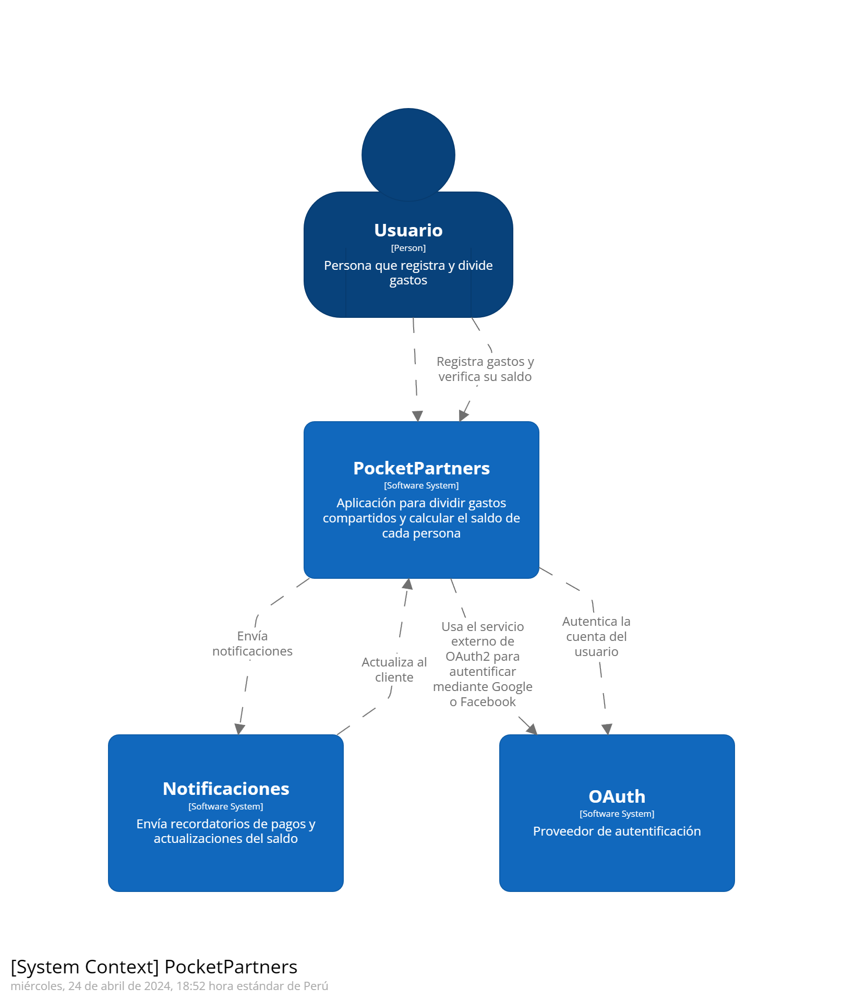
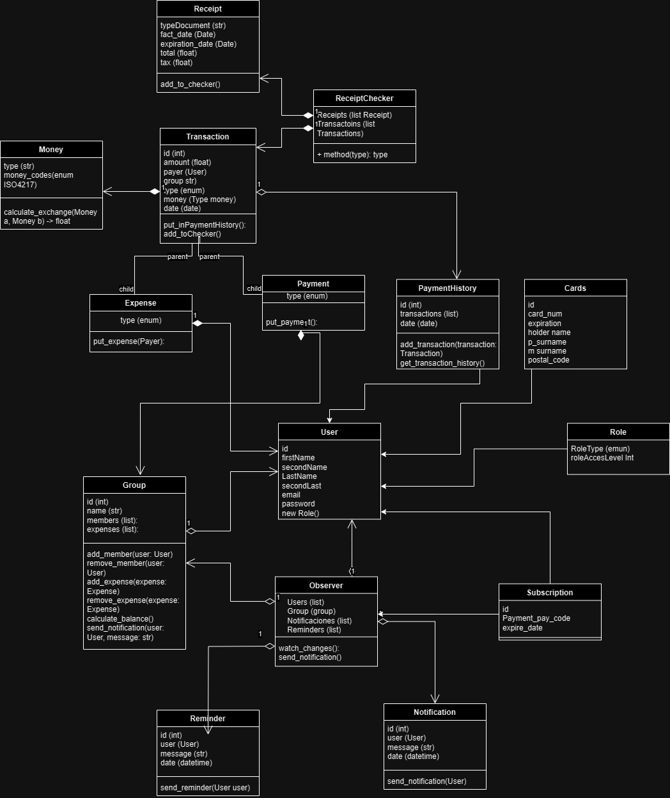
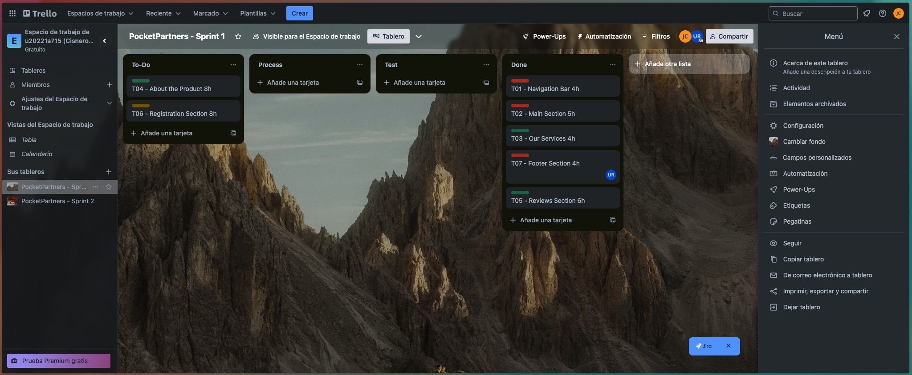
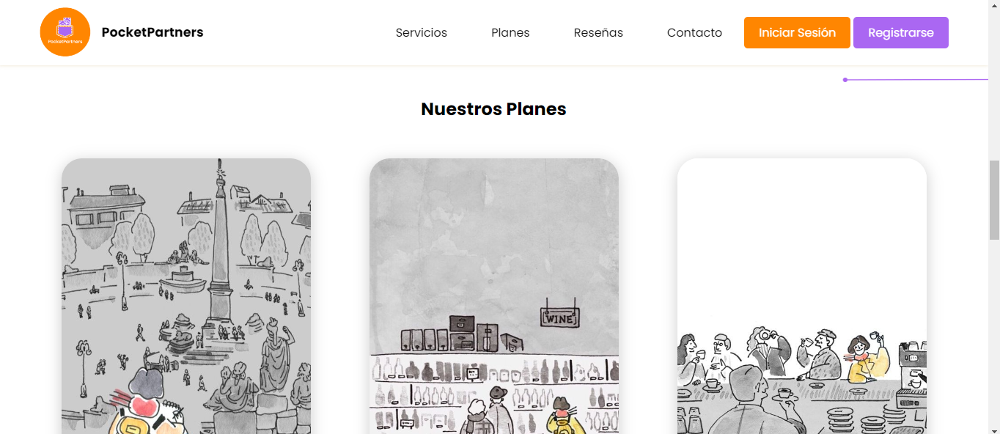

<p align="center">
  
</p>

<div align="center">

# Universidad Peruana de Ciencias Aplicadas

## Carrera de Ingeniería de Software

</div>

<div align="center">

Ciclo: 2024 - 0 1

Curso: Desarrollo de Aplicaciones Open Source

Sección: SW58

Profesor: Efraín Ricardo Bautista Ubillús

“Informe de Trabajo Final”

Startup: FairFinance

Producto: PocketPartners

Grupo: 03

|          Integrantes           |   Código   |
| :----------------------------: | :--------: |
| Carbajal Pozzo, Joaquín Alonso | U202121881 |
|  Cisneros Tafur, Diego Rafael  | U20221A715 |
|   Jarama Peñaloza, Fiorella    | U202120418 |
|      Ramos Carpio, Karen       | U20201E493 |
| Ventura Allasi, Randel Russell | U201910669 |

Abril 2024

</div>

# **Registro de Versiones**

<table>
  <thead>
    <tr>
        <th>Versión</th>
        <th>Fecha</th>
        <th>Autor</th>
        <th>Descripción de modificación</th>
    </tr>
  </thead>
  <tbody>
  <tr>
      <td><strong>TB1</strong></td>
      <td>Sábado 13 de Abril</td>
      <td>
        <ul>
          <li>Carbajal Pozzo, Joaquín Alonso</li>
          <li>Cisneros Tafur, Diego Rafael</li>
          <li>Jarama Peñaloza, Fiorella</li>
          <li>Ramos Carpio, Karen</li>
          <li>Ventura Allasi, Randel Russell</li>
        </ul>
      </td>
      <td>
        Se han incluído los siguientes capítulos:
        <ul>
          <li>Capítulo I: Introducción</li>
          <li>Capítulo II: Requirements Elicitation & Analysis</li>
          <li>Capítulo III: Requirements Specification</li>
          <li>Capítulo IV: Product Design</li>
          <li>Avance del Capítulo V: Product Implementation, Validation & Deployment hasta el punto 5.2.1.8</li>
          <li>Avance de Conclusiones, Bibliografía y Anexos</li>
        </ul>
      </td>
  </tr>
  </tbody>
</table>

# **Student Outcomes**

<table>
  <thead>
    <tr>
        <th>Criterio especifico</th>
        <th>Acciones realizadas</th>
        <th>Conclusiones</th>
    </tr>
  </thead>
  <tbody>
  <tr>
      <td><strong>Comunica en forma escrita ideas y/o resultados con objetividad a público de diferentes especialidades y niveles jerarquicos,en el marco deldesarrollo de un proyecto eningeniería</strong></td>
      <td>- Carbajal Pozzo, Joaquín Alonso TB1: En esta entrega se realizaron los diagramas C4, diagramasinvolucrados en el proceso de DDD o Domain Driven Design. Unacaracterística de esta metodología es el uso del lenguaje ubicuo quepermite a 	todos los stakeholders internos y externos del proyectoentender detalles técnicos a un alto nivel mediante la visualización de los diagramas  
      	- Cisneros Tafur, Diego Rafael TB1: Realizó la seccion de header en el landing page, además de sucorrespondiente codigo en javascript para cumplir funcionalidades.Adicionalmente se encargo de documentar los commits realizados por elequipo. 	- Jarama Peñaloza, Fiorella TB1: Para el trabajo se hizo uso de github para documentar el trabajo demodo que se aprendió a utilizar conventional commits y gitflow de modoque se pueda tener una correcta comunicación escrita en lo 		quecorresponde a la documentación del proyecto, además de aprender autiizar el lenguaje markdown para comunicarlo mediante github en unarchivo README.md - Ramos Carpio, Karen TB1: En el informe se comunicaron las herramientas a utilizar, su 	utilidad ylas convenciones típicas, esto con el objetivo de documentar el procesode elaboración y de explicar a un público ajeno al entorno de desarrollode software los pasos necesarios para diseñar a la aplicación Ventura Allasi, 	- Randel 	Russell TB1: Avance con tood el capitulo 4 y avance con el diagrama de base de datos</td>
      <td>Se logró realizar un trabajo sobresaliente,pues cumplimos con todos los segmentosdel trabajo, de tal manera que se puedaentregar un trabajo digno. El documentoredactado se presenta como un sustentoescrito para todo aquel que desee 	conocera detalle los pasos seguidos para planificar,desarrollar y enviar el proyecto aproducción</td>
  </tr>
   <tr>
      <td><strong>Comunicaoralmente sus ideas y/oresultados con objetividad a público de diferentes especialidades y niveles jerarquicos,en el marco del desarrollo de un proyecto en ingeniería </strong></td>
      <td>- Carbajal Pozzo, Joaquín Alonso TB1: Se llevó a cabo el proceso de entrevistas con los segmentos objetivos para realizar el proceso de requirements elicitation, se comunicó lapropuesta de solución a los clientes esperados del proyecto 	y se dirigió eldiseño de la solución a una opción que cumple con los requisitossolicitados.
      	- Cisneros Tafur, Diego Rafael TB1: Encargado de realizar la sección de sprint donde se incluye el sprintbacklog y sprint planning. De la mismas forma trabajo en el figmadiseñando la landing page y su versión responsive al igual que la 
       versiónresponsive de la aplicación web. Ramos Carpio, Karen TB1: TB1: A lo hora de realizar el trabajo se tuvo que mantener un constatecontacto con nuestros segmento objetivo para poder delimitarcorrectamente nuestra solución, asímismo 	mantener una buenacomunicación y organización mediante reuniones. - Jarama Peñaloza, Fiorella TB1: Para culminar la entrega de esta primera versión del trabajo final,resultó necesario realizar exposiciones grabadas dentro de las cuales 	seexpresan los requisitos del proyecto, cómo estos fueron implementados ycuál fue el ciclo de vida del desarrollo del software a elaborar - Randel Russell TB1: Avance con tood el capitulo 4 y avance con el diagrama de base de datos</td>
      <td>Como equipo pudimos establecer mediosde comunicación para poder entregar un trabajo completo ante el obstáculo quesuponen los cortos períodos de tiempopara la entrega del proyecto. De la mismamanera, se comunicaron los 			resultadosobtenidos a los stakeholders, quienes através de una serie de entrevistasdemostraron su satisfacción con elprograma </td>
  </tr>
	  
  </tbody>
</table>

# **Project Report Collaboration Insights**

URL Project Report (Github): https://github.com/PocketPartners/Informe

# **Tabla de Contenido**

- [Registro de Versiones](#registro-de-versiones)
- [Student Outcome](#student-outcome)
- [Capítulo I: Introducción](#Capítulo-I-Introducción)
  - [1.1. Startup Profile](#11-startup-profile)
    - [1.1.1. Descripción de la Startup](#111-descripción-de-la-startup)
    - [1.1.2. Perfiles de integrantes del equipo](#112-perfiles-de-integrantes-del-equipo)
  - [1.2. Solution Profile](#12-solution-profile)
    - [1.2.1. Antecedentes y problemática](#121-antecedentes-y-problemática)
    - [1.2.2. Lean UX Process](#122-lean-ux-process)
      - [1.2.2.1. Lean UX Problem Statements](#1221-lean-ux-problem-statements)
      - [1.2.2.2. Lean UX Assumptions](#1222-lean-ux-assumptions)
      - [1.2.2.3. Lean UX Hypothesis Statements](#1223-lean-ux-hypothesis-statements)
      - [1.2.2.4. Lean UX Canvas](#1224-lean-ux-canvas)
  - [1.3. Segmentos objetivo](#13-segmentos-objetivo)
- [Capítulo II: Requirements Elicitation & Analysis](#Capítulo-II-Requirements-Elicitation-&-Analysis)
  - [2.1. Competidores](#21-competidores)
    - [2.1.1. Análisis competitivo](#211-análisis-competitivo)
    - [2.1.2. Estrategias y tácticas frente a competidores](#212-estrategias-y-tácticas-frente-a-competidores)
  - [2.2. Entrevistas](#22-entrevistas)
    - [2.2.1. Diseño de entrevistas](#221-diseño-de-entrevistas)
    - [2.2.2. Registro de entrevistas](#222-registro-de-entrevistas)
    - [2.2.3. Análisis de entrevistas](#223-análisis-de-entrevistas)
  - [2.3. Needfinding](#23-needfinding)
    - [2.3.1. User Personas](#231-user-personas)
    - [2.3.2. User Task Matrix](#232-user-task-matrix)
    - [2.3.3. User Journey Mapping](#233-user-journey-mapping)
    - [2.3.4. Empathy Mapping](#234-empathy-mapping)
    - [2.3.5. As-is Scenario Mapping](#235-as-is-scenario-mapping)
  - [2.4. Ubiquitous Language](#23-ubiquitous-language)
- [Capítulo III: Requirements Specification](#Capítulo-III-Requirements-Specification)
  - [3.1. To-Be Scenario Mapping](#31-to-be-scenario-mapping)
  - [3.2. User Stories](#32-user-stories)
  - [3.3. Impact Mapping](#33-impact-mapping)
  - [3.4. Product Backlog](#34-product-backlog)
- [Capítulo IV: Product Design](#Capítulo-IV-Product-Design)
  - [4.1. Style Guidelines](#41-style-guidelines)
    - [4.1.1. General Style Guidelines](#411-general-style-guidelines)
    - [4.1.2. Web Style Guidelines](#412-web-style-guidelines)
  - [4.2. Information Architecture](#42-information-architecture)
    - [4.2.1. Organization Systems](#421-organization-systems)
    - [4.2.2. Labeling Systems](#422-labeling-systems)
    - [4.2.3. SEO Tags and Meta Tags](#423-seo-tags-and-meta-tags)
    - [4.2.4. Searching Systems](#424-searching-systems)
    - [4.2.5. Navigation Systems](#425-navigation-systems)
  - [4.3. Landing Page UI Design](#43-landing-page-ui-design)
    - [4.3.1. Landing Page Wireframe](#431-landing-page-wireframe)
    - [4.3.2. Landing Page Mock-up](#432-landing-page-mock-up)
  - [4.4. Web Applications UX/UI Design](#44-web-applications-uxui-design)
    - [4.4.1. Web Applications Wireframes](#441-web-applications-wireframes)
    - [4.4.2. Web Applications Wireflow Diagrams](#442-web-applications-wireflow-diagrams)
    - [4.4.3. Web Applications Mock-ups](#443-web-applications-mock-ups)
    - [4.4.4. Web Applications User Flow Diagrams](#444-web-applications-user-flow-diagrams)
  - [4.5. Web Applications Prototyping](#45-web-applications-prototyping)
  - [4.6. Domain-Driven Software Architecture](#46-domain-driven-software-architecture)
    - [4.6.1. Software Architecture Context Diagram](#461-software-architecture-context-diagram)
    - [4.6.2. Software Architecture Container Diagrams](#462-software-architecture-container-diagrams)
    - [4.6.3. Software Architecture Components Diagrams](#463-software-architecture-components-diagrams)
  - [4.7. Software Object-Oriented Design](#47-software-object-oriented-design)
    - [4.7.1. Class Diagrams](#471-class-diagrams)
    - [4.7.2. Class Dictionary](#472-class-dictionary)
  - [4.8. Database Design](#48-database-design)
    - [4.8.1. Database Diagram](#481-database-diagram)
- [Capítulo V: Product Implementation, Validation & Deployment](#Capítulo-V-Product-Implementation-Validation--Deployment)
  - [5.1. Software Configuration Management](#51-software-configuration-management)
    - [5.1.1. Software Development Environment Configuration](#511-software-development-environment-configuration)
    - [5.1.2. Source Code Management](#512-source-code-management)
    - [5.1.3. Source Code Style Guide & Conventions](#513-source-code-style-guide--conventions)
    - [5.1.4. Software Deployment Configuration](#514-software-deployment-configuration)
  - [5.2. Landing Page, Services & Applications Implementation](#52-landing-page-services--applications-implementation)
    - [5.2.1. Sprint n](#521-sprint-n)
      - [5.2.1.1. Sprint Planning n](#5211-sprint-planning-n) -[5.2.1.2. Sprint Backlog n](#5212-sprint-backlog-n)
      - [5.2.1.3. Development Evidence for Sprint Review](#5213-development-evidence-for-sprint-review)
      - [5.2.1.4. Testing Suite Evidence for Sprint Review](#5214-testing-suite-evidence-for-sprint-review)
      - [5.2.1.5. Execution Evidence for Sprint Review](#5215-execution-evidence-for-sprint-review)
      - [5.2.1.6. Services Documentation Evidence for Sprint Review](#5216-services-documentation-evidence-for-sprint-review)
      - [5.2.1.7. Software Deployment Evidence for Sprint Review](#5217-software-deployment-evidence-for-sprint-review)
      - [5.2.1.8. Team Collaboration Insights during Sprint](#5218-team-collaboration-insights-during-sprint)
  - [5.3. Validation Interviews](#53-validation-interviews)
    - [5.3.1. Diseño de Entrevistas](#531-diseño-de-entrevistas)
    - [5.3.2. Registro de Entrevistas](#532-registro-de-entrevistas)
    - [5.3.3. Evaluaciones según heurísticas](#533-evaluaciones-según-heurísticas)
  - [5.4. Video About-the-Product](#54-video-about-the-product)
- [Conclusiones](#conclusiones)
  - [Conclusiones y recomendaciones](#conclusiones-y-recomendaciones)
- [Video About-the-Team](#video-about-the-team)
- [Bibliografía](#bibliografía)
- [Anexos](#anexos)

# Capítulo I Introducción

## 1.1. Startup Profile

En esta sección se presenta la descripción del startup y los perfiles de los miembros del equipo

### 1.1.1. Descripción de la Startup

La startup, presentada con el nombre de “FairFinance”, se enfoca en facilitar la división de gastos y la gestión de finanzas compartidas entre grupos de personas.Para ello, implementa una plataforma donde los usuarios pueden crear grupos para organizar y compartir gastos, dentro de estos grupos, pueden agregar gastos, especificando quién pagó y cuánto, así como qué parte corresponde a cada persona. La aplicación calcula automáticamente las deudas y los saldos, mostrando claramente quién debe cuánto a quién, es especialmente útil para compañeros de cuarto, parejas, amigos o familiares
que comparten gastos en actividades como viajes, cenas, alquileres, facturas de servicios, compras compartidas. Por otro lado también ofrece características adicionales, como la posibilidad de dividir los gastos de forma equitativa según porcentajes personalizados, la programación de recordatorios de pago y la capacidad de agregar comentarios o notas a cada gasto. Además, proporciona opciones para liquidar deudas directamente lo que facilita la simplificación y la transparencia en la gestión de las finanzas compartidas.

Misión: Facilitar la administración equitativa y transparente de gastos compartidos, simplificando la gestión financiera entre amigos, familiares y compañeros de vivienda.

Visión: Convertirnos en la plataforma líder mundial para la gestión colaborativa de gastos, promoviendo la armonía y la transparencia en las relaciones financieras cotidianas.

Logotipo de la Startup:

<p style="text-align: center" align="center"> <p align="center"></p></p>

Logotipo del servicio:

<p style="text-align: center" align="center"> <p align="center"></p></p>

### 1.1.2. Perfiles de integrantes del equipo

<TABLE BORDER>
	<TR>
		<TH><h2>Intregantes</h2></TH> 
		<TH><h2>Descripción</h2></TH>
		<TH><h2>Conocimientos</h2></TH>
	</TR>
	<TR>
		<td style="text-align: center" align="center"><p align="center"> Fiorella Jarama - U202120418   </p></td> 
		<td style="text-align: center" align="center">Estudiante de 6to ciclo de la carrera de Ingeniería de Software. Me interesa la inteligencia artificial y el desarrollo de aplicaciones móviles. Me considero una persona responsable y 			autodidacta, soy buena trabajando en grupo y adquirir nuevos conocimientos de parte de mis compañeros.</td>
		<td style="text-align: center" align="center">Conocimiento de Frontend en lenguaje HTML, CSS, JavaScript. Conocimiento básico de C + +, Python, SQL. Habilidades en programas de diseño web, y conocimiento en Agile Frameworks</td>
	</TR>
	<TR>
		<td style="text-align: center" align="center"><p align="center"> Karen Ramos - U20201E493  </p></td>
		<td style="text-align: center" align="center">Cuento con gran capacidad de autoaprendizaje, esto me permite alcanzar mejores índices de productividad para la empresa de forma individual como en trabajo en equipo para poder llegar a los 		objetivos definidos por la empresa.Tengo un alto sentido del compromiso y la responsabilidad por lo que puedo garantizar que la tarea que me sea asignada será gestionada con diligencia.</td>
		<td style="text-align: center" align="center">Desarrollador entusiasta de resolución de problemas de .NET con experiencia en C#, JavaScript, TypeScript, Golang, C++, HTML CSS. Además de .NET, .Net Core, Angular, React y Kendo UI. 			Trabaja bien tanto individualmente como en un ambiente de equipo. Como profesional de TI, me dedico a administrar mis proyectos hasta su finalización, asegurándose de que se completen en el plazo establecido</td>
	</TR>
	<TR>
		<td style="text-align: center" align="center"><p align="center"> Joaquín Carbajal - U2021218813  </p></td>
		<td style="text-align: center" align="center">Estudiante de 5to ciclo de Ingeniería de Software. Me interesa el desarrollo móvil y el desarrollo web. En mis tiempos libres me gusta caminar, leer y cocinar. Considero que soy responsable 		y empeñoso para conseguir lo que busco.</td>
		<td style="text-align: center" align="center">Buen manejo de lenguajes como HTML, CSS y C++, conocimiento del funcionamiento y uso de otros lenguajes como C#, JavaScript, Typescript, Java y SQL.</td>
	</TR>
	<TR>
		<td style="text-align: center" align="center"><p align="center"> Diego Cisneros Tafur - U20221A715  </p></td>
		<td style="text-align: center" align="center">Estudiante de 5to ciclo de Ingeniería de software. Me gusta la inteligencia artificial, programación competitiva, hacking ético, jugar videojuegos y leer.</td>
		<td style="text-align: center" align="center">Domino C++, Python, SQL y Rust. También tengo conocimientos básicos de  JS y TS y me apasiona el desarrollo frontend y backend.</td>
	</TR>
	<TR>
		<td style="text-align: center" align="center"><p align="center"> Randel Ventura - U201910669  </p></td>
		<td style="text-align: center" align="center">21 años. Estudiante del 5to ciclo de Ingeniería de Software. Aspirante profesional del desarrollo web Frontend & Backend, inteligencia artificial, ML y Data Management.. Hobbies: Idiomas, 		tenis, literatura, cine francés y descubrir música</td>
		<td style="text-align: center" align="center">Conocimientos Web Frontend: HTML, CSS, JavaScript, TS. Conocimientos dedicados:  Python, TensorFlow, PyTorch. Organización y desarrollo Agile. Frameworks Web: React, Spring y Laravel. </td>
	</TR>
</TABLE>

## 1.2. Solution Profile

### 1.2.1. Antecedentes y problemática

What (Qué)
¿Cuál es el problema?

El problema radica en el desafío de dividir equitativamente los gastos y las facturas compartidas entre amigos, compañeros de cuarto, familiares y grupos, este proceso podía ser complicado y propenso a generar conflictos, ya que calcular quién debe cuánto y a quién puede resultar confuso y tedioso.

When (Cuándo)
¿Cuándo sucede el problema?

El dilema principal surge cuando se tiene situaciones donde hay gastos compartidos que deben dividirse equitativamente entre múltiples personas. Esto puede ocurrir en cualquier momento en el que un grupo de individuos comparta gastos, ya sea en viajes, cenas, facturas de servicios públicos o cualquier otro tipo de transacción económica compartida.

Where (Dónde)
¿A dónde se dirige?

El servicio está direccionado a ser agente de solución para los grupos de personas que comparten responsabilidades económicas de una mismo recinto.

¿Dónde surge el problema?

El problema se manifiesta durante el proceso de dividir y rastrear gastos compartidos. hay una necesidad de registrar fácilmente quién pagó qué, dividir los gastos de manera equitativa y realizar un seguimiento en tiempo real de quién debe dinero a quién, esto permite simplificar y transparentar este proceso, por otro lado, ayuda a prevenir malentendidos y conflictos relacionados con el dinero, mejorando así la experiencia de compartir gastos entre amigos, familiares y compañeros de vivienda.

Who (Quién)
¿Quiénes están involucrados? ¿Quién lo utilizará?

La plataforma será utilizada por una variedad de personas, incluidos amigos que comparten gastos en viajes, compañeros de apartamento que dividen el alquiler y las facturas, parejas que gestionan sus finanzas conjuntas, entre otros grupos que necesitan dividir y rastrear gastos compartidos.

Why (Por qué)
¿Cuál es la causa del problema?

La causa principal del problema es tener un registro manual de quién ha pagado qué y quién debe a quién puede resultar confuso y propenso a errores humanos, lo que puede dar lugar a malentendidos y conflictos.

¿Cuáles son las 2H?
How (Cómo)
¿Cómo se utilizará el producto?.

El producto será empleado para registrar fácilmente los gastos que comparten con otras personas, ingresando detalles como el monto, la descripción y quién participó en la transacción. A partir de ello, los usuarios pueden optar por dividir equitativamente el gasto entre todos los participantes, asignar porcentajes específicos a cada persona o personalizar la división según las contribuciones individuales.

¿Cómo lograremos desarrollar la correcta división de gastos entre nuestros usuarios?

Los técnicos y administradores acceden a la plataforma a través de un navegador. Dicha plataforma les permitirá revisar los cálculos de cada registro, así como la situación financiera global actual. Por otro lado, los usuarios pueden registrar todos los gastos de manera precisa dentro de la aplicación. Esto puede incluir la cantidad total del gasto, una descripción detallada y quiénes participaron en la transacción.Además, proporciona opciones flexibles para dividir los gastos.

.How (Cómo)
¿Cómo se utilizará el producto?

Permite a los usuarios registrar fácilmente quién pagó qué, dividir los gastos de manera equitativa y realizar un seguimiento en tiempo real de quién debe dinero a quién. Al simplificar y transparentar este proceso, podemos ayudar a prevenir malentendidos y conflictos relacionados con el dinero, mejorando así la experiencia de compartir gastos entre amigos, familiares y compañeros de vivienda.

How much (Cuánto)
¿Cuál es la magnitud del problema?

Según La Encuesta Nacional de Capacidades Financieras (2023), el 46% de la población peruana cuenta con un nivel medio de educación financiera y un 13% tiene un nivel adecuado; pero aún hay un 41% que carece de capacidades financieras, según revela la tercera Encuesta Nacional de Capacidades Financieras, desarrollada por la Superintendencia de Banca, Seguros y AFP del Perú (SBS) y la CAF - Banco de Desarrollo de América Latina, presentada en la inauguración de la Semana Mundial del Ahorro 2023. La encuesta tiene como objetivo conocer los niveles de conocimientos, actitudes y comportamientos de los peruanos con relación a temas financieros, así como identificar cambios producidos respecto a los años 2013 y 2019. Esta fue realizada por Ipsos-Perú en el año 2022 e incluyó a peruanos a partir de los 18 años de todos los niveles socioeconómicos en zonas urbanas como rural. Cabe precisar que la encuesta se basó en la metodología de la Organización para la Cooperación y el Desarrollo Económico (OECD) y que se trata de una iniciativa que forma parte de la Política Nacional de Inclusión Financiera. Por otro lado, el porcentaje de adultos que eligió un producto financiero a partir de una comparación o búsqueda de información creció de 56% a 60% entre el 2019 y 2022. Asimismo, el consejo de familiares y amigos mantiene su influencia (40% en 2019 y 42% en el 2022) al momento de elegir un producto financiero. Sin embargo, otras estrategias que incrementan su relevancia fueron la revisión de portales de comparación de precios, tasas y tarifas y la publicidad en redes sociales, con el 21% y 18%, respectivamente. Es ahí que se ve implicado Pocket Partners como alternativa de gestión para una buena salud financiera.

¿Qué porcentaje de usuarios se verá beneficiado por el servicio?

El sistema se dirige principalmente a grupos de personas que comparten gastos, como amigos, compañeros de apartamento, parejas, etc. Por lo tanto, el porcentaje de usuarios que se verán beneficiados depende en gran medida de la prevalencia de este tipo de relaciones y situaciones de compartición de gastos en la población general. En resumen, el porcentaje de usuarios que se verán beneficiados por el servicio probablemente sea significativo, especialmente entre aquellos que comparten gastos de manera regular en diversas situaciones sociales y de convivencia. Sin embargo, el porcentaje exacto variará dependiendo de factores demográficos y culturales específicos.

### 1.2.2. Lean UX Process

#### 1.2.2.1. Lean UX Problem Statements

- Hemos detectado que a los usuarios les resulta difícil realizar un seguimiento preciso de los gastos compartidos con varias personas, lo que genera confusión, disputas y cálculos manuales que consumen mucho tiempo.
- Hemos observado que los usuarios se sienten frustrados por la falta de actualizaciones en tiempo real sobre los gastos compartidos, lo que genera incertidumbre sobre sus obligaciones financieras y posibles gastos excesivos.
- Hemos notado que los usuarios expresan frustración por el esfuerzo manual necesario para clasificar los gastos con precisión, lo que genera registros desorganizados y dificultades para rastrear los patrones de gastos.
- Hemos detectado que los usuarios desean una integración perfecta con sus cuentas bancarias u otras plataformas financieras para agilizar el seguimiento de gastos y facilitar procesos de reembolso más rápidos.
- Hemos observado que los usuarios luchan con la complejidad de liquidar facturas dentro de grupos, incluidas contribuciones desiguales, pagos parciales y múltiples métodos de pago, lo que genera retrasos y malentendidos.
- Hemos observado que los usuarios expresan preocupaciones sobre la privacidad y la seguridad cuando comparten detalles de gastos con otros, particularmente en situaciones financieras delicadas o entre conocidos.
- Hemos notado que los usuarios enfrentan desafíos al asignar responsabilidades por gastos específicos dentro de los grupos, lo que genera desacuerdos y dificultades para resolver disputas de manera justa.
- Hemos detectado que los usuarios enfrentan desafíos al asignar responsabilidades por gastos específicos dentro de los grupos, lo que genera desacuerdos y dificultades para resolver disputas de manera justa.
- Hemos detectado que los usuarios se sienten abrumados por el volumen de notificaciones y alertas dentro de la aplicación, lo que genera distracciones y dificultades para priorizar actualizaciones importantes.

#### 1.2.2.2. Lean UX Assumptions

Business Assumptions:

1. Creemos que nuestros usuarios necesitan adoptar soluciones digitales para administrar gastos compartidos.
2. Estas necesidades se pueden satisfacer con el desarrollo de una plataforma que permitirá el acceso oportuno y confiable a una plataforma en línea en lugar de métodos tradicionales como llevar un registro manual en una hoja de cálculo.
3. Nuestros clientes están dispuestos a proporcionar información financiera, como detalles de cuentas bancarias o tarjetas de crédito, para facilitar los pagos y reembolsos a través de la aplicación.
4. El valor más importante de un cliente es la equidad y la transparencia en la división de gastos compartidos y están dispuestos a utilizar una herramienta como FarFinance para lograrlo.
5. El cliente también va a obtener diversos beneficios adicionales como visualizar reportes estadísticos dentro de la aplicación con datos actuales e históricos.
6. Vamos a obtener la mayoría de los clientes ya que prefieren una experiencia de usuario sin complicaciones que les permita registrar y dividir gastos fácilmente, sin la necesidad de aprender complejas funciones o características.
7. Vamos a obtener ingresos mediante el modelo de suscripción llamado FairFinance Pro y FairFinance Enterprise con diferentes niveles para el uso de la aplicación por parte de las empresas.
8. Las notificaciones y los recordatorios automáticos son eficaces para mantener a los usuarios comprometidos y recordarles registrar sus gastos y realizar pagos en la aplicación.
9. Vamos a tener ventaja frente a nuestra competencia debido a que la plataforma incluye validación contable con las version FarFinance Enterprise.
10. El mayor riesgo del servicio es que el segmento objetivo no se muestre dispuesto e interesado en automatizar los procesos de pago colectivo. Las razones vendrían a ser de un contexto interno social: problemas de adaptación,pensamiento estático y manejo de herramientas tecnológicas.

User Assumptions:

¿Quién es el usuario?

El usuario de FarFinance puede ser cualquier persona que necesita gestionar gastos compartidos de manera eficiente, ya sea en entornos personales o profesionales:

Amigos o compañeros de cuarto: Grupos de amigos que comparten gastos comunes, como el alquiler, las facturas de servicios públicos, las compras de comestibles y las cenas fuera.

Familias: Miembros de la familia que desean realizar un seguimiento de los gastos compartidos, como la compra de comestibles, la factura del teléfono celular o los gastos de viaje.

Compañeros de trabajo: Equipos de trabajo que necesitan dividir gastos relacionados con viajes de negocios, almuerzos de equipo, suministros de oficina compartidos, etc.

Estudiantes universitarios: Estudiantes universitarios que comparten gastos de vivienda, alimentos, libros de texto y otras necesidades estudiantiles comunes.

Viajeros: Grupos de amigos o familias que viajan juntos y desean dividir los costos de alojamiento, transporte, comidas y actividades.

Grupos sociales y comunitarios: Clubes, organizaciones sin fines de lucro o equipos deportivos que necesitan rastrear y dividir los costos de eventos, salidas grupales o actividades compartidas.

Profesionales autónomos y freelancers: Trabajadores independientes que necesitan gestionar gastos comerciales compartidos, como alquiler de espacios de trabajo, herramientas y suministros.

Grupos de proyectos o equipos de estudio: Estudiantes o profesionales que trabajan en proyectos grupales o académicos y necesitan compartir gastos relacionados con materiales, reuniones, etc.

¿Qué problemas tiene nuestro producto? ¿Resolver?

Un problema que enfrenta actualmente la aplicación, radica en que para algunos usuarios, especialmente aquellos menos familiarizados con la tecnología, la interfaz podría resultar confusa o compleja de usar. Esto puede dificultar la adopción y el uso continuo de la aplicación.Por otro lado, aunque se ofrece una amplia gama de características útiles, algunos usuarios pueden encontrar que carece de ciertas funcionalidades específicas que podrían mejorar su experiencia de usuario. Por ejemplo, puede haber demanda de características adicionales de informes o integraciones con otras aplicaciones financieras. Además, dado que involucra compartir información financiera y personal con otros usuarios, la privacidad y la seguridad de los datos son preocupaciones importantes. Cualquier brecha de seguridad o preocupación relacionada con la privacidad podría afectar la confianza de los usuarios en la aplicación.

¿Qué características son importantes?

Las características más importantes de la plataforma son:
Permite dividir los gastos de manera equitativa entre amigos, compañeros de piso o familiares. Esto es especialmente útil para situaciones en las que múltiples personas comparten gastos, como el alquiler, las facturas de servicios públicos, las comidas compartidas, etc.
Registra quién debe dinero a quién, manteniendo un seguimiento claro de las deudas compartidas. Esto elimina la necesidad de llevar un registro manual y reduce las posibilidades de conflictos sobre quién debe pagar qué.
Es útil para grupos de personas que pueden utilizar diferentes monedas. La aplicación admite múltiples monedas y realiza conversiones automáticamente, lo que facilita la gestión de gastos compartidos en diferentes países o regiones.

¿Dónde encaja nuestro producto en su trabajo o vida?

El producto encaja en varios aspectos de la vida y el trabajo, especialmente en situaciones donde las personas comparten gastos y necesitan una forma conveniente y equitativa de administrar sus finanzas compartidas

¿Cuándo y cómo es nuestro producto usado?

El servicio será utilizado por el segmento objetivo cuando surja la necesidad de agregar nuevos gastos, especificar quién participa en ellos, dividir equitativamente la cantidad, agregar comentarios y notas, y realizar un seguimiento de las deudas compartidas. La aplicación también proporciona notificaciones y recordatorios para ayudar a los usuarios a mantenerse al día con sus gastos compartidos y pagos pendientes.

¿Cómo debe verse nuestro producto y cómo debe comportarse?

La apariencia y el comportamiento deseado de FarFinance deben enfocarse en la usabilidad, la claridad y la eficiencia para facilitar la gestión de gastos compartidos, la interfaz de usuario debe ser simple y clara, con un diseño intuitivo que permita a los usuarios navegar fácilmente por la aplicación y acceder a todas las funciones importantes sin confusión. Por otro lado debe verse como una aplicación limpia, organizada y con funcionalidades claras y directas que faciliten la gestión de gastos compartidos para los usuarios.

Feature Assumptions:

Creemos que la aplicación debe contar con una interfaz de usuario intuitiva y fácil de usar para gestionar sus gastos compartidos, por lo que las características se desarrollan teniendo en cuenta la simplicidad y la intuición en el diseño de la interfaz de usuario.

Creemos que la plataforma debe de tener la capacidad de manejar recordatorios para realizar pagos, por lo que las características incluyen notificaciones y recordatorios automáticos para ayudar a los usuarios a mantenerse al día con sus finanzas compartidas.

Creemos que nuestros usuarios valoran la seguridad y la privacidad de sus datos financieros, por lo que las características se diseñan para garantizar la protección de la información personal y financiera de los usuarios mediante medidas de seguridad adecuadas.

Creemos que los usuarios pueden tener diferentes preferencias y necesidades en la forma en que desean dividir sus gastos compartidos, por lo que las características proporcionan opciones flexibles para dividir los gastos de manera equitativa según las preferencias individuales.

#### 1.2.2.3. Lean UX Hypothesis Statements

Hypothesis Statement 01:
Creemos que si simplificamos el proceso de división de gastos en FairFinance, entonces los usuarios encontrarán más fácil y rápido agregar y dividir gastos compartidos, lo que aumentará la adopción y retención de la aplicación

Hypothesis Statement 02:
Creemos que si implementamos notificaciones y recordatorios automáticos para deudas pendientes en FairFinance, entonces los usuarios estarán más al tanto de sus obligaciones financieras compartidas y tomarán medidas para resolverlas a tiempo, mejorando así la gestión de gastos compartidos.

Hypothesis Statement 03:
Creemos que si mejoramos la sincronización de datos en FairFinance, entonces los usuarios podrán acceder y actualizar su información de gastos compartidos de manera consistente desde cualquier dispositivo, lo que aumentará la conveniencia y la utilidad de la aplicación.

Hypothesis Statement 04:
Creemos que si implementamos medidas de seguridad adicionales para proteger la información financiera y personal de los usuarios en FairFinance, entonces los usuarios tendrán una mayor confianza en la privacidad de sus datos y estarán más inclinados a compartir información sensible a través de la aplicación.

#### 1.2.2.4. Lean UX Canvas

El Lean UX Canvas es una herramienta utilizada en el campo del diseño centrado en el usuario (UX) y la metodología Lean para crear y desarrollar productos de manera más eficiente y efectiva. Su objetivo es proporcionar un marco estructurado para la colaboración entre equipos multidisciplinarios. A continuación se presenta el Lean UX Canvas trabajado por el equipo a través de la herramienta digital Mural:
<p style="text-align: center" align="center"> <p align="center"></p></p>
<A HREF="https://app.mural.co/t/opso6836/m/opso6836/1712598445725/0636fb07984bf6d4efa16afadcf32ed49794f9cd?sender=u3a3ac67b672d09ad13ca4525"> Lean UX Canvas PocketPartners </A>

<p style="text-align: center" align="center"> <p align="center"></p></p>
<A HREF="https://app.mural.co/t/opso6836/m/opso6836/1712598445725/0636fb07984bf6d4efa16afadcf32ed49794f9cd?sender=u3a3ac67b672d09ad13ca4525"> Lean UX Canvas PocketPartners </A>

## 1.3. Segmentos objetivo

El segmento objetivo de PcketPartners consiste en personas y grupos que comparten gastos y desean una solución conveniente y efectiva para rastrear, dividir y liquidar esos gastos. Aquí hay algunos segmentos específicos que podrían formar parte del público objetivo de PocketPartners:

Grupos de Amigos o Compañeros de Piso: Personas que comparten gastos comunes, como el alquiler, las facturas de servicios públicos, las compras de comestibles y las salidas sociales.

Familias o Parejas: Hogares que desean administrar y dividir los gastos compartidos, incluyendo facturas, compras familiares y actividades recreativas.

Grupos de Viajeros: Amigos o familiares que viajan juntos y necesitan rastrear y dividir los gastos relacionados con el transporte, el alojamiento, la comida y las actividades turísticas.

Grupos de Trabajo o Proyectos: Equipos que colaboran en proyectos o actividades compartidas y necesitan una forma de dividir y registrar los gastos relacionados con el trabajo.

Estudiantes o Residentes Universitarios: Estudiantes universitarios que viven juntos o comparten gastos de manera informal, como el alquiler de alojamiento, la compra de alimentos y los gastos de ocio.

Profesionales Autónomos o Freelancers: Individuos que trabajan de forma independiente y necesitan rastrear y dividir los gastos relacionados con proyectos, clientes y actividades laborales.

Grupos de Organizaciones sin Fines de Lucro o Clubes: Organizaciones sin fines de lucro, asociaciones o clubes que necesitan una manera de administrar y dividir los gastos compartidos entre sus miembros.

PcketPartners se dirige a una amplia variedad de usuarios que comparten gastos en diferentes contextos y situaciones de la vida, ofreciendo una solución versátil y adaptable para satisfacer las necesidades de estos segmentos específicos.

# Capítulo II Requirements Elicitation & Analysis

## 2.1. Competidores

### 2.1.1. Análisis Competitivo

<table>
    <thead>
        <tr >
            <th colspan=6 style="text-align: center">
				<h2>
					Competitive Analisis Landscape
				</h2>
			</th>
        </tr>
    </thead>
    <tbody>
        <tr>
            <td colspan=2 rowspan=2 style="text-align: center" align="center">¿Por qué llevar a cabo este análisis?</td>
            <td colspan=4 style="text-align: center" align="center">¿Quiénes son nuestros principales competidores?</td>
        </tr>
		<tr>
            <td colspan=4 style="text-align: center" align="center">Gracias al análisis de la competencia, se logra comprender el entorno competitivo en el que operará nuestro producto. Esto proporciona una visión detallada de quienes son nuestros competidores directos e indirectos, logrando así, trazar 
 una estretegia sólida para alcanzar la máxima exposición de nuestro producto, llegando así a más posibles consumidores.</td>
        </tr>
		<tr>
			<td rowspan=3 style="text-align: center" align="center">Perfil</td>
			<td rowspan=2 style="text-align: center" align="center">Overview</td>
      <td style="text-align: center" align="center">PocketPartners <p align="center">
</p></td>
			<td style="text-align: center" align="center">Splittr <p align="center"></p></td>
			<td style="text-align: center" align="center">Tricount <p align="center"></p></td>
			<td style="text-align: center" align="center">Splitwise <p align="center"></p></td>
		</tr>
		<tr>
			<td style="text-align: center" align="center">Plataforma que busca facilitar el proceso de división de costos en diversas situaciones, con varias herramientas que son de utilidad en dicho momento</td>
			<td style="text-align: center" align="center">Plataforma que busca dividir los gastos grupales en viajes o comidas.</td>
			<td style="text-align: center" align="center">Plataforma colaborativa que busca dividir todo tipo de gastos grupales.</td>
			<td style="text-align: center" align="center">Plataforma que busca, de forma colaborativa, llevar un recuento de todos los gastos grupales que se hacen.</td>
		</tr>
		<tr>
			<td style="text-align: center" align="center">Ventaja Competitiva ¿Qué valor ofrecen a los clientes</td>
			<td style="text-align: center" align="center"><ul><li>Organización por grupos y etiquetas</li> <li>Notificaciones en tiempo real</li> <li>Beneficios adicionales por plan premium</li></ul> </td>
			<td style="text-align: center" align="center"><ul><li>Simplicidad de la plataforma</li> <li>Exportar a pdf o cvs</li> <li>No requiere registro</li></ul> </td>
			<td style="text-align: center" align="center"><ul><li>División desigual de gastos</li> <li>Guardado de fotos</li> <li>Notificaciones en tiempo real</li></ul> </td>
			<td style="text-align: center" align="center"><ul><li>Facilidad de uso</li> <li>Sincronización en la nube</li> <li>Métodos de pago integrados</li> <li>Funciones pro adicionales</li></ul> </td>
		</tr>
		<tr>
			<td rowspan=2 style="text-align: center" align="center">Perfil del Marketing</td>
			<td style="text-align: center" align="center">Mercado Objetivo</td>
			<td style="text-align: center" align="center"><ul><li>Viajeros que busquen dividir sus gastos</li> <li>Roomates que quieran dividir los gastos del hogar</li> <li>Grupos de personas que desean dividir los gastos de una cena</li></ul> </td>
			<td style="text-align: center" align="center"><ul><li>Viajes</li> <li>Casas compartidas</li></ul> </td>
			<td style="text-align: center" align="center"><ul><li>Parejas que desean dividir gastos</li> <li>Viajeros que quieren gestionar sus compras</li> <li>Comapñeros de piso</li></ul> </td>
			<td style="text-align: center" align="center"><ul><li>Viajeros</li> <li>Compañeros de piso</li> <li>Parejas</li> <li>Grupos de amigos</li></ul> </td>
		</tr>
		<tr>
			<td style="text-align: center" align="center">Estrategias de Marketing</td>
			<td style="text-align: center" align="center"><ul><li>Uso de publicidad en redes sociales</li> <li>Recomendación de voz a voz</li> <li>Prueba gratis de 30 días del plan premium para lograr retención</li></ul> </td>
			<td style="text-align: center" align="center"><ul><li>Promoción de la app en su cuenta de Twitter</li></ul> </td>
			<td style="text-align: center" align="center"><ul><li>Presentación de referencias en su landing page</li> <li>Cuentas activas de Facebook y Twitter</li></ul> </td>
			<td style="text-align: center" align="center"><ul><li>Presentación en una landing page vistosa</li> <li>Fácil acceso a los contactos para invitar más personas</li> <li>Página de redes sociales</li></ul> </td>
		</tr>
		<tr>
			<td rowspan=3 style="text-align: center" align="center">Perfil del Producto</td>
			<td style="text-align: center" align="center">Productos & Servicios</td>
			<td style="text-align: center" align="center">Sitio web para el registro y uso de nuestro aplicativo</td>
			<td style="text-align: center" align="center">Aplicativo móvil para el uso de la solución</td>
			<td style="text-align: center" align="center">Aplicativo móvil para el uso de la solución</td>
			<td style="text-align: center" align="center">Aplicativo móvil para el uso de la solución</td>
		</tr>
		<tr>
			<td style="text-align: center" align="center">Precios & Costos</td>
			<td style="text-align: center" align="center"><ul><li>Suscripción de un mes - 9.90 soles</li> <li>Suscripción de un año - 29.90 soles</li> <li>Suscripción empresarial - 169.90 soles</li></ul> </td>
			<td style="text-align: center" align="center"><ul><li>Pase de un mes - 2.90 soles</li> <li>Suscripción de un año - 11.90 soles</li> <li>Pase de por vida - 39.90 soles</li></ul> </td>
			<td style="text-align: center" align="center"><ul><li>Suscripción de un mes - 12.90 soles</li> <li>Suscripción de un año - 35.90 soles</li></ul> </td>
			<td style="text-align: center" align="center"><ul><li>Suscripción de un mes - 19.90 soles</li> <li>Suscripción de un año - 149.90 soles</li></ul> </td>
		</tr>
		<tr>
			<td style="text-align: center" align="center">Canales de distribución (web/móvil)</td>
			<td style="text-align: center" align="center">Plataforma web</td>
			<td style="text-align: center" align="center">Plataforma móvil</td>
			<td style="text-align: center" align="center">Plataforma móvil</td>
			<td style="text-align: center" align="center">Plataforma móvil</td>
		</tr>
		<tr>
			<td rowspan=4 style="text-align: center" align="center">Análisis SWOT</td>
			<td style="text-align: center" align="center">Fortalezas</td>
			<td style="text-align: center" align="center"><ul><li>Canales de atención disponibles</li> <li>Cálculo automático de saldos</li> <li>Uso de etiquetas para categorizar y filtrar las transacciones</li></ul> </td>
			<td style="text-align: center" align="center"><ul><li>Funciona offline</li> <li>Se sincroniza de forma automática con nuestros amigos</li></ul> </td>
			<td style="text-align: center" align="center"><ul><li>Uso de imágenes como evidencia</li> <li>Uso de claves de color para mejor visualización</li></ul> </td>
			<td style="text-align: center" align="center"><ul><li>Integración con cuentas de banco para realizar los pagos dentro de la misma aplicación</li> <li>División en partes iguales o desiguales</li></ul> </td>
		</tr>
		<tr>
			<td style="text-align: center" align="center">Debilidades</td>
			<td style="text-align: center" align="center"><ul><li>Requiere de conección a internet</li> <li>No soporta muchos idiomas</li></ul> </td>
			<td style="text-align: center" align="center"><ul><li>El diseño es demasiado simple</li> <li>Carece de diferenciadores con la competencia</li> <li>Cobra por features que se encuentran gratis en otras aplicaciones</li></ul> </td>
			<td style="text-align: center" align="center"><ul><li>La interfaz no es fácil de usar</li> <li>Cobra por features que se encuentran gratis en otras aplicaciones</li></ul> </td>
			<td style="text-align: center" align="center"><ul><li>Te da una cantidad de gastos limitados en el plan gratuito</li> <li>Los planes premium son demasiado costosos</li></ul> </td>
		</tr>
		<tr>
			<td style="text-align: center" align="center">Oportunidades</td>
			<td style="text-align: center" align="center"><ul><li>Es posible agregar más funcionalidades</li> <li>Ya se está empezando a crear un mercado gracias a las otras apps</li></ul> </td>
			<td style="text-align: center" align="center">Se puede agregar un poco más de profundidad al diseño</td>
			<td style="text-align: center" align="center">Se puede mejorar la interfaz para que sea más intuitiva</td>
			<td style="text-align: center" align="center">Es la aplicación con más features</td>
		</tr>
		<tr>
			<td style="text-align: center" align="center">Amenazas</td>
			<td style="text-align: center" align="center">Es comlpicado competir con aplicaciones ya establecidas en el mercado</td>
			<td style="text-align: center" align="center">Sigue quedándose atrás en la cantidad de features que tiene comparado con la competencia</td>
			<td style="text-align: center" align="center">Los consumidores están acostumbrados a aplicaciones intuitivas, por lo que aprender a utilizar una app va a ser complicaco para algunos usuarios</td>
			<td style="text-align: center" align="center">Los precios altos ocasionan que los usuarios no deseen pagar la suscripción</td>
		</tr>
    </tbody>
</table>

### 2.1.2. Estrategias y tácticas frente a competidores

Gracias al análisis presentado anteriormente, logramos identificar todos los aspectos necesarios para poder idear un plan de acción de forma efectiva. Con el cuál lograremos un mejor producto con mejores resultados después del periodo de lanzamiento. Acontinuación se brindará dicho plan, representado en una serie de estrategias y tácticas para alcanzar lo anteriormente mencionado.

**Afrontando las fortalezas de nuestros competidores:**

- Se sincroniza de forma automática con nuestros amigos
- Uso de imágenes como evidencia
- Uso de claves de color para mejor visualización
- Integración con cuentas de banco para realizar los pagos dentro de la misma aplicación

**Comprendemos que nuestras fortalezas son:**

- Canales de atención disponibles
- Cálculo automático de saldos
- Uso de etiquetas para categorizar y filtrar las transacciones

Entonces, podemos aplicar las siguientes estrategias y tácticas:

**Estrategias**

- Hacer que el usuario se sienta cómodo utilizando nuestra aplicación.

**Tácticas**

- Aplicar códigos de color para que sea más amigable visualmente para los consumidores
- Agregar la opción de agregar imágenes
- Añadir la sincronización en tiempo real

**Afrontando las debilidades de nuestros competidores:**

- El diseño es demasiado simple
- Cobra por features que se encuentran gratis en otras aplicaciones
- La interfaz no es fácil de usar
- Los planes premium son demasiado costosos

**Comprendemos que nuestras debilidades son:**

- Requiere de conección a internet
- No soporta muchos idiomas

Entonces, podemos aplicar las siguientes estrategias y tácticas:

**Estrategias**

- Crear un ambiente intuitivo y visual para que el usuario no se sienta perdido al momento de utilizar el aplicativo, además de brindarle el mejor valor por su dinero

**Tácticas**

- Utilizar un diseño llamativo
- Crear una interfaz dinámica e intuitiva
- No elevar demasiado los costos luego del posicionamiento inicial
- Agregar más features gratis

**Afrontando las oportunidades de nuestros competidores:**

- Se puede agregar un poco más de profundidad al diseño
- Se puede mejorar la interfaz para que sea más intuitiva
- Es la aplicación con más features

**Comprendemos que oportunidades fortalezas son:**

- Es posible agregar más funcionalidades
- Ya se está empezando a crear un mercado gracias a las otras apps

Entonces, podemos aplicar las siguientes estrategias y tácticas:

**Estrategias**

- Aprovecharemos las oportunidades de nuestros competidores para agregar sus mejoras a nuestro aplicativo

**Tácticas**

- Añadir las mejoras de nuestros competidores
- Aprovechar el mercado existente para tener más alcance

**Afrontando las amenazas de nuestros competidores:**

- Sigue quedándose atrás en la cantidad de features que tiene comparado con la competencia
- Los consumidores están acostumbrados a aplicaciones intuitivas, por lo que aprender a utilizar una app va a ser complicaco para algunos usuarios
- Los precios altos ocasionan que los usuarios no deseen pagar la suscripción

**Comprendemos que nuestras amenazas son:**

- Es comlpicado competir con aplicaciones ya establecidas en el mercado

Entonces, podemos aplicar las siguientes estrategias y tácticas:

**Estrategias**

- Utilizaremos las amenazas de los otros competidores para evitar caer en los mismos errores que ellos

**Tácticas**

- No aumentar mucho los precios
- Siempre comparar nuestros features con los de la competencia para no quedarnos por detrás
- Crear una interfaz intuitiva y simple

## 2.2. Entrevistas

### 2.2.1. Diseño de entrevistas

_Preguntas generales:_

- ¿Cuál es su nombre?
- ¿Cuántos años tiene?
- ¿Cuál es la actividad que más realiza con sus amigos o conocidos?

## Preguntas para viajeros

1. Al momento de realizar su viaje, ¿cómo llevan los registros de los gastos de cada uno?
2. Cuando viaja con sus amigos, ¿cómo suelen realizar los pagos?
3. ¿Cuál piensa que es la mayor dificultad al momento de hacer esta operación?
4. ¿Encuentra tardado este proceso de divisón?
5. ¿Qué hace cuando se olvida anotar algún gasto o préstamo realizado?
6. ¿Conoce alguna herrmienta que le pueda ayudar a realizar estos cálculos?

## Preguntas para amigos que salen a almorzar

1. Cuando salen a cenar, ¿cómo pagan la cuenta?
2. ¿Cómo hacen para recordar cuánto debe pagar cada uno?
3. ¿Cuánto tiempo se demoran en el proceso del cálculo?
4. ¿Qué hace cuando se olvida anotar algún gasto o préstamo realizado?
5. ¿Conoce alguna herrmienta que le pueda ayudar a realizar estos cálculos?
6. ¿Cuál piensa que es la mayor dificultad al momento de hacer esta operación?

## Preguntas para compañeros de piso

1. ¿Cuál es su proceso para dividir los gastos?
2. ¿Cómo lleva registro de los gastos?
3. ¿Cómo lleva registro de los pagos?
4. ¿Conoce alguna manera de hacer más simple este tema?
5. ¿Cuál es la mayor dificultad que tiene al momento de realizar esta operación?
6. ¿Conoce alguna herramienta que le pueda ayudar a realizar estos cálculos?

### 2.2.2 Registro de entrevistas

#### Renzo Castro, 20 años.

 <div align="center">
  
 </div>
 
 Link de la entrevista: https://upcedupe-my.sharepoint.com/:v:/g/personal/u20221a715_upc_edu_pe/EeGZzWgvpHBJr63SdUhU5nMBkNyqKHawW4ybbB9OPmhAcA?e=Vjn5sO

##### Resumen de la entrevista

El entrevistado indica que al momento de viajar o en salidas con amigos y a la vez con personas con las que vive, utiliza herramientas conocidas como papel y lápiz, Google Sheets o Excel para llevar el registro de los gastos. Indica que el proceso de división de gastos es demora y que en ocasiones se olvida de anotar algún gasto o préstamo. Además, menciona que no conoce muchas herramientas que le ayuden con los cálculos o que le faciliten el proceso aparte de Splitwise o otra mas conocida.
<br>

#### Margarita Robles, 36 años.

 <div align="center">
  
 </div>
 
 Link de la entrevista: https://upcedupe-my.sharepoint.com/:v:/g/personal/u201910669_upc_edu_pe/EbK5VeI6FutMvlmYek5mUAsBqUxNTBMrT530l3pD0BRmsg?e=XoEv29&nav=eyJyZWZlcnJhbEluZm8iOnsicmVmZXJyYWxBcHAiOiJTdHJlYW1XZWJBcHAiLCJyZWZlcnJhbFZpZXciOiJTaGFyZURpYWxvZy1MaW5rIiwicmVmZXJyYWxBcHBQbGF0Zm9ybSI6IldlYiIsInJlZmVycmFsTW9kZSI6InZpZXcifX0%3D

##### Resumen de la entrevista

La entrevistada indica ser una viajera concurrente con sus amigos o grupos afines de la misma actividad, utiliza herramientas caseras de apuntes como un cuadernillo, notas en el celular al momento de hacer registros y una calculadora al hacer los cálculos finales. Indica que el proceso de división de todos los gastos le toma buen tiempo de demora y que en ocasiones se da cuenta que olvidó anotar algún gasto o préstamo, lo cual es molesto. Menciona que no conoce ninguna herramienta que le ayude con los cálculos o que le faciliten el proceso de registras los gastos compartidos con sus compañeros viajeros, así que está contenta y dispuesta de recibir mayores noticias de nuestro producto PocketPartners.

#### Elizabeth Saico Quispe, 32 años.

 <div align="center">
  
 </div>
 
 Link de la entrevista: https://www.youtube.com/watch?v=-d7Rogkp794


##### Resumen de la entrevista

La entrevistada indica que es muy importante llevar el gasto, ya que algunas ocasionaes uno paga ya sea con yape o tranferencia y los demas le hacen en recargo, pero muchas veces es tedioso llevar un control en imagenes de dichos pagos la mayoria de veces solo se usa whatsapp sobre todo cuandos se tiene un viaje programado, por ahora el unico registro que lleva es el del historial de imagenes de whatsapp y el registrr de movimiento de sus tarjetas. Con el pasar de los dias de la finalizacion de algun viaje eso termina olvidandose y nunca se saldan cuentas.<br>

### 2.2.3. Análisis de entrevistas

<p align="justify">Los entrevistados destacan la necesidad de simplificar y agilizar el proceso de dividir gastos durante viajes y salidas con amigos o compañeros de vivienda. En ambas situaciones, los entrevistados utilizan métodos tradicionales como papel y lápiz, Google Sheets o Excel para llevar un registro de los gastos compartidos, pero enfrentan desafíos como la demora en el proceso, olvidos de gastos o préstamos, y la falta de conocimiento sobre herramientas más eficientes. Sin embargo, muestran disposición para adoptar soluciones que faciliten esta tarea. En este contexto, PocketPartners emerge como una solución prometedora. Al ofrecer una interfaz intuitiva, cálculos automáticos y registro en tiempo real, esta aplicación tiene el potencial de simplificar drásticamente el proceso de división de gastos, ayudando a los usuarios a gestionar de manera más efectiva sus finanzas compartidas durante sus actividades sociales y de viaje.</p>

## 2.3. Needfinding

### 2.3.1 User Personas

## **User persona viajero**

<p align="center"></p>

## **User persona que frecuenta restaurantes**

<p align="center"></p>

## **User persona compañero de piso**

<p align="center"></p>

### 2.3.2 User task Matrix

<table>
    <thead>
        <tr >
        	<th colspan=1 style="text-align: center"></th>
		<th colspan=2 style="text-align: center">Viajero</th>
		<th colspan=2 style="text-align: center">Frecuenta restaurantes</th>
		<th colspan=2 style="text-align: center">Tiene compañeros de piso</th>
        </tr>
    </thead>
    <tbody>
        <tr>
        	<td style="text-align: center" align="center">TASK</td>
        	<td style="text-align: center" align="center">FREQUENCY</td>
		<td style="text-align: center" align="center">IMPORTANCE</td>
		<td style="text-align: center" align="center">FREQUENCY</td>
		<td style="text-align: center" align="center">IMPORTANCE</td>
		<td style="text-align: center" align="center">FREQUENCY</td>
		<td style="text-align: center" align="center">IMPORTANCE</td>
        </tr>
	<tr>
        	<td style="text-align: center" align="center">Dividir los gastos</td>
        	<td style="text-align: center" align="center">Always</td>
		<td style="text-align: center" align="center">High</td>
		<td style="text-align: center" align="center">Always</td>
		<td style="text-align: center" align="center">High</td>
		<td style="text-align: center" align="center">Always</td>
		<td style="text-align: center" align="center">High</td>
        </tr>
	<tr>
        	<td style="text-align: center" align="center">Calcular los gastos</td>
        	<td style="text-align: center" align="center">Sometimes</td>
		<td style="text-align: center" align="center">Medium</td>
		<td style="text-align: center" align="center">Always</td>
		<td style="text-align: center" align="center">HIgh</td>
		<td style="text-align: center" align="center">Always</td>
		<td style="text-align: center" align="center">High</td>
        </tr>
	<tr>
        	<td style="text-align: center" align="center">Mantener registro de deudas</td>
        	<td style="text-align: center" align="center">Always</td>
		<td style="text-align: center" align="center">High</td>
		<td style="text-align: center" align="center">Sometimes</td>
		<td style="text-align: center" align="center">High</td>
		<td style="text-align: center" align="center">Always</td>
		<td style="text-align: center" align="center">High</td>
        </tr>
	<tr>
        	<td style="text-align: center" align="center">Mantener registro de pagos</td>
        	<td style="text-align: center" align="center">Always</td>
		<td style="text-align: center" align="center">High</td>
		<td style="text-align: center" align="center">Always</td>
		<td style="text-align: center" align="center">Medium</td>
		<td style="text-align: center" align="center">Always</td>
		<td style="text-align: center" align="center">High</td>
        </tr>
	<tr>
        	<td style="text-align: center" align="center">Rotular los gastos</td>
        	<td style="text-align: center" align="center">Sometimes</td>
		<td style="text-align: center" align="center">Medium</td>
		<td style="text-align: center" align="center">Never</td>
		<td style="text-align: center" align="center">Low</td>
		<td style="text-align: center" align="center">Sometimes</td>
		<td style="text-align: center" align="center">Low</td>
        </tr>
	<tr>
        	<td style="text-align: center" align="center">Uso de múltiples divisas</td>
        	<td style="text-align: center" align="center">Sometimes</td>
		<td style="text-align: center" align="center">High</td>
		<td style="text-align: center" align="center">Never</td>
		<td style="text-align: center" align="center">Low</td>
		<td style="text-align: center" align="center">Sometimes</td>
		<td style="text-align: center" align="center">Medium</td>
        </tr>
	<tr>
        	<td style="text-align: center" align="center">Guardado de boletas</td>
        	<td style="text-align: center" align="center">Always</td>
		<td style="text-align: center" align="center">Medium</td>
		<td style="text-align: center" align="center">Sometimes</td>
		<td style="text-align: center" align="center">Low</td>
		<td style="text-align: center" align="center">Always</td>
		<td style="text-align: center" align="center">High</td>
        </tr>
	<tr>
        	<td style="text-align: center" align="center">Uso de archivos excel</td>
        	<td style="text-align: center" align="center">Always</td>
		<td style="text-align: center" align="center">High</td>
		<td style="text-align: center" align="center">Sometimes</td>
		<td style="text-align: center" align="center">Medium</td>
		<td style="text-align: center" align="center">Neves</td>
		<td style="text-align: center" align="center">Low</td>
        </tr>
	<tr>
        	<td style="text-align: center" align="center">Estar notificados de los consumos de otros</td>
        	<td style="text-align: center" align="center">Always</td>
		<td style="text-align: center" align="center">Medium</td>
		<td style="text-align: center" align="center">Sometimes</td>
		<td style="text-align: center" align="center">Low</td>
		<td style="text-align: center" align="center">Sometimes</td>
		<td style="text-align: center" align="center">Medium</td>
        </tr>
    </tbody>
</table>

### 2.3.3 User Journey Mapping

## **User persona viajero**

<p align="center"></p>

## **User persona que frecuenta restaurantes**

<p align="center"></p>

## **User persona compañero de piso**

<p align="center"></p>

### 2.3.4 Empathy Mapping

Técnica utilizada en el diseño UX y la investigación de usuarios para comprender mejor las necesidades, emociones y comportamientos de los usuarios. Mapa Visual que representa desde la perspectiva del usuario el recorrido de sus necesidades y deseos en la problemática reconocida.

## **Empathy Map User Viajero**

<p align="center"></p>

## **Empathy Map User Frecuente de restaurantes**

<p align="center"></p>

## **Empathy Map User Compañero de Piso**

<p align="center"></p>

### 2.3.5 As-Is Scenario Mapping

Visualización y comprensión el estado actual del proceso de la determinación de requerimientos. Este mapa muestra el flujo de actividades, las interacciones entre elementos y las áreas potenciales para mejorar.

### As - Is User Viajero

<p align="center"></p>

### As - Is User Frecuente de Restaurante

<p align="center"></p>

### As - Is User Compañero de Piso

<p align="center"></p>

## 2.4 Ubiquitous Language

- Final User(Usuario Final): Usuario determinado como miembro del grupo SplitWise, quien podrá crear registros, obtener los cálculos finales, etc.
- Expense(Gasto): Los gastos los registra el usuario y se pueden clasificar como alimentos, servicios públicos, etc.
- Record(Registro): Los registros se dar por el usuario y se podrán ordenar y filtrar para facilitar el acceso.
- Balance(Balance): Registros de todos los movimientos financieros detodos los montos ingresados de los registros dados por el usuario.
- Final Total Calculation(Cálculos finales): La plataforma calcula el importe total final de cada usuario en función de sus aportaciones y gastos.
- Notification(Notificación): Los usuarios reciben notificaciones de nuevos gastos y actualizaciones de saldo.
- Settlement(Asentamiento): La aplicación ofrece opciones para métodos de pago y seguimiento de transacciones.
- Expense Sharing(Gasto compartido): La aplicación calcula automáticamente el valor equitativo.
- Summary(Resumen): La plataforma proporciona un resumen de las transacciones y saldos de cada usuario.
- Dashboard(Dashboard): El panel muestra una descripción general de las finanzas del grupo, incluidos saldos y transacciones recientes.
- Privacy Settings(Configuraciones de privacidad): Los usuarios pueden establecer preferencias de privacidad para su información financiera.
- Reminder(Recordatorio): La plataforma envía recordatorios a los usuarios sobre registros de transacciones o liquidaciones pendientes.
- Integration(Integración): La plataforma ofrece integración con servicios externos para procesamiento de pagos e importación/exportación de datos.

# Capítulo III Requirements Especification

## 3.1 To-Be Scenario Mapping

### To - Be User Viajero

<p align="center"></p>

### To - Be User Frecuente de Restaurante

<p align="center"></p>

### To - Be User Compañero de Piso

<p align="center"></p>

## 3.2 User Stories

<table>
  <thead>
    <tr>
        <th>Epic/User Story ID</th>
        <th>Titulo</th>
        <th>Descripción</th>
        <th>Criterios de aceptación</th>
        <th>Relacionado con (Epic ID)</th>
    </tr>
  </thead>

  <tbody>
  <!-- US01
  -->
  <tr>
      <td><strong>EP01</strong></td>
      <td>US1 - Recibir notificaciones</td>
      <td>
          Como usuario, quiero recibir notificaciones automáticas cuando se agreguen nuevos gastos compartidos para mantenerme al tanto de las actualizaciones en mis finanzas compartidas y evitar perder información importante.
      </td>
      <td>
        <strong>Escenario 1: Recibir Notificacion</strong> <br>
        <strong>Dado que</strong> estoy utilizando la aplicación PocketPartners en mi navegador web y he activado las notificaciones, <br>
        <strong>Cuando</strong> agregue un nuevo gasto compartido asociado a uno de mis contactos ficticios mientras estoy conectado a la aplicación, <br>
        <strong>Entonces</strong> debería ver una notificación emergente en la pantalla de mi navegador que me informe sobre la actualización en mis finanzas compartidas.
      </td>
      <td>
        EP03
      </td>
  </tr>
  <!--
  -->
  <tr>
      <td><strong>EP01</strong></td>
      <td>US2 - Añadir o Eliminar Transacciones</td>
      <td>
          Como usuario, quiero poder editar o eliminar transacciones registradas incorrectamente para corregir errores y mantener un registro preciso de mis gastos compartidos.
      </td>
      <td>
        <strong>Escenario 1: Observar opciones</strong> <br>
        <strong>Dado que</strong> soy un usuario registrado en la aplicación PocketPartners y he iniciado sesión en mi cuenta, <br>
        <strong>Cuando</strong> acceda a la sección de "Historial de Transacciones" o "Registro de Gastos", <br>
        <strong>Entonces</strong> debería ver una lista de todas las transacciones registradas, con opciones para editar o eliminar cada una. <br>
        <br> 
        <strong>Escenario 2: Editar detalles</strong> <br>
        <strong>Dado que</strong> estoy visualizando la lista de transacciones en la aplicación PocketPartners, <br>
        <strong>Cuando</strong> seleccione una transacción específica que deseo editar, <br>
        <strong>Entonces</strong> debería poder acceder a un formulario de edición donde pueda modificar los detalles de la transacción, como el monto, la descripción o la fecha. <br>
        <br>
        <strong>Escenario 3: Eliminar transaccion</strong> <br>
        <strong>Dado que</strong> deseo eliminar una transacción registrada incorrectamente, <br>
        <strong>Cuando</strong>seleccione la opción para eliminar una transacción específica, <br>
        <strong>Entonces</strong> debería ver una confirmación de eliminación y, al confirmar, la transacción debe eliminarse de mi historial de transacciones de manera permanente.<br>
      </td>
      <td>
        EP01, EP02, ...
      </td>
  </tr>
  <!-- US03  
  -->
  <tr>
      <td><strong>EP01</strong></td>
      <td>US3 - Division de presupuesto</td>
      <td>
          Como usuario, quiero tener la opción de dividir equitativamente un gasto entre los miembros del grupo para garantizar que todos contribuyan de manera justa y transparente a los gastos compartidos.
      </td>
      <td>
        <strong>Escenario 1: Dividir igualmente</strong> <br>
        <strong>Dado que</strong> soy un usuario registrado en PocketPartners y estoy creando un nuevo gasto compartido, <br>
        <strong>Cuando</strong> ingreso los detalles del gasto, como el monto total y la descripción, <br>
        <strong>Entonces</strong> debería tener la opción de seleccionar la función "Dividir Equitativamente" antes de guardar el gasto.<br>
        <br>
        <strong>Escenario 2: Division</strong> <br>
        <strong>Dado que</strong> he seleccionado la opción "Dividir Equitativamente" al crear un nuevo gasto, <br>
        <strong>Cuando</strong> el gasto se guarda exitosamente, <br>
        <strong>Entonces</strong> el monto total del gasto se dividirá automáticamente de manera equitativa entre todos los miembros del grupo.<br>
      </td>
      <td>
        EP01
      </td>
  </tr>
  <!-- US04
  -->
  <tr>
      <td><strong>EP01</strong></td>
      <td>US4 - Exportar Detalles</td>
      <td>
          Como usuario, quiero poder exportar un resumen de mis transacciones en un formato fácilmente legible, como un archivo PDF o CSV, para poder realizar un seguimiento detallado de mis gastos compartidos y compartir información con otros miembros del grupo si es necesario.
      </td>
      <td>
        <strong>Escenario 1: Encontrar Boton</strong> <br>
        <strong>Dado que</strong> soy un usuario registrado en PocketPartners y deseo exportar un resumen de las transacciones de grupo, <br>
        <strong>Cuando</strong> accedo a la sección de "+ detalles" o "Informe de Gastos", <br>
        <strong>Entonces</strong> debería encontrar una opción claramente etiquetada para exportar el resumen de transacciones.<br>
        <strong>Escenario 2: Exportar resumen</strong> <br>
        <strong>Dado que</strong>  he seleccionado la opción de exportar un resumen de transacciones,<br>
        <strong>Cuando</strong> elija el formato de archivo deseado, como PDF o CSV, <br>
        <strong>Entonces</strong> la aplicación debería generar automáticamente el archivo de resumen en el formato seleccionado y comenzar la descarga.<br>
        <strong>Y</strong> debería poder ver claramente un resumen detallado de mis transacciones, incluyendo la fecha, el monto y la descripción de cada transacción.
      </td>
      <td>
        EP03
      </td>
  </tr>
  <!-- US05
  -->
  <tr>
      <td><strong>EP02</strong></td>
      <td>US5 -Acceso Seguro</td>
      <td>
          Como usuario, quiero que mi información sea accesible unicamente por mi o con una autorización especial para garantizar la seguridad y privacidad de mis datos financieros compartidos.
      </td>
      <td>
        <strong>Escenario 1: Acceso Seguro</strong> <br>
        <strong>Dado que</strong> Soy un usuario registrado en la aplicación PocketPartners, <br>
        <strong>Cuando</strong>  Intento iniciar sesión, la aplicación debe solicitar mi nombre de usuario y contraseña o utilizar Google o Facebook. <br>
        <strong>Entonces</strong> Y si ingreso los detalles correctamente, debería tener acceso a mi cuenta.
        <br>
        <strong>Escenario 2: Olvidar Contraseña</strong> <br>
        <strong>Dado que</strong> he olvidado mi contraseña y necesito restablecerla, <br>
        <strong>Cuando</strong> seleccione la opción "Olvidé mi contraseña" en la pantalla de inicio de sesión, <br>
        <strong>Entonces</strong> debería recibir un enlace de restablecimiento de contraseña en mi correo electrónico registrado para crear una nueva contraseña y acceder a mi cuenta.
      </td>
      <td>
        EP02
      </td>
  </tr>
  <!-- US06
  -->
  <tr>
      <td><strong>EP02</strong></td>
      <td>US06 - Conversor de Moneda Integrado</td>
      <td>
          Como usuario, quiero convertir los montos de mis transacciones a diferentes monedas para facilitar la comprensión de los gastos por parte de los usuarios que usen otras monedas.
      </td>
      <td>
        <strong>Escenario 1: Acceso al Conversor</strong> <br>
        <strong>Dado que</strong> 
        Soy un usuario registrado en la aplicación PocketPartners y deseo convertir un monto de transacción a una moneda diferente, <br>
        <br>
        <strong>Cuando</strong> reviso los detalles de una transacción específica, <br>
        <br>
        <strong>Entonces</strong> debería encontrar una opción claramente etiquetada para acceder al conversor de moneda integrado.<br>
      </td>
      <td>
        EP03
      </td>
  </tr>
  <!-- US07
  -->
  <tr>
      <td><strong>EP02</strong></td>
      <td>US7 - Rastreador de Deuda</td>
      <td>
          Como usuario, quiero poder rastrear las deudas que otros usuarios tienen conmigo y mis deudas pendientes con otros para poder mantener un control sobre mis finanzas.
      </td>
      <td>
        <strong>Escenario 1: Rastreador de Deuda</strong> <br>
        <strong>Dado que</strong> que soy un usuario de la aplicación PocketPartners, <br>
        <strong>Cuando</strong>  selecciono el módulo de "Rastreador de Deuda", <br>
        <strong>Entonces</strong> debería ver una lista de todas las deudas pendientes y el nombre del deudor.
        <br>
        <strong>Escenario 2: Notificar al deudor</strong><br>
        <strong>Dado que</strong> que deseo recordar a un deudor sobre una deuda pendiente, <br>
        <strong>Cuando</strong> seleccione la opción "Notificar al Deudor", <br>
        <strong>Entonces</strong> debería poder enviar una notificación automática al deudor para recordarle sobre la deuda pendiente.
      </td>
      <td>
        EP01, EP02
      </td>
  </tr>
  <!-- US08
  -->
  <tr>
      <td><strong>EP02</strong></td>
      <td>US8 - Balance General</td>
      <td>
          Como usuario, quiero visualizar un balance general de mis gastos para poder tener una vision clara acerca de mis ingresos y egresos.	
      </td>
      <td>
        <strong>Escenario 1: Acceso al Balance General</strong> <br>
        <strong>Dado que</strong> 
        Soy un usuario registrado en la aplicación PocketPartners y deseo visualizar mi balance general, <br>
        <strong>Cuando</strong> Accedo a la sección de "Mi Balance" o "Resumen Financiero", <br>
        <strong>Entonces</strong> Debería ver un resumen detallado de mis ingresos y egresos, incluyendo el saldo actual y los gastos totales.
        <strong>Escenario 2: Filtrar por Fecha</strong> <br>
        <strong>Dado que</strong> que deseo visualizar mi balance general para un período de tiempo específico, <br>
        <strong>Cuando</strong> seleccione la opción "Filtrar por Fecha", <br>
        <strong>Entonces</strong> debería poder seleccionar un rango de fechas personalizado para ver el balance general correspondiente a ese período.
        <strong>Escenario 3: Detalles del Balance</strong> <br>
        <strong>Dado que</strong> estoy revisando el resumen del balance, <br>
        <strong>Cuando</strong> selecciono una categoría específica, <br>
        <strong>Entonces</strong> debería ver la lista de transacciones correspondientes a esa categoría para un análisis más detallado.
      </td>
      <td>
        EP03, EP04
      </td>
  </tr>
  <!-- US09
  -->
  <tr>
      <td><strong>EP03</strong></td>
      <td>US9 - Ajustes de la cuenta</td>
      <td>
          Como usuario que poder modificar aspectos generales de mi cuenta. Como eliminar grupos, cambiar mis datos, entre otras cosas.
      </td>
      <td>
        <strong>Escenario 1: Modificación de datos</strong> <br>
        <strong>Dado que</strong> soy un usuario registrado que quiere modificar sus datos personales (Nombre, apellido, correo) <br>
        <strong>Cuando</strong> Entre a la barra lateral y de click en modificar datos <br>
        <strong>Entonces</strong> Podré hacer los cambios necesarios
	<strong>Escenario 2: Gestionar grupos</strong> <br>
        <strong>Dado que</strong> soy un usuario registrado que quiere busca eliminar un grupo ya creado<br>
        <strong>Cuando</strong> Entre a la barra lateral y de click en gestionar grupos <br>
        <strong>Entonces</strong> Podré eliminar los grupos a los que ya no quiera participar
      </td>
      <td>
        EP02, EP05
      </td>
  </tr>
  <!-- US10
  -->
  <tr>
      <td><strong>EP03</strong></td>
      <td>US10 - Visualizar grupos</td>
      <td>
          Como usuario quiero poder tener una lista con los grupos a los que pertenezco en donde se pueda ver información relevante sobre los mismos
      </td>
      <td>
        <strong>Escenario 1: Ver grupos</strong> <br>
        <strong>Dado que</strong> Soy un usuario registrado que quiere ver sus grupos<br>
        <strong>Cuando</strong> Presione la sección de grupos <br>
        <strong>Entonces</strong> Se mostrarán los grupos en los que estoy asi como los gastos actuales y los participantes.
      </td>
      <td>
        EP03, EP04
      </td>
  </tr>
  <!-- US11
  -->
  <tr>
      <td><strong>EP03</strong></td>
      <td>US11 - Crear nuevos grupos</td>
      <td>
          Como usuario quiero poder crear nuevos grupos con diferentes personas
      </td>
      <td>
        <strong>Escenario 1: Creación de grupos</strong> <br>
        <strong>Dado que</strong> Soy un usuario registrado que quiere crear un nuevo grupo <br>
        <strong>Cuando</strong> Esté en la página principal y presione el botón de añadir, y luego agregar grupo <br>
        <strong>Entonces</strong> Podré configurar los aspectos básicos del grupo que deseo crear
      </td>
      <td>
        EP02
      </td>
  </tr>
  <!-- US12
  -->
  <tr>
      <td><strong>EP03</strong></td>
      <td>US12 - Adición de gastos</td>
      <td>
          Como usuario quiero agregar gastos nuevos a los grupos a los que pertenezco.
      </td>
      <td>
        <strong>Escenario 1: Adición de gastos</strong> <br>
        <strong>Dado que</strong> Soy un usuario registrado y quiero agregar un nuevo gasto a un grupo existente <br>
        <strong>Cuando</strong> Entre en la pestaña "Grupos" y de click en la sección "Añadir gasto" en el recuadro del grupo deseado <br>
        <strong>Entonces</strong> Podré añadir los datos imoprtantes del gasto y agregarlo a la lista de gastos del grupo.
      </td>
      <td>
        EP02
      </td>
  </tr>
  <!-- US13
  -->
  <tr>
      <td><strong>EP04</strong></td>
      <td>US13 - Adición de recibos de gastos</td>
      <td>
          Como usuario, quiero tener la opción de adjuntar recibos o imágenes a mis gastos para mantener un registro visual de mis transacciones.
      </td>
      <td>
        <strong>Escenario 1: Adición de recibos de gastos</strong> <br>
        <strong>Dado que</strong> Soy un usuario registrado y quiero agregar un nuevo recibo a un grupo existente <br>
        <strong>Cuando</strong> Entre en la pestaña "Grupos" y de click en la sección "Añadir recibo" en el recuadro del grupo deseado <br>
        <strong>Entonces</strong> Podré añadir las imágenes adjuntas junto con los detalles del gasto y agregarlo a la lista de gastos del grupo.
      </td>
      <td>
        EP02
      </td>
  </tr>
  <!-- US14
  -->
  <tr>
      <td><strong>EP04</strong></td>
      <td>US14 - Importar datos</td>
      <td>
          Como usuario, quiero poder importar y exportar datos de transacciones desde y hacia otros servicios financieros y aplicaciones de gestión de gastos, para facilitar la integración y la 	  transferencia de información.
      </td>
      <td>
        <strong>Escenario 1: Importar datos</strong> <br>
        <strong>Dado que</strong> Soy un usuario registrado y quiero importar datos de transacciones desde y hacia otros servicios financieros y aplicaciones de gestión de gastos, para 
        facilitar la integración y la transferencia de información.<br>
        <strong>Cuando</strong> Entre en la pestaña "Grupos" y de click en la sección "Importar servicios externos de gestión financiera" en el recuadro del grupo deseado <br>
        <strong>Entonces</strong> la aplicacion generara una importación y exportación automática de datos.
      </td>
      <td>
        EP03, EP04
      </td>
  </tr>
  <!-- US15
  -->
  <tr>
      <td><strong>EP04</strong></td>
      <td>US15 - Modificación de notas en los gastos</td>
      <td>
          Como usuario, quiero tener la opción de agregar notas o comentarios a cada gasto compartido, para proporcionar contexto adicional o aclaraciones sobre la transacción.
      </td>
      <td>
        <strong>Escenario 1: Modificación de notas en gastos</strong> <br>
        <strong>Dado que</strong> Soy un usuario registrado y quiero agregar notas según sea necesario.<br>
        <strong>Cuando</strong> Entre al detalle de gastos y a agrega notas<br>
        <strong>Entonces</strong> se debe mostrar las notas junto con los detalles del gasto en la lista de transacciones.
	<strong>Escenario 2: Eliminacion de notas en gastos</strong> <br>
        <strong>Dado que</strong> Soy un usuario registrado y quiero eliminar notas según sea necesario.<br>
        <strong>Cuando</strong> Entre al detalle de gastos y a eliminar notas<br>
        <strong>Entonces</strong> se debe eliminar las notas junto con los detalles del gasto en la lista de transacciones.
      </td>
      <td>
        EP02
      </td>
  </tr>
  <!-- US16
  -->
  <tr>
      <td><strong>EP04</strong></td>
      <td>US16 - Pago recurrente</td>
      <td>
          Como usuario, quiero poder establecer gastos recurrentes con pagos programados automáticamente (como pagos mensuales de alquiler o facturas), para evitar la necesidad de registrarlos 	  manualmente cada vez.
      </td>
      <td>
        <strong>Escenario 1: Agregar Pago Recurrente</strong> <br>
        <strong>Dado que</strong> soy un usuario registrado que quiere programar gastos recurrentes con detalles específicos (monto, frecuencia, fecha de inicio, etc.) <br>
        <strong>Cuando</strong> Entre a la opcion Pagos Recurrentes <br>
        <strong>Entonces</strong> Podré generar automáticamente los gastos recurrentes en las fechas programadas y notificar a los participantes correspondientes.
	<strong>Escenario 2: Eliminar Pago Recurrente</strong> <br>
        <strong>Dado que</strong> soy un usuario registrado que quiere eliminar gastos recurrentes con detalles específicos (monto, frecuencia, fecha de inicio, etc.) <br>
        <strong>Cuando</strong> Entre a la opcion Pagos Recurrentes <br>
        <strong>Entonces</strong> Podré eliminar los gastos recurrentes en las fechas programadas y notificar a los participantes correspondientes.
      </td>
      <td>
        EP02
      </td>
  </tr>
  <!-- US17
  -->
  <tr>
      <td><strong>EP05</strong></td>
      <td>US17 - Mostrar resultados de los cálculos financieros por individuo</td>
      <td>
          Como usuario quiero que me muestren los resultados finales de todos los cálculos financieros y el monto a ser pagado o recibido por cada integrante del grupo.
      </td>
      <td>
        <strong>Escenario 1: Muestra de resultados</strong> <br>
        <strong>Dado que</strong> Soy un usuario registrado y quiero que se me muestren todos los resultados financieros por integrante del grupo.<br>
        <strong>Cuando</strong> dé click al boton de "mostrar resultados"  <br>
        <strong>Entonces</strong> Me mostrará los resultados a pagar o recibir dinero por cada integrante del grupo.
      </td>
      <td>
        EP05
      </td>
  </tr>
  <!-- US18
  -->
  <tr>
      <td><strong>EP05</strong></td>
      <td>US18 - Buscar Grupo por nombre</td>
      <td>
          Como usuario, quiero poder buscar un grupo en específico por el nombre de los que soy miembro para tener una búsqueda ágil.
      </td>
      <td>
        <strong>Escenario 1: </strong> <br>
        <strong>Dado que</strong> soy un usuario registrado que quiere buscar un grupo del cual soy integrante por el nombre <br>
        <strong>Cuando</strong> dé click al icono de buscar <br>
        <strong>Entonces</strong> podré ingresar un pequeño texto y ver los resultados
      </td>
      <td>
        EP05
      </td>
  </tr>
  <!-- US19
  -->
  <tr>
      <td><strong>EP05</strong></td>
      <td>US19 - Mejora de subscripción</td>
      <td>
          Como usuario quiero poder cambiarme de subscripción para tener un mejor acceso a mejores servicios de SplitWise
      </td>
      <td>
        <strong>Escenario 1: </strong> <br>
        <strong>Dado que</strong> soy un usuario registrado <br>
        <strong>Cuando</strong> dé click a la barra de estado de mi subscripción actual <br>
        <strong>Entonces</strong> pueda cambiar de modo de subcripción y se realice el trámite correcto para ello.
      </td>
      <td>
        EP05
      </td>
  </tr>
  <!-- US20
  -->
  <tr>
      <td><strong>EP05</strong></td>
      <td>US20 - Acceso a versión de prueba</td>
      <td>
          Como usuario quiero tener acceso a una versión de prueba limitada para poder verificar y probar los servicios que ofrece SplitWise.
      </td>
      <td>
        <strong>Escenario 1: </strong> <br>
        <strong>Dado que</strong> soy un usuario registrad <br>
        <strong>Cuando</strong> dé click a iniciar versión de prueba <br>
        <strong>Entonces</strong> pueda iniciarse la comprobación de usuario para calificar como un usuario limitado por una cantidad de días y poder cambiarme a un modo de subscripción de mi preferencia.
      </td>
      <td>
        EP05
      </td>
  </tr>
  </tbody>
</table>

## 3.3 Impact Mapping

#### Mejorar la experiencia de distribución de movimientos financieros grupales.

<p align="center"></p>

#### Digitalizar el 80% de procesos de registro de saldos y movimientos financieros grupales.

<p align="center"></p>

#### Discernir la preocupación constante del uso de diferentes registros de movimientos financieros en los usuarios Compañeros de piso.

<p align="center"></p>

## 3.4 Product Backlog

<table>
  <thead>
    <tr>
      <th># Orden</th>
      <th>User Story ID</th>
      <th>Título</th>
      <th>Descripción</th>
      <th>Story Points</th>
    </tr>
  </thead>

  <tbody>
    <tr style="text-align: center;">
      <td>1</td>
      <td>US9</td>
      <td>Ajustes de la cuenta</td>
      <td style="text-align: justify;">Modificación de aspectos generales de la cuenta del usuario. Eliminar grupos, cambiar datos, entre otros.</td>
      <td>1</td>
    </tr>  
    <tr style="text-align: center;">
      <td>2</td>
      <td>US5</td>
      <td>Acceso Seguro</td>
      <td style="text-align: justify;">La información sera accesible unicamente con una autorización especial para garantizar la seguridad y privacidad de los datos financieros compartidos de los usuarios.</td>
      <td>1</td>
    </tr>  
    <tr style="text-align: center;">
      <td>3</td>
      <td>US1</td>
      <td>Recibir notificaciones</td>
      <td style="text-align: justify;">Envío ed notificaciones automáticas cuando se agreguen nuevos gastos compartidos para mantener al tanto de las actualizaciones en las finanzas compartidas y evitar perder información importante.</td>
      <td>2</td>
    </tr>    
    <tr style="text-align: center;">
      <td>4</td>
      <td>US10</td>
      <td>Visualizar grupos</td>
      <td style="text-align: justify;">Muestra de lista con los grupos a los que pertence el usuario en donde se pueda ver información relevante sobre los mismos</td>
      <td>2</td>
    </tr>  
    <tr style="text-align: center;">
      <td>5</td>
      <td>US11</td>
      <td>Crear nuevos grupos</td>
      <td style="text-align: justify;">Creación de nuevos grupos SplitWise con diferentes personas</td>
      <td>2</td>
    </tr>  
    <tr style="text-align: center;">
      <td>6</td>
      <td>US12</td>
      <td>Adición de gastos</td>
      <td style="text-align: justify;">Agregación de gastos nuevos a los grupos a los que pertence el usuario.</td>
      <td>3</td>
    </tr>  
    <tr style="text-align: center;">
      <td>7</td>
      <td>US13</td>
      <td>Adición de recibos de gastos</td>
      <td style="text-align: justify;">Opción de adjuntar recibos o imágenes a mis gastos para mantener un registro visual de mis transacciones.</td>
      <td>5</td>
    </tr>  
    <tr style="text-align: center;">
      <td>8</td>
      <td>US15</td>
      <td>Modificación de notas en los gastos/td>
      <td style="text-align: justify;">Opción de agregar notas o comentarios a cada gasto compartido, para proporcionar contexto adicional o aclaraciones sobre la transacción.</td>
      <td>5</td>
    </tr>  
    <tr style="text-align: center;">
      <td>9</td>
      <td>US18</td>
      <td>Buscar Grupo por nombre</td>
      <td style="text-align: justify;">Buscar un grupo en específico por el nombre de los que soy miembro para tener una búsqueda ágil.</td>
      <td>5</td>
    </tr>  
    <tr style="text-align: center;">
      <td>9</td>
      <td>US16</td>
      <td>Pago recurrente</td>
      <td style="text-align: justify;">Establecer gastos recurrentes con pagos programados automáticamente (como pagos mensuales de alquiler o facturas), para evitar la necesidad de registrarlos 	  manualmente cada vez.</td>
      <td>5</td>
    </tr>  
    <tr style="text-align: center;">
      <td>10</td>
      <td>US8</td>
      <td>Balance General</td>
      <td style="text-align: justify;">Visualizar un balance general de mis gastos para poder tener una vision clara acerca de mis ingresos y egresos.</td>
      <td>5</td>
    </tr>  
    <tr style="text-align: center;">
      <td>11</td>
      <td>US17</td>
      <td>Mostrar resultados de los cálculos financieros por individuo</td>
      <td style="text-align: justify;">Mostrar los resultados finales de todos los cálculos financieros y el monto a ser pagado o recibido por cada integrante del grupo.</td>
      <td>8</td>
    </tr>  
    <tr style="text-align: center;">
      <td>12</td>
      <td>US2</td>
      <td>Añadir o Eliminar Transacciones</td>
      <td style="text-align: justify;">Editar o eliminar transacciones registradas incorrectamente para corregir errores y mantener un registro preciso de mis gastos compartidos.</td>
      <td>8</td>
    </tr>  
    <tr style="text-align: center;">
      <td>13</td>
      <td>US3</td>
      <td>Division de presupuesto</td>
      <td style="text-align: justify;">Opción de dividir equitativamente un gasto entre los miembros del grupo para garantizar que todos contribuyan de manera justa y transparente a los gastos compartidos</td>
      <td>8</td>
    </tr>  
    <tr style="text-align: center;">
      <td>14</td>
      <td>US7</td>
      <td>Rastreador de Deuda</td>
      <td style="text-align: justify;">Rastrear las deudas que otros usuarios tienen conmigo y mis deudas pendientes con otros para poder mantener un control sobre mis finanzas.</td>
      <td>8</td>
    </tr>  
    <tr style="text-align: center;">
      <td>15</td>
      <td>US4</td>
      <td>Exportar Detalles</td>
      <td style="text-align: justify;">Exportar un resumen de mis transacciones en un formato fácilmente legible, como un archivo PDF o CSV, para poder realizar un seguimiento detallado de mis gastos compartidos y compartir información con otros miembros del grupo si es necesario.</td>
      <td>8</td>
    </tr>  
    <tr style="text-align: center;">
      <td>16</td>
      <td>US06</td>
      <td>Conversor de Moneda Integrado</td>
      <td style="text-align: justify;">Convertir los montos de mis transacciones a diferentes monedas para facilitar la comprensión de los gastos por parte de los usuarios que usen otras monedas.</td>
      <td>8</td>
    </tr>  
    <tr style="text-align: center;">
      <td>17</td>
      <td>US14</td>
      <td>Importar datos</td>
      <td style="text-align: justify;">Importar y exportar datos de transacciones desde y hacia otros servicios financieros y aplicaciones de gestión de gastos, para facilitar la integración y la 	  transferencia de información.</td>
      <td>13</td>
    </tr>  
    <tr style="text-align: center;">
      <td>19</td>
      <td>US19</td>
      <td>Mejora de subscripción</td>
      <td style="text-align: justify;">Cambio de subscripción para tener un mejor acceso a mejores servicios de SplitWise</td>
      <td>13</td>
    </tr>  
    <tr style="text-align: center;">
      <td>20</td>
      <td>US20</td>
      <td>Acceso a versión de prueba</td>
      <td style="text-align: justify;">Acceso o a una versión de prueba limitada para poder verificar y probar los servicios que ofrece SplitWise.</td>
      <td>13</td>
    </tr>  
  </tbody>  
</table>

# Capítulo IV Product Design

## 4.1. Style Guidelines

### 4.1.1. General Style Guidelines

<div style="text-align: justify;">
    <strong>Branding</strong>
    <p>El logotipo de PocketPartners se presenta en forma de un círculo, que sugiere una solución integral y completa para las necesidades técnicas de los clientes. En el centro del círculo se encuentra un bolsillo con unos billetes saliendo de adentro, un símbolo universalmente reconocido para el dinero y como este se guarda en él. El texto 'PocketPartners' se coloca de manera prominente debajo del bolsillo, asegurando que el nombre de la marca sea claramente legible y memorable.
    </p> 
</div>

<p align="center">
      
</p>

<div>
  <strong>Typography</strong>
  <p>La tipografía elegida para PocketPartners es "Poppins", una fuente sans-serif moderna y altamente legible. Este tipo de letra se caracteriza por su estilo limpio y contemporáneo, lo que comunica profesionalismo y actualización. La elección de Poppins asegura que el texto en todas las aplicaciones de PocketPartners, desde el logotipo hasta las interfaces de usuario, sea fácilmente legible y tenga una apariencia moderna y uniforme.
  </p>

  <p>Asimismo también se usa la fuente “Volkhov” para diferentes textos a través del sitio web. Volkhov es una fuente serif de bajo contraste con un carácter robusto, diseñada para proporcionar una experiencia de lectura motivadora. Es una familia de cuatro pesos, lo que la hace adecuada para entornos de texto complejos, siendo económica y legible, contemporánea y prominente.
  </p>
</div>

<p align="center">
      
</p>
<p align="center">
      
</p>

**Spacing**

<p>El spacing mantiene: </p>

- Margen entre texto: 16px
- Margen entre elementos: 24px
- Margen entre secciones: 72px

<p align="center">
      
</p>

### 4.1.2. Web Style Guidelines

<p align="center">
      
</p>
<p align="center">
      
</p>
<p align="center">
      
</p>

## 4.2. Information Architecture

### 4.2.1. Organization Systems

<p align="justify">
  En PocketPartners, aplicamos una organización visual del contenido utilizando un sistema de jerarquía visual. Esto significa que resaltamos la información más relevante y esencial en el diseño de nuestras páginas, asegurando que los usuarios encuentren fácilmente lo que están buscando. Además, utilizamos una organización secuencial para guiar a los usuarios a través del proceso de registro y búsqueda de servicios de manera intuitiva.
</p>

<p align="justify">
  En lo que respecta a la categorización de contenido, empleamos una categorización por temas para simplificar la búsqueda de servicios. Los servicios se agrupan en categorías lógicas que se alinean con las necesidades específicas de nuestros usuarios. También organizamos la información según la audiencia principal para proporcionar una experiencia personalizada y relevante para cada usuario.
</p>

### 4.2.2. Labeling Systems

<p align="justify">
  En el proyecto PocketPartners se ha elegido implementar un sistema de etiquetado breve y fácil de comprender para los usuarios. En la barra de navegación, se muestran constantemente etiquetas textuales para las vistas principales, el panel de control y el registro de procesos. Para el flujo principal de la aplicación, los encabezados están presentes en las pantallas, además de que  las secciones del panel de control tienen etiquetas asociadas que informan al usuario sobre el contenido disponible si accede a esas secciones
</p>

### 4.2.3. SEO Tags and Meta Tags

<p align="justify"> 
  Las meta-etiquetas son fragmentos de código HTML que proporcionan información sobre una página web, ayudando en la optimización para motores de búsqueda (SEO), controlando la descripción y título, especificando el conjunto de caracteres, y gestionando la indexación y derechos de autor.   
</p>

<p align="justify">
  Las meta-etiquetas que estan presenten son:
</p>

**Codificacion de caracteres**

<p align="justify"> 
Este meta especifica la codificación de caracteres del documento HTML. En este caso, se establece en "UTF-8", que es una codificación de caracteres ampliamente compatible que incluye una amplia gama de caracteres y es compatible con varios idiomas.
</p>

```
<meta charset="UTF-8">
```

**Título**

<p align="justify"> 
Esta es la etiqueta que define el título del documento HTML que se mostrará en la barra de título o pestaña del navegador.67dx
</p>

```
<title>PocketPartners</title>
```

**Autor**

<p align="justify"> 
Este meta elemento proporciona información sobre el autor del documento HTML. En este caso, el autor se establece como "FairFinance".
</p>

```
<meta name="author" content="FairFinance"/>
```

**Letra del proyecto**

<p align="justify"> 
Este elemento `<link>` se utiliza para importar una fuente externa desde Google Fonts. En este caso, se está importando la fuente "Poppins" con un peso de 300 (delgado). La propiedad rel="stylesheet" indica que el archivo enlazado es una hoja de estilos externa.
</p>

```
<link href="https://fonts.googleapis.com/css2?family=Poppins:wght@300&display=swap" rel="stylesheet">
```

### 4.2.4. Searching Systems

**Implementación del Sistema de Búsqueda:**

<p align="justify"> 
El proyecto FastService tiene previsto implementar un sistema de búsqueda que permita a los usuarios encontrar la información que necesitan de forma sencilla e intuitiva. Este sistema se basará en filtros que faciliten la búsqueda y eviten que el usuario se sienta abrumado por la gran cantidad de información disponible. De esta manera, se mejorará la experiencia del usuario al buscar información en la aplicación.
</p>

- **Crear Etiquetas Personalizadas:**

  <p align="justify"> 
  En la sección de configuración de PocketPartners, los usuarios pueden crear etiquetas personalizadas para categorizar sus gastos. Por ejemplo, podrían crear etiquetas como "Transporte", "Comida", "Entretenimiento", "Alojamiento", etc.
  </p>

- **Asignar Etiquetas a Transacciones:**

  <p align="justify"> 
  Cada vez que realizan una transacción durante el viaje, como pagar por comidas, transporte o actividades, los usuarios pueden asignar una o más etiquetas a esa transacción. Por ejemplo, si compran boletos para un espectáculo, pueden etiquetar esa transacción como "Entretenimiento".
  </p>

- **Filtrar Transacciones por Etiquetas:**

  <p align="justify"> 
  Una vez que han registrado varias transacciones etiquetadas, pueden filtrar fácilmente sus transacciones por etiquetas en PocketPartners. Esto les permite ver rápidamente cuánto han gastado en cada categoría durante el viaje y les ayuda a mantener un registro claro de sus gastos relacionados con diferentes aspectos del viaje.
  </p>

### 4.2.5. Navigation Systems

<p align="justify">
La landing page de PocketPartners está diseñada para ser fácil de usar y te ofrece todas las opciones importantes que necesitas:
</p>

- **Iniciar Sesión / Registrarse:**
  En la landing page, los usuarios tienen la opción de iniciar sesión si ya tienen una cuenta o registrarse si son nuevos en la plataforma. Estos botones permiten a los usuarios acceder a sus cuentas existentes o crear nuevas cuentas para aprovechar al máximo PocketPartners.
- **Barra de Navegación:**

  En la landing page, se tiene una barra de navegación que sigue al usuario a medida que va desplazándose por la landing page, conteniendo los nombres de las 3 secciones principales y únicas.

## 4.3. Landing Page UI Design

### 4.3.1. Landing Page Wireframe

<p align="justify">
En PocketPartners, se emplea el patrón Z en la página de inicio para dirigir a los usuarios de manera eficiente a través del contenido clave. Comienza con el encabezado y mensaje de bienvenida en la esquina superior izquierda, luego pasa horizontalmente por las características que ofrece la aplicación en la esquina superior derecha, continúa diagonalmente hacia la esquina inferior izquierda para más información sobre los planes ofrecidos y lo que nuestros usuarios opinan de nosotros, y finaliza en la esquina inferior derecha con un mensaje que anima a nuestros usuarios a registrarse y una caja de texto para que coloque su email. Este enfoque organizado aumenta la probabilidad de que los usuarios se registren y utilicen la plataforma.
</p>

<p align="center">
      
</p>

<p align="center">
      
</p>

<p align="center">
      
</p>

<p align="center">
      
</p>

<p align="center">
      
</p>

### 4.3.2. Landing Page Mock-up

<p align ="justify">
Se elaboró un esquema inicial para la página de inicio, estableciendo la disposición de los elementos. El mock-up resultante ofrece una representación visual detallada de cómo se verán los elementos en la versión final de la página. Este paso permite ajustes y mejoras antes de la implementación del diseño definitivo, asegurando que cumpla con los requisitos establecidos.
</p>

<p align="center">
      
</p>

<p align="center">
      
</p>

<p align="center">
      
</p>

<p align="center">
      
</p>

<p align="center">
      
</p>

## 4.4. Web Applications UX/UI design

### 4.4.1. Web Applications wireframes

<p align="center"></p>

<p align="center"></p>

<p align="center"></p>

<p align="center"></p>

<p align="center"></p>

<p align="center"></p>

<p align="center"></p>

<p align="center"></p>

<p align="center"></p>

<p align="center"></p>

<p align="center"></p>

### 4.4.2. Web Application Wireflow Diagram

El usuario tiene una cuenta y desea ingresar para consultar sus movimientos y resumen.

<p align="center"></p>

El usuario no tiene una cuenta y desea crearse una para poder emprezar a utilizar la aplicaicón.

<p align="center"></p>

El usuario desea realizar ajustes y cambios en su cuenta

<p align="center"></p>

El usuario busca exportar sus datos para poder presentarselo a sus amigos y tenerlo registrado dentro de su máquina.

<p align="center"></p>

El usuario desea agregar un grupo o relizar un nuevo pago.

<p align="center"></p>

El usuario desea crear un grupo

<p align="center"></p>

El usuario desea consultar los pagos que le han hecho en sus distintos grupos

<p align="center"></p>

El usuario desea consultar sus pagos realizados y pagos faltantes

<p align="center"></p>

El usuario desea registrar un nuevo gasto y dividirlo con su grupo

<p align="center"></p>

### 4.4.3 Web Application Mock-Ups

<p align="center"></p>

<p align="center"></p>

<p align="center"></p>

<p align="center"></p>

<p align="center"></p>

<p align="center"></p>

<p align="center"></p>

<p align="center"></p>

<p align="center"></p>

<p align="center"></p>

<p align="center"></p>

### 4.4.4. Web Applications User Flow Diagrams

El usuario tiene una cuenta y desea ingresar para consultar sus movimientos y resumen.

<p align="center"></p>

El usuario no tiene una cuenta y desea crearse una para poder emprezar a utilizar la aplicaicón.

<p align="center"></p>

El usuario desea realizar ajustes y cambios en su cuenta

<p align="center"></p>

El usuario busca exportar sus datos para poder presentarselo a sus amigos y tenerlo registrado dentro de su máquina.

<p align="center"></p>

El usuario desea agregar un grupo o relizar un nuevo pago.

<p align="center"></p>

El usuario desea crear un grupo

<p align="center"></p>

El usuario desea consultar los pagos que le han hecho en sus distintos grupos

<p align="center"></p>

El usuario desea consultar sus pagos realizados y pagos faltantes

<p align="center"></p>

El usuario desea registrar un nuevo gasto y dividirlo con su grupo

<p align="center"></p>

## 4.5. Web Applications Prototyping

<p align="justify">Nuestro prototipo de LandingPage: https://pocketpartners.github.io/LandingPage/ </p>

<p align="center"></p>

## 4.6. Domain-Driven Software Architecture.

### 4.6.1. Software Architecture Context Diagram.

  <div align="center">
        

  </div>
<p align ="justify">
      En esta imagen podemos evidenciar la relación entre el usuario y la aplicación, 
      así como los servicios que se ofrecen a través de la misma. Además, se muestra la interacción con otros sistemas externos, 
      como el sistema como notificaciones y el sistema de autenticación.
</p>

### 4.6.2. Software Architecture Container Diagrams.

  <div align="center">
      

  </div>
<p align ="justify">
      Este diagrama ilustra la estructura de la aplicación, 
      incluyendo los contenedores que la componen y las tecnologías utilizadas en cada uno. 
      Se observa la interacción entre los contenedores y cómo se comunican para brindar los servicios que el usuario necesita.
</p>

### 4.6.3. Software Architecture Components Diagrams.

  <div align="center">
        
  </div>
<p align ="justify">
      El presente diagrama expone en detalle los componentes que integran la aplicación, 
      incluyendo las interfaces y dependencias entre ellos.
      Se ilustra la estructura interna de la aplicación y la forma en que los 
      distintos componentes mantienen una interconexión para ofrecer los servicios que el usuario demanda.
</p>

## 4.7. Software Object-Oriented Design.

### 4.7.1. Class Diagrams.

  <div align="center">
        
  </div>

<p align ="justify">
      En este diagrama de clases se muestran las clases que componen la aplicación PocketPartners, se añadió el patron observer para la notificación de los usuarios que permite mantener informados a los usuarios sobre los cambios en el grupo o otros sistemas importantes como pagos o gastos.

### 4.7.2. Class Dictionary.

<div align="center">
    <h3>User Class</h3>
    <table>
      <thead>
          <tr>
              <th>Attribute</th>
              <th>Type</th>
              <th>Description</th>
          </tr>
      </thead>
      <tbody>
          <tr>
              <td>id</td>
              <td>int</td>
              <td>Identificador único del usuario</td>
          </tr>
          <tr>
              <td>userName</td>
              <td>string</td>
              <td>Nombre del usuario</td>
          </tr>
          <tr>
              <td>fullName</td>
              <td>string</td>
              <td>Nombre Normal del usuario</td>
          </tr>
          <tr>
              <td>email</td>
              <td>string</td>
              <td>Correo electrónico del usuario</td>
          </tr>
          <tr>
              <td>password</td>
              <td>string</td>
              <td>Contraseña del usuario</td>
          </tr>  
      </tbody>
    </table>
    <h3>Group Class</h3>
    <table>
      <thead>
          <tr>
              <th>Attribute</th>
              <th>Type</th>
              <th>Description</th>
          </tr>
      </thead>
      <tbody>
          <tr>
              <td>id</td>
              <td>int</td>
              <td>Identificador único del grupo</td>
          </tr>
          <tr>
              <td>name</td>
              <td>string</td>
              <td>Nombre del grupo</td>
          </tr>
          <tr>
              <td>members</td>
              <td>list</td>
              <td>Lista de miembros del grupo</td>
          </tr>
          <tr>
              <td>expenses</td>
              <td>list</td>
              <td>Lista de gastos del grupo</td>
          </tr>  
      </tbody>
    </table>
    <h3>PaymentHistory</h3>
    <table>
      <thead>
          <tr>
              <th>Attribute</th>
              <th>Type</th>
              <th>Description</th>
          </tr>
      </thead>
      <tbody>
          <tr>
              <td>id</td>
              <td>int</td>
              <td>Identificador único del historial de pagos</td>
          </tr>
          <tr>
              <td>Transactions</td>
              <td>Transaction</td>
              <td>Lista de transacciones representa Expenses y Payments</td>
          </tr>
          <tr>
              <td>date</td>
              <td>date</td>
              <td>Fecha del pago</td>
          </tr>
      </tbody>
    </table>
    <h3>Notificaciones</h3>
    <table>
      <thead>
          <tr>
              <th>Attribute</th>
              <th>Type</th>
              <th>Description</th>
          </tr>
      </thead>
      <tbody>
        <tr>
            <td>id</td>
            <td>int</td>
            <td>Identificador único de la notificación</td>
        </tr>
        <tr>
            <td>user</td>
            <td>User</td>
            <td>Usuario al que se le envía la notificación</td>
        </tr>
        <tr>
            <td>message</td>
            <td>str</td>
            <td>Mensaje de la notificación</td>
        </tr>
        <tr>
            <td>date</td>
            <td>datetime</td>
            <td>Fecha de la notificación</td>
        </tr>
      </tbody>
    </table>
    <h3>Observer</h3>
    <table>
      <thead>
          <tr>
              <th>Attribute</th>
              <th>Type</th>
              <th>Description</th>
          </tr>
      </thead>
      <tbody>
        <tr>
            <td>Users</td>
            <td>list</td>
            <td>Lista de usuarios observados</td>
        </tr>
        <tr>
            <td>Group</td>
            <td>Group</td>
            <td>Grupo observado</td>
        </tr>
        <tr>
            <td>Notificaciones</td>
            <td>list</td>
            <td>Lista de notificaciones observadas</td>
        </tr>
        <tr>
            <td>Reminders</td>
            <td>list</td>
            <td>Lista de recordatorios observados</td>
        </tr>
      </tbody>
    </table>
    <h3>Reminder</h3>
      <table>
        <thead>
            <tr>
                <th>Attribute</th>
                <th>Type</th>
                <th>Description</th>
            </tr>
        </thead>
        <tbody>
          <tr>
              <td>id</td>
              <td>int</td>
              <td>Identificador único del recordatorio</td>
          </tr>
          <tr>
              <td>user</td>
              <td>User</td>
              <td>Usuario al que se le envía el recordatorio</td>
          </tr>
          <tr>
              <td>message</td>
              <td>str</td>
              <td>Mensaje del recordatorio</td>
          </tr>
          <tr>
              <td>date</td>
              <td>datetime</td>
              <td>Fecha del recordatorio</td>
          </tr>
        </tbody>
      </table>
    <h3>Transaction</h3>
    <table>
      <thead>
          <tr>
              <th>Attribute</th>
              <th>Type</th>
              <th>Description</th>
          </tr>
      </thead>
      <tbody>
        <tr>
            <td>id</td>
            <td>int</td>
            <td>Identificador único de la transacción</td>
        </tr>
        <tr>
            <td>amount</td>
            <td>float</td>
            <td>Monto de la transacción</td>
        </tr>
        <tr>
            <td>payer</td>
            <td>User</td>
            <td>Usuario que realiza la transacción</td>
        </tr>
        <tr>
            <td>group</td>
            <td>str</td>
            <td>Grupo al que pertenece la transacción</td>
        </tr>
        <tr>
            <td>type</td>
            <td>enum</td>
            <td>Tipo de transacción (Expense o Payment)</td>
        </tr>
        <tr>
            <td>money</td>
            <td>Type money</td>
            <td>Moneda de la transacción</td>
        </tr>
        <tr>
            <td>date</td>
            <td>datetime</td>
            <td>Fecha de la transacción</td>
        </tr>
      </tbody>
    </table>      
    <h3>Payment</h3>
    <table>
      <thead>
          <tr>
              <th>Attribute</th>
              <th>Type</th>
              <th>Description</th>
              Esta es una clase heredada de Transaction
          </tr>
      </thead>
      <tbody>
        <tr>
            <td>id</td>
            <td>int</td>
            <td>Identificador único de la transacción</td>
        </tr>
        <tr>
            <td>amount</td>
            <td>float</td>
            <td>Monto de la transacción</td>
        </tr>
        <tr>
            <td>payer</td>
            <td>User</td>
            <td>Usuario que realiza la transacción</td>
        </tr>
        <tr>
            <td>group</td>
            <td>str</td>
            <td>Grupo al que pertenece la transacción</td>
        </tr>
        <tr>
            <td>type</td>
            <td>enum</td>
            <td>Tipo de transacción (Expense o Payment)</td>
        </tr>
        <tr>
            <td>money</td>
            <td>Type money</td>
            <td>Moneda de la transacción</td>
        </tr>
        <tr>
            <td>date</td>
            <td>datetime</td>
            <td>Fecha de la transacción</td>
        </tr>
      </tbody>
    </table>
    <h3>Expense</h3>
    <table>
      <thead>
          <tr>
              <th>Attribute</th>
              <th>Type</th>
              <th>Description</th>
              Esta es una clase heredada de Transaction
          </tr>
      </thead>
      <tbody>
        <tr>
            <td>id</td>
            <td>int</td>
            <td>Identificador único de la transacción</td>
        </tr>
        <tr>
            <td>amount</td>
            <td>float</td>
            <td>Monto de la transacción</td>
        </tr>
        <tr>
            <td>payer</td>
            <td>User</td>
            <td>Usuario que realiza la transacción</td>
        </tr>
        <tr>
            <td>group</td>
            <td>str</td>
            <td>Grupo al que pertenece la transacción</td>
        </tr>
        <tr>
            <td>type</td>
            <td>enum</td>
            <td>Tipo de transacción (Expense o Payment)</td>
        </tr>
        <tr>
            <td>money</td>
            <td>Type money</td>
            <td>Moneda de la transacción</td>
        </tr>
        <tr>
            <td>date</td>
            <td>datetime</td>
            <td>Fecha de la transacción</td>
        </tr>
      </tbody>
    </table>
    <h3>Money</h3>
    <table>
      <thead>
          <tr>
              <th>Attribute</th>
              <th>Type</th>
              <th>Description</th>
          </tr>
      </thead>
      <tbody>
        <tr>
            <td>type</td>
            <td>str</td>
            <td>Nombre de la moneda</td>
        </tr>
        <tr>
            <td>money_codes</td>
            <td>enum</td>
            <td>Código de la moneda</td>
        </tr>
      </tbody>
    </table>
    <h3>Receipt</h3>
    <table>
      <thead>
          <tr>
              <th>Attribute</th>
              <th>Type</th>
              <th>Description</th>
          </tr>
      </thead>
      <tbody>
        <tr>
            <td>typeDocument</td>
            <td>str</td>
            <td>Tipo de documento</td>
        </tr>
        <tr>
            <td>fact_date</td>
            <td>Date</td>
            <td>Fecha de la factura</td>
        </tr>
        <tr>
            <td>expiration_date</td>
            <td>Date</td>
            <td>Fecha de vencimiento</td>
        </tr>
        <tr>
            <td>total</td>
            <td>float</td>
            <td>Total de la factura</td>
        </tr>
        <tr>
            <td>tax</td>
            <td>float</td>
            <td>Impuesto de la factura</td>
        </tr>
      </tbody>
  </table>
  <h3>ReceiptChecker</h3>
  <table>
      <thead>
          <tr>
              <th>Attribute</th>
              <th>Type</th>
              <th>Description</th>
          </tr>
      </thead>
      <tbody>
        <tr>
            <td>Receipts</td>
            <td>list</td>
            <td>Lista de facturas</td>
        </tr>
        <tr>
            <td>Transactions</td>
            <td>list</td>
            <td>Lista de transacciones</td>
        </tr>
      </tbody> 
    </table> 
  </div>

## 4.8. Database Design.

### 4.8.1. Database Diagram

[Modelo en Vertabelo](https://my.vertabelo.com/doc/YrYUSjkG3P9nyXFwHtsHMCz09bs5xKvS)

  <div align="center">
        
  </div>

# Capítulo V Product Implementation, Validation & Deployment

## 5.1. Software Configuration Management

### 5.1.1. Software Development Environment Configuration

**Requirements Management**

1. Trello: Es una herramienta utilizada para gestionar el flujo de trabajo de proyectos principalmente basados en marcos detrabajos ágiles. Será empleado para visualizar y actualizar el estado actual de las tareas e historias de usuariopertenecientes al sprint a desarrollar. Ruta de referencia https://trello.com/es

**Product UX/UI Design**

1. Figma: Plataforma de elaboración de prototipos y edición gráfica, principalmente utilizado para el diseño digital. En elcaso del proyecto, será utilizado para el prototipado de la aplicación y sus versiones de Desktop y Mobile Web Browser.Ruta de referencia https://www.figma.com/login2.
2. Lucidchart: Aplicación para diagramar flujos. Será empleado para el diseño de wireflows, user-flows y el diagrama declases asociado a la aplicación. Ruta de referencia https://www.lucidchart.com/

**Software Testing**

1. Gherkin: Es un sistema de etiquetado utilizado para describir los criterios de aceptación de estructura de una user story.Ruta de referencia https://cucumber.io/docs/gherkin/

**Software Development**

1. WebStorm: Entorno de desarrollo integrado elegido para la elaboración y compilación del código por motivos dedominio por parte de los integrantes del equipo de trabajo. Utilizar este IDE supone de valor para el desarrollo del proyecto puesto que incluye la posibilidad de agregar extensiones de utilidad, soporte de edición de texto en múltipleslenguajes de programación, disponibilidade en múltiples sistemas operativos, entre otros beneficios. Ruta de referencia https://www.jetbrains.com/webstorm/
2. HTML5: HyperText Markup Language, o por sus siglas HTML, es un lenguaje de etiquetado para páginas web. Seráempleado en el desarrollo del proyecto para la presentación del contenido en la aplicación. Ruta de referenciahttps://www.w3schools.com/html/html5_syntax.asp
3. CSS: Cascading Style Sheets es un lenguaje que maneja el diseño y presentación de las páginas web, el cual va de la manocon HTML. Ruta de referencia https://google.github.io/styleguide/htmlcssguide.html
4. JavaScript: Es un lenguaje de programación interpretado y orientado a objetos. Se utilizará para elaborar la interfaz deusuario dentro de la aplicación. Ruta de referencia https://developer.mozilla.org/es/docs/Web/JavaScript
5. Angular: Angular es un framework de desarrollo de aplicaciones web de código abierto y basado en TypeScript, mantenido por Google y una comunidad de desarrolladores. Es utilizado para crear aplicaciones web de una sola página (SPA) y aplicaciones web dinámicas. Angular proporciona un conjunto de herramientas y bibliotecas que simplifican el desarrollo de aplicaciones web complejas al seguir el patrón de arquitectura Modelo-Vista-Controlador (MVC) y ofrecer funcionalidades como enlace de datos bidireccional, inyección de dependencias, rutas, formularios reactivos, animaciones y mucho más https://angular.io/

**Software Deployment**

1. Git: Herramienta de control de versiones que permite registrar y gestionar las diferentes versiones del programa. Seutilizará para mantener un historial de cambios y simplificar la corrección de errores. Los miembros del equipo accederána través de la línea de comandos en sus sistemas locales. Ruta de referencia https://git-scm.com/

**Software Documentation and Project Management**

1. Github: Plataforma basada en la nube que alojará los repositorios de código del proyecto. Facilitará la colaboración entiempo real y la revisión de contribuciones de cada miembro del equipo. Los miembros del equipo accederán a través desus navegadores web. Ruta de referencia https://github.com/

### 5.1.2. Source Code Management

El presente proyecto seguirá los lineamientos del modelo GitFlow para controlar las versiones, donde utilizaremos GitHub como plataforma y sistema para el control de dichas versiones.
**Liks del repositorio de GitHub**:

- Link de la organización: https://github.com/PocketPartners
- Link de la landing page: https://github.com/PocketPartners/LadingPage
- Link del informe: https://github.com/PocketPartners/Informe
- Link del front end: https://github.com/PocketPartners/Frontend
- Link del back end: https://github.com/PocketPartners/Backend

Estrucutra de las ramas:

- **Main Branch:** Esta rama es la principal de la aplicación. Donde se encontrarán las versiones más estables del desarrollo. Solo se admiten cambios que hayan sido probados en otras ramas.
- **Develop Branch:** Esta rama es donde se realizarán los avances del proyecto y desarollo.
- **Feature Branch:** Esta rama es donde se implementarán nuevas características de la aplicación, para luego ser enviada a la rama de desarrollo.
- **Release Branch:** Esta rama es una instancia de la rama Develop, para posteriormente ser enviada a la rama Main.
- **Hotfix Branch:** Estas ramas son creadas con la finalidad de corregir errores puntuales que puedan estar perjudicando al usuario en su experiencia de uso de la aplicación.

### 5.1.3. Source Code Style Guide & Conventions

**HTML**: Unas de las prácticas que hemos seguido para alcanzar un código limpio, conciso, coherente, legible y escalable son las siguientes:

- Se usan elementos HTML que tengan un significado claro y preciso para el contenido que se está marcando. Por ejemplo, utiliza header, nav, main, article, section, aside, footer, entre otros, para estructurar la landing page de forma semántica.
- Aunque HTML5 permite algunas etiquetas sin cierre (como "img" y "input"), utilizamos la buena práctica de cerrar todas las etiquetas correctamente para evitar problemas de renderizado. Por ejemplo: `<p> Código claro y legible.</p>`
- Para mejorar la accesibilidad, siempre incluye el atributo alt en las etiquetas "img" para describir brevemente el contenido de la imagen. Por ejemplo: ``
- HTML permite combinar mayúsculas y minúsculas en los nombres de los elementos y atributos, pero limitamos dar
  al uso de solo minúsculas para preservar el orden y asegurar la legibilidad del código.
- No omitir las etiquetas `<html>`, `<body>` y `<header>`.
- Escribir en una línea los comentarios cortos.

**CSS**: Entre las prácticas se mencionan:

- Los nombres de clases son intuitivos, legibles y autodescriptivos.
- Separar los nombres de las clases y ID con guión, por ejemplo: `#userViajero-id` y`.userImg-shape{}`
- Separar las declaraciones y selectores en nuevas líneas para agilizar la legibilidad.
- Usar comentarios para explicar el código.
- Aplicar sangría a todo el contenido de un bloque.

**JavaScript**: Principales prácticas aplicadas:

- Uso de camelCase para nombrar variables y funciones. Por ejemplo, `myVariable` y `myFunction`.
- Uso de PascalCase para nombrar clases y constructores.Por ejemplo, `myClass`.
- Evitar el uso de nombres de variables genéricos o ambiguos.
- Uso general de comentarios para explicar el propósito y funcionalidad de la porción del código.
- Uso de punto y coma al final de cada declaración.
- Uso de comillas simples ('') o comillas dobles ("") de forma consistente para las cadenas de texto.
- Organización del código en bloques lógicos separados por líneas en blanco para mejorar la legibilidad.
- Uso de el operador ternario `(condición ? resultadoTrue : resultadoFalse)` de manera adecuada y legible.
- Evitar el uso de funciones obsoletas o en desuso.
- Uso de try-catch para manejar y gestionar errores de manera adecuada.

**Gherking Language:** Lenguaje de dominio específico utilizado en Behavior Driven Development (BDD), se enfoca en facilitar la comunicación entre los equipos de negocios y técnicos al abordar los problemas concretos. Para mejorar la legibilidad y la organización de nuestrosd escenarios, se emplean saltos de línea y palabras clave como "Given", "When", "Then" y "And". Estas prácticas nos ayudan a estructurar de manera clara y efectiva los diferentes tipos de escenarios en BDD.

### 5.1.4. Software Deployment Configuration

<p align="justify"> 
  Para la implementación de la aplicación PocketPartners, se utilizará la plataforma de Github Pages y Github Actions para la implementación y despliegue de la aplicación. 
  Donde en cada cambio que se realice en nuestra rama pricipal (main), se desplegará automáticamente en la plataforma de Github Pages.
</p>

- Paso uno: Crear un archivo de configuración de flujo de trabajo en la carpeta .github/workflows/main.yml.
En este caso obtaremos por una ya creada por la comunidad de Github Actions exactamente el de Jekyll que nos permitira desplegar nuestra aplicación en Github Pages simplemente haciendo push a la rama main.

  

- Paso dos: Subir nuestros cambios a la rama main.

- Paso tres: Verificar que se haya desplegado correctamente en la plataforma de Github Pages.
  

## 5.2. Landing Page, Services & Applications Implementation

### 5.2.1. Sprint 1

#### 5.2.1.1. Sprint Planning 1

<table>
  <caption>Sprint #1</caption>
  <thead>
    <tr>
      <th colspan="2">Sprint Planning Backlog</th>
    </tr>
  </thead>
  <tbody>
    <tr>
      <td>Fecha</td>
      <td>08/04/2024</td>
    </tr>
    <tr>
      <td>Hora</td>
      <td>17:00 horas (GMT -5)</td>
    </tr>
    <tr>
      <td>Ubicación</td>
      <td>Modalidad remota a través de plataforma Discord</td>
    </tr>
    <tr>
      <td>Preparado por</td>
      <td>Jarama Peñaloza, Fiorella</td>
    </tr>
    <tr>
      <td>Asistentes (a la reunión de planificación)</td>
      <td>Todos los miembros de FairFinance</td>
    </tr>
    <tr>
      <td colspan="2">
        <strong>Sprint n - 1 Review</strong>
      </td>
    </tr>
    <tr>
      <td>Resumen</td>
      <td>
        Se creará la organización de FairFinance en Github y el repositorio de la organización. Además, se implementará el single page landing page.
      </td>
    </tr>
    <tr>
      <td colspan="2">
        <strong>Sprint n - 1 Retrospective</strong>
      </td>
    </tr>
    <tr>
      <td>Resumen</td>
      <td>
        La implementación para el landing se ha realizado mediante html y css.
      </td>
    </tr>
    <tr>
      <td colspan="2">
        <strong>Sprint Goal and User Stories</strong>
      </td>
    </tr>
    <tr>
      <td>Sprint 1 Velocity</td>
      <td>5</td>
    </tr>
    <tr>
      <td>Sum of Story Points</td>
      <td>8</td>
    </tr>
  </tbody>
</table>

#### 5.2.1.2. Sprint Backlog 1

En el primer Sprint, se implementará la página LandingPage de PocketPartners. La herramienta para gestionar a los miebros del equipo y visualizar los avanzes del proyecto será Trello.



Aqui podra encontrar la evidencia de Trelo:
https://trello.com/invite/b/1wElHuAs/ATTIfcb4e18a8cb60d870438f23502ff3344F06E6516/pocketpartners-sprint-1

#### 5.2.1.3. Development Evidence for Sprint Review

<p align="justify">A continuación se presentan informacion de los commits de la Landing page de PocketPartners, con el uso de HTML, CSS y JavaScript</p>

<table border="0" width="100%" height="100%">
  <tr>
    <th>Repository</th>
    <th>Branch</th>
    <th>Commit Id</th>
    <th>Commit Message</th>
    <th>Commited on</th>
  </tr>
  <tr>
    <td>Landing Page</td>
    <td>developer</td>
    <td>1c23922a980579e72d882443b3c4d49823bbcbac</td>
    <td>feat: navbar</td>
    <td>08/10/2024</td>
  </tr>
   <tr>
    <td></td>
    <td></td>
    <td>84e4dbdcf1773fcfd5820743222dc1f490e8766c</td>
    <td>feat: home</td>
    <td>09/04/2024</td>
  </tr>
  <tr>
    <td></td>
    <td></td>
    <td>3ed58ac70fba5ac93635032ee181856f107ccb33</td>
    <td>feat(footer): added subscribe section in footer</td>
    <td>10/04/2024</td>
  </tr>
  <tr>
    <td></td>
    <td></td>
    <td>1d21d009d135540353ccbdb44a64f18656e9c941</td>
    <td>feat(footer): added footer info section with links and info about de company</td>
    <td>10/04/2024</td>
  </tr>
  <tr>
    <td></td>
    <td></td>
    <td>8368ca2527fae35b1b94da3a03da0d3648473aa0</td>
    <td>fix(footer): fixed styles in botton footer section</td>
    <td>10/04/2024</td>
  </tr>
  <tr>
    <td></td>
    <td></td>
    <td>a6b9c0f3ec45231e74a78db230eb48c555b32229</td>
    <td>fix(footer): icons size</td>
    <td>10/04/2024</td>
  </tr>
  <tr>
    <td></td>
    <td></td>
    <td>e604b1c31ef96c3441acdd1294887eb738432ed1</td>
    <td>feat: index de los services</td>
    <td>10/04/2024</td>
  </tr>
  <tr>
    <td></td>
    <td></td>
    <td>5e8cfa0e61ca39da6d150a304ac2c50f20dfe9e5</td>
    <td>feat: css de services</td>
    <td>10/04/2024</td>
  </tr>
   <tr>
    <td></td>
    <td></td>
    <td>95d0e5d69e162c6805163ba5cbc179ee5c7d1a42</td>
    <td>feat(footer): added hover in icons</td>
    <td>10/04/2024</td>
  </tr>
   <tr>
    <td></td>
    <td></td>
    <td>272130405c146d13c389850eac08abdaeed5349e</td>
    <td>feat: Add reviews</td>
    <td>10/04/2024</td>
  </tr>
  </table>

#### 5.2.1.4. Testing Suite Evidence for Sprint Review

<p align="justify">En el transcurso del primer sprint, no se realizaron pruebas en la aplicación ya que nuestro enfoque estuvo dirigido exclusivamente a la construcción de la página de inicio.</p>

#### 5.2.1.5. Execution Evidence for Sprint Review

<p align="justify">A continuación se presentan capturas del landing page implementado parcialmente en código, con el uso de HTML, CSS y JavaScript</p>





#### 5.2.1.6. Services Documentation Evidence for Sprint Review

<p align="justify">En este sprint en particular, no hemos utilizado servicios web, ya que nos hemos concentrado exclusivamente en la creación de la página de inicio estática. Por lo tanto, en esta presentación no se proporciona documentación relacionada con la utilización de servicios web.
</p>

#### 5.2.1.7. Software Deployment Evidence for Sprint Review

<p align = "justify">Hasta ahora, no hemos utilizado servicios web en el proceso de desarrollo de la página de inicio. Esto significa que no hemos realizado actividades como la creación de cuentas, la configuración de recursos en proveedores de servicios en la nube, la creación de proyectos de desarrollo para la integración o automatización de tareas de implementación, entre otras acciones relacionadas.</p>

<p align = "justify">En cuanto al despliegue de la página de inicio, lo hemos realizado en la plataforma de Github Pages. </p>

<p align = "justify">Se puede acceder a la página de inicio a través del siguiente enlace: https://pocketpartners.github.io/LadingPage/  </p>

#### 5.2.1.8. Team Collaboration Insights during Sprint
<p align = "justify">A continuación se presentan capturas de los insights del repositorio del landing page
en Github </p>


<p align = "justify">De la mimsma manera se presentan capturas de los insights del repositorio del Informe
en Github </p>


## Avance de Conclusiones, Bibliografía y Anexos

### Conclusiones

<p align="justify">La representación detallada de las clases, atributos y métodos en el diseño del sistema proporciona una base sólida para el desarrollo y la implementación de la plataforma de intermediación entre técnicos y clientes. Este enfoque orientado a objetos permite una comprensión clara de la estructura del sistema y facilita la colaboración entre los miembros del equipo de desarrollo.</p>

<p align="justify">El equipo ha trabajado en el desarrollo de la aplicación, con contribuciones en el código de GitHub y el uso de herramientas como Visual Studio, HTML, y CSS. Se ha seguido la metodología GitFlow para el control del flujo de trabajo y la colaboración efectiva.</p>

<p align="justify">Las entrevistas de validación y las preguntas diseñadas sugieren que el equipo está enfocado en la mejora continua y en la satisfacción del usuario. Esto es una práctica positiva para el desarrollo ágil.</p>

### Bibliografía

<p>Dividir gastos con amigos. (n.d.). Splitwise. https://www.splitwise.com/</p>
<p>Tricount - Organiza tus gastos en groupo. (n.d.). Tricount.com. https://www.tricount.com/es/hacer-cuentas-entre-amigos</p>
<p>Expansión. (2023, June 13). Cuentas claras, amistades largas: apps para dividir gastos. Expansión. https://expansion.mx/tecnologia/2023/06/13/apps-para-dividir-gastos</p>
<p>Cronista, E. (2023, September 4). Esta app gratuita es ideal para llevar las cuentas en común y tenés que probarla. ECC. https://www.cronista.com/infotechnology/actualidad/esta-app-gratuita-es-ideal-para-llevar-las-cuentas-en-comun-y-tenes-que-probarla/</p>

### Anexos

<p align="justify">Lean UX Canvas: https://app.mural.co/t/opso6836/m/opso6836/1712598445725/0636fb07984bf6d4efa16afadcf32ed49794f9cd?sender=u3a3ac67b672d09ad13ca4525 </p>

<p align="justify">Landing Page Figma: https://www.figma.com/file/6T9PCsMZDovaaJKLzoGxuF/PocketPartners-Landing-Page?type=design&node-id=201%3A116&mode=design&t=sIqLYVxz41m2vlgD-1</p>

<p align="justify">Wireframes y Mockups Figma: https://www.figma.com/file/aGnIQGSQByRUR5y16qirYd/Wireframe---Websites-PocketPartners?type=design&node-id=0%3A1&mode=design&t=A7asuU1bBsKnXbPR-1</p>

<p align="justify">Trello: https://trello.com/invite/b/1wElHuAs/ATTIfcb4e18a8cb60d870438f23502ff3344F06E6516/pocketpartners-sprint-1</p>

<p align="justify">Landing Page:https://pocketpartners.github.io/LandingPage/ </p>

<p align="justify">Entrevista 1: https://upcedupe-my.sharepoint.com/:v:/g/personal/u20221a715_upc_edu_pe/EeGZzWgvpHBJr63SdUhU5nMBkNyqKHawW4ybbB9OPmhAcA?e=Vjn5sO </p>

<p align="justify">Entrevista 2: https://upcedupe-my.sharepoint.com/:v:/g/personal/u201910669_upc_edu_pe/EbK5VeI6FutMvlmYek5mUAsBqUxNTBMrT530l3pD0BRmsg?e=XoEv29&
nav=eyJyZWZlcnJhbEluZm8iOnsicmVmZXJyYWxBcHAiOiJTdHJlYW1XZWJBcHAiLCJyZWZlcnJhbFZpZXciOiJTaGFyZURpYWxvZy1MaW5rIiwicmVmZXJyYWxBcHBQbGF0Zm9ybSI6IldlYiIsInJlZmVycmFsTW9kZSI6InZpZXcifX0%3D</p>

<p align="justify">Entrevista 3: https://www.youtube.com/watch?v=-d7Rogkp794</p>

<p align="justify">Video TB1: </p>
